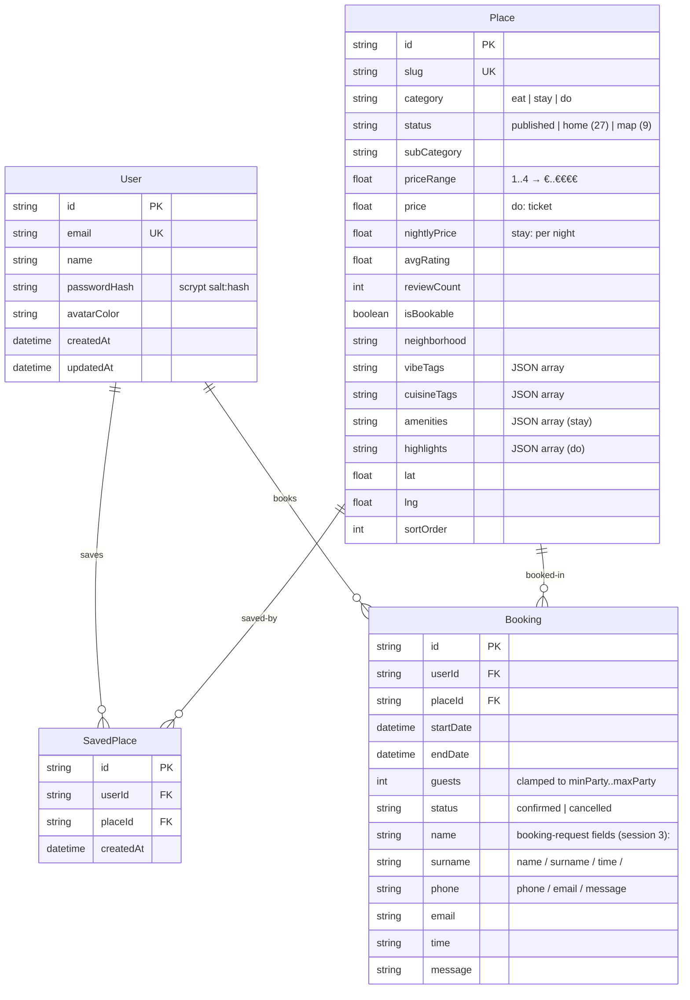

# ROAM (Augsburg City Guide) — Master Project Architecture Document (PAD) v1.0

**Classification:** Internal Engineering Reference
**Status:** DEFINITIVE, PRODUCTION-LOCKED BLUEPRINT
**Companion Documents:** `README.md` (user-facing), `AGENTS.md` (compact operator file), `CLAUDE.md` (agent conventions), `docs/DEPLOYMENT.md` (production runbook), `docs/Tailwind-V4-Validation-Report.md` (v4 findings)
**Last Updated:** 2026-10-01 (v2.19)
**Audience:** Senior Engineers, Tech Leads, DevOps, and Onboarding Engineers
**Rule:** Every architectural decision in this document traces to a specific rationale. Nothing is here "because it's popular."

#### Revision Block — v1.0 (Tracked Changes)

- `[v2.19]` Calendar-day booking classification + the live's identity/avatar re-alignment (session 48 — the v2.18 audit on the REDEPLOYED mirror). Finding F1 (HIGH): the profile's Upcoming/Past split used an INSTANT comparison (`new Date(startDate).getTime() < Date.now()`), so a reservation made now for TONIGHT flipped to "Past" at 00:00 UTC before the reservation happened — reproduced LIVE on the deployed mirror (a today-19:00 booking landed under "Past (1)") and time-bombed the E2E corpus at the 2026-10-01 UTC midnight boundary (the hardcoded "2026-10-01" booking fixture aged past the boundary; the suite went 84/84 → 83/84 the moment the clock crossed midnight). Remediation: the pure `isBookingPast(startDate, now)` seam (`src/lib/bookings.ts`, NEW — §3.2/§6.2/§7.1) — CALENDAR-DAY comparison (day-ordinal via local parts + Date.UTC; null/invalid never past), pinned by 8 unit checks (`tests/bookings.test.ts`) + a deterministic same-day E2E pin (the booking spec books TODAY, computed at runtime — it can never cross itself); ProfileView's upcoming/past filters route through the seam. Findings F2/F3 (parity drift — the live's account state changed upstream since session 14): the live profile now renders h1 "Explorer" + the STATIC "Your Roam account" 16px line (the email line is gone), and the navbar's black avatar disc renders the white 17×17 strokeWidth-2 lucide `User` icon (account-agnostic — no email initial). Re-aligned: `prisma/seed.ts` name "Explorer", ProfileView's subtitle, Navbar's avatar (one DOM node — the `md:[stroke-width:2]` arbitrary property overrides the presentation attribute from md up; the `userEmail` prop and the `initials()` render retired). F4: the smoke + E2E booking fixtures now use runtime-computed dates (`date -d "+7 days"` / JS `new Date()` — never hardcoded). §7.1/§7.3: 75→**83 unit** (+8 booking checks) / 84 E2E / 31 smoke; §11 line counts refreshed; §12 glossary updated. Verified in this revision: lint 0 errors, typecheck clean, **83/83 unit, 31/31 smoke, 84/84 E2E green** (session 48); 16 screenshots re-captured (`scripts/capture-screens-session48.mjs` — the profile capture documents the same-day booking under Upcoming).
- `[v2.18]` Deep-link-preserving guest gates (the v2.16/v2.17 audit finding F1: the E2E corpus had never been EXECUTED for those commits — only `--list` — and running it exposed 2 RED guest specs, reproduced on the deployed mirror: a fresh visitor deep-linking to `/profile`, `/eat`, or `/place/<slug>` was bounced to `/`; the live source preserves logged-out deep links). ADR-008 amended: the PATH-AWARE gate — `requireUser("/own-path")` (`src/lib/page-gate.ts`, new) in every authenticated page (home, eat, stay, do, map, favourites, place/[slug], profile) 307s session-less visitors to the bootstrap WITH the page's own path as next; the `(app)`/`(bare)` layouts became CHROME-ONLY (they resolve the session for the Navbar, rendering it only when a user exists — a layout cannot learn the request path, verified: `headers()` exposes only proxy headers — and a layout redirect always preempts the page's, so the gate must live in the pages); the pure `guestBootstrapUrl(next)` seam (encodeURIComponent — path characters can never corrupt the bootstrap URL's query) added to `src/lib/guest.ts`. ProfileView's sign-out is now a FULL navigation (`window.location.assign("/")`): the App Router's RSC soft-nav cannot follow a server redirect targeting a route handler — it rendered an empty shell (no navbar/main) after logout; login keeps `router.refresh()` (its POST sets the cookie directly). §3.2 tree (page-gate.ts, chrome-only layouts), §6.2 (`requireUser`/`guestBootstrapUrl` utilities), §7.1/§7.3: 72→**75 unit** (+3 `guestBootstrapUrl` checks) / 81→**84 E2E** (+3 deep-link pins) / 30→**31 smoke** (check 14 next-aware + the new 14b deep-link 303); §11 line counts refreshed; §12 glossary updated. Verified in this revision: lint 0 errors, typecheck clean, **75/75 unit green, 31/31 smoke green, 84/84 E2E green — the first fully-executed run of the guest suite** (session 46). `.env` untracked (a live AUTH_SECRET had been git-tracked since the v2.16 upload — AGENTS.md's own "never commit .env" rule now enforced by the index).
- `[v2.17]` Origin-agnostic bootstrap redirect (the live-deploy regression: behind a reverse proxy forwarding `Host: localhost:3000` + `X-Forwarded-Proto: https`, `req.nextUrl.origin` computed as `https://localhost:3000` and the bootstrap's ABSOLUTE 303 Location bounced `https://activity-map.jesspete.shop` visitors onto the origin box's localhost — the layout gates' relative 307 worked fine through the same proxy). ADR-008 amended: the 303 now emits a RELATIVE `Location` (an RFC 9110 §10.2.2 URI-reference) built from `sanitizeNextPath` output only — the CLIENT resolves it against whichever origin it is browsing, so the redirect can never leave the host on any deployment (localhost dev, preview, production domain) with zero configuration; `NextResponse.redirect()` demands an absolute URL, hence the hand-rolled `seeOther()` helper (§3.2, §6.4, ADR-008). docs/DEPLOYMENT.md: reverse-proxy guidance (`Host`/`X-Forwarded-Host` forwarding), the `NEXT_PUBLIC_SITE_URL` row corrected (it IS load-bearing — the cookie Secure flag), and the localhost-bounce row added to its §7 common issues. Tests: +4 unit origin-agnostic Location checks (`tests/guest.test.ts` 20→24; the existing absolute-Location assertions flipped to relative) / +1 smoke raw relative-Location check (29→30) / the E2E open-redirect assertion tightened to the exact `/` (81 unchanged). §7.1/§7.3: 68→**72 unit** · 29→**30 smoke** · 81 E2E; §11 line counts refreshed. Verified in this revision: lint 0 errors (2 pre-existing warnings), typecheck clean, 72/72 unit green, the 81-test census re-listed; build/smoke/E2E left to the repo's own full local gate (no server boot in this environment).
- `[v2.16]` Login-free guest bootstrap (the change request: "disable login for a fresh user initial visit; create and use a guest account with the necessary seed data"). ADR-008 added (the shared `guest@roam.local` account + the `GET /api/auth/guest` bootstrap route handler); the `(app)`/`(bare)` layout gates and `/profile`'s own gate now redirect session-less visitors to the bootstrap instead of `/login` (§2, §3.2, §6.1, §6.3); `prisma/seed.ts` seeds the guest user (password = a discarded random 32-byte secret — never signable) and `src/lib/guest.ts` re-ensures it at runtime (§4.3, ADR-007); sign-out now returns to `/` and re-bootstraps a guest session (the login wall never resurfaces; `/login` remains for the demo account — ADR-003). §3.3 Pattern 2 companion note; §6.2 `ensureGuestUser`/`hashGuestPassword`/`sanitizeNextPath` utilities; §6.4 open-redirect threat row; §7.1/§7.3 test distribution 48→**68 unit** (new `tests/guest.test.ts`, 20 checks) / 76→**81 E2E** (new `tests/e2e/guest.spec.ts`, 5 checks) / 27→**29 smoke** (the fresh-visit + guest-auth/me checks + the Location-accurate signed-out redirect check); §11 adds the four new files + refreshed line counts; §12 adds the Guest bootstrap term. Verified in this revision: lint 0 errors (2 pre-existing warnings), typecheck clean, 68/68 unit green; build/smoke/E2E left to the repo's own full local gate (no server boot in this environment).
- `[v2.15]` Independent doc-to-code alignment audit — every claim in `docs/findings_to_validate_and_update.md` re-validated against the tree at `1a8b0fe` (fresh clone; the gate counts re-verified authoritatively via `playwright test --list` → **76 tests in 6 files**: auth 5 / browse 32 / home 19 / mobile-nav 16 / not-found 3 + the 1-check setup project; 48 unit = 19+15+10+4; 27 smoke = 15 static + two 6-iteration loops). The stale sections brought to the code in this revision: §1.2 npm runtime + Vitest ^5.0.2, ADR-003/§6.2 sliding-window limiter, ADR-004 19 checks, ADR-005 md breakpoint + 16 mobile-nav checks + hero-shade removal, ADR-006 the 12px-ink-dot no-popup pin model, ADR-007 five (not four) seed files, §2 layer table + topology labels, §3.2 directory tree (the (bare) group, 21 client components, LetterReveal/useParallax/BrowsePlanner/place-404, the refreshed E2E distribution, 16 screenshots), §3.3 Pattern 5 shrink-wrapped sample, §5.1–§5.4 design-system refresh, §7.1 test-distribution table (48/76/27), §11 line counts, §12 seam glossary. One code-side remediation shipped with it: `/api/health`'s unhealthy path now returns `{ ok: false, error: "unhealthy" }` per the envelope contract (was `data`-shaped; zero consumers of the old shape verified).
- `[v2.14]` Session 36 the dependency-hygiene + npm-audit remediation on a fully-verified parity baseline (`docs/remediation-plan-session-36.md`, findings B1–B6) — the workspace re-cloned at `ae20598` (the owner's post-session-35 start-server-log commit: the npm `allowScripts` block — GOOD, kept — + `docs/session_43.md` + the log refresh; no code changes); the baseline gate green on the untouched tree with **76/76 E2E on the FIRST run** (the session-35 font-ready fix holding) and every session-35 remediation verified INTACT (the pinning, the toolchain, the 16 screenshots, the exec bits, no Drizzle, the smoke orphan fix); the dual-site browser audit: the live source UNCHANGED at every swept signature (desktop nav 433/559/639/727/805 · mobile tab-bar 121/192/222/259 @390 + 246/317/347/384 @640 + the 52px glass · footer compact 506×96 → grown 646×118 r-34/links 92×92/gap 12 · hero h1 y=319 @1280×900) and the deployed mirror matching EXACTLY (the footer `--footer-p`=0.9422 → 638×117 mid-growth signature; zero console errors on 7 pages; the mobile nav end-to-end — geometry EXACT, taps + the 700/ink active state; the favourites round-trip through the empty state; the booking round-trip “Request sent” → Profile · My bookings — NO bugs, the mobile navigation menu works exactly as expected, no Tailwind v4 regression); remediated: the 3 unused scaffold deps PRUNED (`zustand` — contradicting the documented no-Zustand state architecture — + `tailwindcss-animate` + `class-variance-authority`; zero src imports verified before the npm remove; `clsx`/`tailwind-merge`/`tw-animate-css` verified used and kept; the PAD §10 hygiene row closed); `npm audit` cleared **3 high → 0 vulnerabilities** via the npm `overrides` deepmerge-ts ^8.0.2 pin (GHSA-ggr8-5vv4-36mx stack-exhaustion in the prisma→@prisma/config CLI chain — dev-CLI-time only, but flagged on every install; the `audit fix --force` prisma-6.12.0 DOWNGRADE rejected; 8.0.2 verified dual-package with the same `deepmerge` export and @prisma/config loads it via dynamic import — the full CLI path re-exercised: prisma generate + db:push + db:seed re-wrote the 118784-byte DB); the `.env` PostgreSQL-section `bun run` leftover fixed (npm-accurate everywhere now); `install_packages.sh` re-aligned; the stale bun/standalone command blocks in THIS PAD + CLAUDE.md's tech-stack line corrected (the npm `next start` runtime — ADR-004 retitled, §7.3–7.4 the 48/76 counts, §8.1/§8.3/§9.1 the npm commands, the architecture-diagram subgraph); the SKILL's toolchain table corrected (npm runtime; the scaffold-leftovers note marked pruned); 16 screenshots re-captured on the remediated tree via `scripts/capture-screens-session36.mjs`. Gates: 48 unit + 27/27 smoke ×2 + **76/76 E2E ×2**.
- `[v2.13]` Session 35 the operator-commit audit + remediation — the workspace re-cloned at `3fc7e4f`; the two operator commits audited (`e35202e` the image/docs cleanup + `3690531` the npm-runtime port, `docs/remediation-plan-session-35.md` findings A1–A15); the mirror verified running the session-33 code ALL GREEN (zero console errors on 10 pages, the mobile nav end-to-end at 390 — geometry EXACT 121/192/222/259 + the icon taps, the favourites + booking round-trips, the footer `--footer-p` growth live at p=0.9441) and the live source re-verified UNCHANGED (the desktop nav 433/559/639/727, the mobile tab-bar + 52px glass, the footer compact 506×96 → grown 646×118); remediated to the documented baseline: the inline `DATABASE_URL=file:../db/custom.db` pinning RESTORED on `dev`/`start`/`db:push`/`db:seed` (the documented hijack REPRODUCED first — a stray parent-directory `.env` + an exported absolute `DATABASE_URL` sent the seed's Prisma client one directory above the repo until the pinning was restored; pinned by a hostile-env probe: push+seed under the exported var writes the fully-seeded 118784-byte `<repo>/db/custom.db`); the parity toolchain restored (tailwindcss 4.3.3 + @tailwindcss/postcss 4.3.3 + next 16.3.x + react 19.3 — the operator commit had downgraded to 4.1.17/16.2.6/19.2.6); the unused Drizzle/Postgres sandbox scaffolding removed (drizzle.config.json, src/db/, drizzle-orm/drizzle-kit/pg/@types/pg/dotenv deps, the stale bun.lock — one lockfile now: package-lock.json); the smoke script's server cleanup fixed for the npm runtime (`next start` renames its worker to `next-server (vX.Y.Z)` which the `pkill -f "next start"` pattern misses — an orphan holding :3000 with a spent in-memory rate limiter failed the NEXT run with phantom 429/401s; now killed by PORT via ss, and the final shutdown kills the port too); the E2E mobile-nav position specs await `document.fonts.ready` before measuring (Inter loads from the Google Fonts CDN and the fallback font's wider metrics shifted the shrink-wrapped links ~6px left under full-suite network contention — Highlights x=115 vs the 121±2 contract, observed once at 75/76); the script exec bits restored (smoke-test.sh + the capture/par probes — the cleanup commit had stripped 100755→100644); `scripts/install_packages.sh` re-aligned to the real dependency set; 16 dev-server screenshots re-captured into docs/screenshots/ (the cleanup commit had deleted all 66 while the README still referenced them) via `scripts/capture-screens-session35.mjs` (the capture login goes STRAIGHT to /login and verifies the input values before submitting — a fill landing before React hydration gets reset to "" and the submit 400s); docs aligned (README, AGENTS, CLAUDE, this PAD, the SKILL, the plan, the worklog, docs/session_42.md). En-route lessons: an exported absolute `DATABASE_URL` beats every .env file (the inline script pinning is the only reliable defense — the npm scripts' env prefix wins over the exported shell var); `next start`'s worker process RENAMES itself (kill by port, not by command pattern); a Playwright `fill` on a not-yet-hydrated React form silently resets (verify input values before clicking submit). Gates: 48 unit + 27/27 smoke (×2, clean port handoff) + **76/76 E2E ×3** (the font-ready wait holds across three consecutive full-suite runs).
- `[v2.12]` Session 33 the footer's scroll-linked growth + the link hover parity — the deployed mirror (running the SESSION-32 code, verified by DOM signature: the 646×118 desktop pill with the 92×92 tiles + 24px icons, the shrink-wrapped mobile nav 121/192/222/259, the press-shrink on every link) audited ALL GREEN (zero console errors swept across 11 pages; the mobile navbar end-to-end at 390; the favourites + booking round-trips; NO bugs found) and the live source re-measured with FOUR FINDINGS remediated to EXACT parity (findings F1–F4, `docs/remediation-plan-session-33.md`): **the desktop footer pill's growth is SCROLL-LINKED and CONTINUOUS** — the live's pill renders the COMPACT model while the footer is offscreen (506×96, gap 8, r-28, pad 8/10, links 74×78 r-18, icons 20px, labels 11px) and interpolates LINEARLY with the footer's visible fraction p (fit to ±0.02 across 10 sampled scroll positions at 1280×900: gap 8+4p, pad (8+4p)/(10+6p), radius 28+6p, links 74+18p × 78+14p with radius 18+6p, icons 20+4p, labels 11+1p) reaching the GROWN model when the footer is fully visible (646×118, gap 12, r-34, pad 12px 16px, links 92×92 **r-24**, icons 24px, labels 12px) and compacting back when it leaves — the per-frame updates smoothed by 120ms linear transitions (the pill: gap/padding/border-radius; the link: width/height/border-radius composed with the 300ms hover transform/background/color/box-shadow list); below md the pill NEVER grows (the static 3-col model, `transition: none`); replicated via the `--footer-p` CSS var written by SiteFooter's rAF-throttled passive scroll listener (a client component now — SSR renders p=0, the live's own initial compact state) + the md+ arbitrary-value calc classes + the `footer-pill-transition`/`footer-link-transition` globals.css utilities (the link's md override sits UNLAYERED, the press-shrink mechanism); **the links' VIOLET hover at both breakpoints** — `transform: translateY(-12px) scale(1.1)` composed into ONE matrix (`matrix(1.1, 0, 0, 1.1, 0, -12)`) over the #571AFF fill with white text + the `0 16px 34px rgba(87,26,255,0.28)` glow, the svg carrying its own hover `scale: 1.1` with `transition-transform duration-300` — written as the unguarded `footer-link-hover` utility (NOT v4's separate translate/scale utilities, which would escape the transform transition entry and read differently in the computed style; NOT v4's media-wrapped group-hover, which would not apply on touch-capable probes where the live's own unguarded classes do); **the pill's soft `0 2px 12px rgba(14,14,14,0.08)` shadow** at both breakpoints; the icons' **stroke-width 2.1** (was 1.8) + the labels' **tracking-[-0.01em]** + the grown link radius **24px** (was 18). En-route lessons: an offscreen element can render a DIFFERENT model than the visible one — sweep scroll-POSITIONS, not just breakpoints (the first live read of the footer at page-top read 506×96 and looked like a reversion; the in-view read shows the growth — the live's pill was caught MID-INTERPOLATION at 537px, exposing the continuous driver); Chrome's computed `transition` shorthand serializes in SECONDS (`0.12s`, not `120ms`); Chrome's INITIAL transition value is `all` — an element with no transition rule reads "all", so the live's explicit mobile `transition: none` needs the clone's explicit `transition-none`; a lingering E2E hover's 1.1 scale inflates later mid-transition measurements (move the pointer off + settle first). Non-gaps re-verified: every session-24→32 surface (the hero vh-model at both breakpoints, the vibe, the parallax, the planner, the band, the category cards, the browse/detail/map/404s, the legal row, the MOBILE pill static + exact). Gates: 42 unit + 27 smoke + **76 E2E** (the rewritten footer contract: the compact-at-load + the transition lists + the shadow + the stroke/tracking + the grown + the link-radius-24 + the hover matrix + the half-visibility interpolation midpoint gap 10 + the mobile static model) — all green; 66 screenshots incl. the session-33 set (the compact pill, the mid-growth interpolation, the grown pill, the violet hover, the mobile footer with the shadow).
- `[v2.11]` Session 32 the mobile-nav link-group + the desktop footer-pill parity — the deployed mirror (running the SESSION-31 code, verified by DOM signature: the vh-model hero h1 y=319 at 1280×900 with the radius string, the centered vibe 1203 @x=38, the showcase parallax matrix(1.16), the hydration-clean generic 404) audited ALL GREEN (zero console errors swept across 11 pages; the mobile navbar end-to-end at 390; the favourites + booking round-trips; NO bugs found) and the live source re-measured with TWO DRIFTS remediated to EXACT parity (findings F1–F2, `docs/remediation-plan-session-32.md`): **the mobile tab-bar's middle link group is now SHRINK-WRAPPED** — the live's group carries `min-w-0 mr-2` with NO `flex-1`, so the four text links sit at x=121/192/222/259 at 390 (was 125/196/226/263 — the flex-1-centered model) and 246/317/347/384 at 640; the nav's justify-between distributes the freed space into the two outer gaps; the `no-scrollbar` overflow safety valve stays; every nav link now carries the live's `press-shrink` touch feedback (the `@utility` + unlayered `:active` rule in globals.css: `transition: transform 0.18s cubic-bezier(0.22,1,0.36,1), box-shadow 0.18s` + `scale(0.97)` on press) with the 200ms color transition MOVED to the label span (the live's own split — two `transition` shorthands on one element would collide and silently drop one); the live's invisible deltas (44px min-height tap targets on links/buttons, the nav h-12 at y=2 inside the same 52px border-box header) recorded as measured non-gaps (the clone's h-full links already exceed 44px); **the desktop footer pill GREW at md+** — 646×118 (was 506×96) with radius 34 (was 28), pad 12px 16px (was 8/10), gap 12 (was 8), the links 92×92 tiles (was 74×78) carrying 24px icons (was 20) over 12px/600 labels (was 11px) in ONE row of six — while the MOBILE pill (<md) is UNCHANGED and verified EXACT (the 3-col grid, max-w 390, r-28, pad 8/10, gap 8, the 104×78 tiles at 390 / 117×78 at 640). En-route lessons: a platform stylesheet can SWAP across breakpoints (the live's desktop CSS carries the press-shrink rules while the mobile sheet reads CORS-blocked — measure the RENDERED geometry, not the source rules); a link-walk-up measurement can land on a padded inner div (the live's category cards measure 263×215 only at the ARTICLE level — an inner 229×211 div reads 4px off); Tailwind's `transition-colors` and a custom `transition` utility on the SAME element are competing shorthands — split them across the anchor and the label span like the live does. Gates: 42 unit + 27 smoke + **76 E2E** (the new shrink-wrapped position tests at 390/640 + the press-shrink class/transition contract + the updated footer test) — all green; 61 screenshots incl. the session-32 set (the shrink-wrap nav at 390/640, the grown 646×118 footer pill, the unchanged mobile footer).
- `[v2.10]` Session 31 the hero vh-model + the 404 hydration fix + the vibe centering + the showcase parallax — the deployed mirror verified REDEPLOYED with the session-30 code (all three signature surfaces + the mobile navbar end-to-end + the favourites/booking round-trips) with ONE BUG FOUND: the generic 404 threw a React #418 hydration error on EVERY visit (the statically-prerendered page's `usePathname()` baked "_not-found" into the server HTML; fixed by reading `window.location` through `useSyncExternalStore` — getServerSnapshot "" — pinned by a zero-console-errors assertion); the live source re-measured at five viewport sizes with THREE DRIFTS remediated to EXACT parity (findings F2–F4, `docs/remediation-plan-session-31.md`): **the hero is now a VIEWPORT-HEIGHT-RELATIVE model with ROUNDED photo corners** — the section `md:-mt-[80px]` over fitted calc heights (`md:h-[calc(577px+30vh)] lg:h-[calc(714px+28vh)]`), the bg `top: calc(-80px+0.25vh)` / `height: calc(100%+72px)` with `border-radius: 32px 32px 60% 60% / 32px 32px 80px 80px` at md+ (elliptical rounded bottom corners) and `0 0 42% 42% / 0 0 48px 48px` on phones (a globals.css `max-width: 767px` override with `!important` over the inline style — the live's own mechanism), the content `md:pt-[calc(5rem+28vh)]`, the h1 `-translate-y-1.5` + the 16px pill gap, the h1 font `clamp(32px,9.2vw,38px)` CAPPED at 38px on phones (was the uncapped 9vw → 57.6px at 640), the img object-fit FILL (`width: 100vw; min-height: 100%; object-position: center top`) with the hero-shade + cream-blend overlays REMOVED (the live renders the raw image — pixel-verified tone match); the h1 lands at y=267/290/319 at 720/800/900 viewport heights — EXACT at every sampled height (at 1280×800 the formulas coincide with the old session-22 fixed values, so the existing E2E assertions held); **the vibe heading is now CENTER-ALIGNED** (the live changed it from the session-12 left-aligned model: the container `px-[18px]` + the h2 `mx-auto max-w-[94vw]` — the box 1203 @x=38 at 1280 with the exact live line breaks "…Select / …Your / Getaway" at x=123/136/263); **the home showcase images carry the live's 1.16 zoom + scroll parallax** — the STAY imgs (the home variant only) render `translateY(8%) scale(1.16)` (no hover zoom — the live's transform/filter sit still on hover) and the SIGHTS imgs sit in oversized `-inset-y-[16%]` wrappers, both interpolating their translateY with scroll (±8% clamped, slope ≈0.05) via the shared `useParallax()` hook (passive + rAF-throttled; the /stay BROWSE cards stay transform-free — verified). En-route lessons: a statically-prerendered client page CANNOT read `usePathname()` for rendered text (the prerender route leaks in — use the `useSyncExternalStore` server-snapshot pattern); a fixed-height hero cannot track a vh-based live (the E2E viewport at 800px hid a 29px drift at 900px); a VLM can misattribute which screenshot shows which alignment — the DOM line-rect extents are the ground truth (all three vibe lines center at exactly x=640); agent-browser's error list ACCUMULATES across page navigations (a stale mirror error surfaced in a localhost test — close/reopen the browser between error assertions). Gates: 42 unit + 27 smoke + **73 E2E** (the zero-console-errors 404 spec + the hero vh/radius/cap contracts + the vibe + showcase extensions) — all green; 57 screenshots incl. the session-31 set (the vh-model hero at 900/800, the mobile hero at 390 + the capped 640 h1, the centered vibe, the stay parallax zoom, the sights oversize crop, the hydration-clean 404).
- `[v2.9]` Session 30 the 404 surfaces + map pin/zoom parity — the deployed mirror REDEPLOYED with the session-29 code (verified by DOM signature: the band heading column h2 x=142/w=996/center=640 + the FIVE-name window at uniform Inter + the 330px compact featured card with pad 16/border 1px/blur 18/h-38 buttons + the map cream-pill eyebrow + the 61×32 detail rating pill; zero console errors across every page, the mobile navbar end-to-end, the favourites + booking round-trips); the live source re-measured with the TWO 404 SURFACES swept for the first time + the map's pin/zoom chrome re-swept below the session-3/8 models (findings F1–F5, `docs/remediation-plan-session-30.md`): **the place-404** — an IN-APP design rendered inside the app chrome (nav + footer): `min-h-screen bg-[#F8F7F4] px-5 py-24 text-center` carrying the 46px Libre Baskerville ink "Place not found" h1 + the 44px ink "Back to Do" pill → /do (was the clone's generic chrome-less "Off the map" page); **the generic unknown-route 404** — the platform's slate default: a chrome-less `bg-slate-50` page with the 72px font-light slate-300 "404" + the 64×2 slate-200 divider + "Page Not Found" 24px slate-800 + the quoted attempted path + the white bordered r-8 "Go Home" button → / (was the clone's custom cream page); **the map zoom controls** — TWO separated circular 34×34 buttons (radius 999, 1px rgba(14,14,14,0.1) border, white bg, 22px/700 ink glyphs, the stack `gap: 8px`, shadowless at (10,10) — was Leaflet's joined 30×30 default pair); **the map pin model** — a 12px ink dot (#0E0E0E, 2px white border, r50%, the `0 4px 10px /0.16` shadow, the 180ms `cubic-bezier(0.22,1,0.36,1)` transition, hover `scale(1.32)` + the `0 8px 18px /0.24` shadow) carrying a hover-reveal NAME-LABEL pill (`.roam-marker-label`: absolute, left 50%, bottom calc(100%+9px), `translate(-50%,4px) scale(0.96)` → hover `translate(-50%,0) scale(1)`, opacity 0→1 at 160ms, white bg, 12px/700 Inter ink text, pad 7/11, r999, the `0 10px 26px /0.16` shadow, a 5px ::after white triangle below — measured 106×31) — the clone's 16px dot + 22px violet `[data-active]` state RETIRED (the live has NO violet pin state at all); **the pin click behavior** — clicking a pin navigates DIRECTLY to `/place/map-<slug>` (no Leaflet popup — the popup + the selected-place card + the "Tap a dot" hint were clone inventions, all removed; the `?place=` deep-link keeps its flyTo). En-route lessons: Chromium 153 serializes slate/cream colors as `lab()`/`oklab()` — even through a canvas fillStyle — so color assertions sample the painted PIXEL via `getImageData` with ±2-per-channel tolerance; Leaflet's bundled CSS loads AFTER globals.css in the chunk order, so the zoom overrides carry `!important` (mirroring the live's own override block); a rewritten `.roam-marker` MUST set `display: block` (an inline span ignores width/height — the first rebuild rendered 4×18 remnants); the CARTO basemap served "API KEY REQUIRED" watermarked tiles to the whole sandbox at capture time (the live app equally affected — the capture script's tile-wait guards for tile *existence*, not content). Non-gaps re-verified: the planner pill + popover chrome, the mobile nav/planner/detail/favourites surfaces, the legal pages, the map command center + stats + canvas, the band/map-cards/detail-pill (session-29 EXACT), the home geometry, the category-pill filtering (markers + list both filter). Gates: 42 unit + 27 smoke + **71 E2E** (the new not-found spec + the map marker/zoom/navigation contract) — all green; 49 screenshots incl. the session-30 set (the two 404s, the zoom pair + pins, the pin labels, the pin-click navigation, the mobile map).
- `[v2.8]` Session 29 restaurant-band + map-card parity — the deployed mirror REDEPLOYED with the session-28 code (verified by DOM signature: the 510px date-picker popover with the self-contained from/to fields, zero console errors, the mobile navbar end-to-end, the favourites + booking round-trips); the live source re-measured with the DESKTOP RESTAURANT BAND swept as a whole for the first time since session 6 + the map "Places on the map" list-card chrome + the map stats pills + the detail hero rating pill (findings F1–F8, `docs/remediation-plan-session-29.md`): **the band heading layer** — a sticky vertically + horizontally CENTERED column (`[data-band-heading]` — the h2 `clamp(46px,7vw,104px)` lh 1.02 tracking −0.055em text-center + the white View All pill BELOW at gap 24: h 44, pad 0/24, 13px/600, tracking 0.02em) that FADES OUT through the first ~45% of the 460vh trap (the live's 120ms linear transition, pointer-events off when hidden); **the names watermark** — a centered FIVE-NAME sliding window (`[data-band-names]` — 2 before + the active + 2 after, circular wrap: Granary/Faro/Volta/Roux/Aura at rest; one centered row at uniform Inter `clamp(24px,2.6vw,40px)` 400, tracking −0.02em, gap 34; the active solid white, the rest white/0.32; the row centers AS A GROUP so the active lands near — not exactly at — the viewport center); **the featured card** — the compact centered model (`[data-featured-card]` — min-w 330 at `bottom-[9vh]` centered, pad 16, radius 28, bg white/0.08 + the 1px white/0.16 border + blur 18 + the shadow `0 18px 48px /0.35`, text-center: the address line 12px tracking 0.04em white/0.56 mb-2 + the centered meta row gap 14 at 13px (the € symbols + the 4px white/0.35 dot + `★★★★★` gold #F7D774 tracking 0.08em + the rating white/0.86) + the buttons row mt-12 gap 8 of TWO flex-1 h-38 r-full buttons — Book a Table bg white + the 1px white/0.28 border + 12px/600 black; Learn More bg white/0.08 + 12px/500 white — NO name inside, the name lives in the names window only) that fades IN as the heading fades out (`cardFade = clamp((p−30)/15)`); **the map list card** — the eyebrow renders as a CREAM PILL (`inline-flex gap-1.5 rounded-full bg-[#F8F7F4] px-2.5 py-1` — 26px tall, 12px/600 #555550) with the eyebrow row on `mb-3` (was a fixed h-[26px]), the neighborhood line carries a 12px MapPin svg (#888580, strokeWidth 2), and the grid gap drops to 12px (3-col → 397px cards @1280); **the map stats pills** — NO shadow (was `0 6px 16px /0.08`); **the detail hero rating pill** — 61×32 (pad 8px 12px, the 14px star — was 56×28/pad 6px 10px/13px star). Non-gaps re-verified: the date-picker popover, the stay pills, the browse chips/cards, the detail structure, the mobile nav at 390/640, the sights pills, the mobile restaurant deck (the live pins via its own JS transforms — the clone's CSS-sticky is the documented visual equivalent), the band bg + trap height, the map command center. Gates: 42 unit + 27 smoke + 69 E2E (the band contract reworked + the map/detail contracts extended) — all green; 43 screenshots (the session-29 set: the band heading + card states, the map list card + grid, the detail rating pill, the mobile map card).
- `[v2.7]` Session 28 date-picker/stay-pill/booking-label parity — the deployed mirror REDEPLOYED with the session-27 code (verified by DOM signature: the coffee-icon time pill h 28 with the 0 8px 22px /0.06 shadow + the 1px /0.1 hairline + the #3A3A3A text, the bordered stop link cards, the lh-1.1 h2, zero console errors across every page, the mobile navbar end-to-end, the favourites + booking round-trips); the live source re-measured with the TRIP-PLANNER DATE-RANGE POPOVER swept for the first time since session 3 + the home stay-showcase pills + the booking-form labels + the profile stat-chips (findings F1–F4, `docs/remediation-plan-session-28.md`): **the popover** — the container is 510px wide at desktop (358 at 390 = `calc(100vw-32px)`) with pad 12 + the shadow `0 18px 52px /0.16`, the from/to header a `mb-2 grid gap-2 sm:grid-cols-2` of SELF-CONTAINED white pill fields (238×50 desktop / 332×50 mobile, `rounded-full border-black/10 px-4 py-2`) carrying the 12px/500 #8A8780 label + the 12px/600 #141413 value + a 14px calendar svg INSIDE, NO "Done" button (outside-click closes), the month label 14px/500, the nav buttons 28×28, the weekday cells 12.8px/400 #737373, the selected days violet at weight 400, the in-range days #F7F4FF bg + violet text, the PREV-MONTH trailing days as gray #737373 buttons, and a 40px day-row pitch; **the home stay-showcase pills** — the live's inline 34px height (the clone's session-6 41px override removed) + the Book Now gained a 1px rgba(255,255,255,0.92) border (the /stay browse variant verified unchanged at 36px borderless); **the booking-form labels** — 12px/600 #3A3A3A with INLINE asterisks (the violet spans removed) + the field borders pinned to #DDDBD5; **the profile chips** — px-4; en-route fix: the hero content wrapper's `z-10` CAPPED the popover's z-[30000] inside a stacking context that the category section's own z-10 (later in the DOM) painted over, intercepting the day-cell pointer events — the wrapper drops the z-index (the absolute backdrop sibling + DOM order keep the content layering identical); gates: 42 unit + 27 smoke + 69 E2E green (the new date-picker contract); 37 screenshots incl. the session-28 set.
- `[v2.6]` Session 27 route-stop/login parity — the deployed mirror REDEPLOYED with the session-26 code (verified by DOM signature: the session-26 footer legal-row hairline + sm: switch + max-w-390 caps, the trap-pinned 42.9px route heading at viewport y=68, the sticky stacking restaurant deck `sticky top-[88px]` with first card 354×490 @x=18, the showcase insets, the category track pad 18/18 gap 12, zero console errors across every page, the mobile navbar end-to-end, the favourites + booking round-trips); the live source re-measured with the ROUTE STOP CARDS swept below the session-20 text-only contract + the login fields re-checked at every breakpoint (findings F1–F6, `docs/remediation-plan-session-27.md`): **the stop time pills** — the live re-added the soft shadow `0 8px 22px rgba(14,14,14,0.06)` + a 1px rgba(14,14,14,0.1) hairline + a PER-STOP category icon (Morning Coffee→Coffee, Lunch Break→Utensils, Afternoon Culture→Palette, Sunset Drinks→Martini, Dinner→Leaf — 14px svgs at stroke-width 1.8, stroke #141413) + dimmer #3A3A3A 12px text (the pill computes 28×101 at 390 — pad 4/12, gap 8; the clone rendered a shadow-less border-less pill with a generic Clock icon at #141413, h 24); **the stop link cards** — a 1px rgba(14,14,14,0.08) hairline over the existing 0 8px 28px shadow + the hover lift (`hover:-translate-y-1 hover:shadow-[0_18px_44px_rgba(14,14,14,0.10)]`); **the stop titles** — lh 1.1 (48.4px at 44 mobile / 52.8px at 48 desktop) + an 8px bottom margin above the link card's mt-7; **the meta rows** — a gap-1.5 flex-wrap row led by a 14px MapPin svg (stroke #72706A, width 2) with the neighborhood/rating/price/sub-category as SEPARATE 13px #72706A spans; **the Learn More hover** — violet #571AFF + the 0 12px 28px violet glow (was hover-black); **the login fields** — RESPONSIVE: the inputs `text-base md:text-sm` (16px below md → 14px at md+, over the existing h-11 sm:h-12) and the Sign-in button `h-11 sm:h-12` (44px below sm → 48px from sm; the clone rendered 14px/48px at every breakpoint). En-route lesson: agent-browser 0.38.x renders BLANK element screenshots of tall sticky sections (the 3360px route section captured as pure cream — the git-version captures came from an older agent-browser); the Playwright `locator.screenshot()` path stitches sticky content correctly — `scripts/capture-screens-v8-session27.mjs` is the new element-capture entry point. Gates re-verified: 42 unit ✓, 27 smoke ✓, **68 E2E** ✓ (the route-stop contract extended with the session-27 chrome + the responsive login pinned at 390/640/1280). 32 screenshots (3 refreshed + the session-27 set: the desktop + mobile route-stop chrome, the mobile login fields).
- `[v2.5]` Session 26 footer/mobile-home parity — the deployed mirror REDEPLOYED with the session-25 code (verified by DOM signature: the login's 14px inputs + the one-button "Need an account? Sign up" row, the legal routes `/privacy-policy` + `/accessibility-statement` rendering the exact chrome with the legacy paths redirecting, the category cards 24px headers/32×32 cells/gap 14/pill 229×54 hanging 48/6, the favourites empty card 576 @x=352, the session-24 chips/card shell/map shell/heart-36, the 52px tab-bar) and audited ALL GREEN (zero console errors across every page; the mobile navbar end-to-end; the favourites + booking round-trips); the live source re-measured with the FOOTER swept below the session-23 pill + the mobile home sections swept systematically for the first time since session 20 (findings F1–F7, `docs/remediation-plan-session-26.md`): **the footer legal row** — it carries a 1px `black/[0.05]` TOP HAIRLINE at every breakpoint + `pt-3` (12px phones) / `sm:pt-5` (20px) + `mt-4`/`sm:mt-8` (the clone had relied on the parent's flex gap — no hairline, no padding, the text 13/21px too high); **the footer's sm-vs-md breakpoint mix** — the live's footer element carries `px-5` itself and switches its vertical pads at **sm (640)**, and the legal row switches to its space-between ROW at sm too (the clone switched both at md — a 640–767 window mismatch); **the mobile footer pill caps at max-w 390 centered** (the live's mobile-override max-width — the pill renders 390 wide @x=125 at 640, as does the legal row; the clone rendered a 600px w-full pill); **the mobile route heading** — the live HIDES its heading section below lg and renders the h2 INSIDE the pinned trap (`pointer-events-none absolute left-1/2 top-[68px] z-20 w-[min(92vw,360px)] -translate-x-1/2`, `clamp(38px,11vw,48px)` = 42.9px at 390, lh ≈1.02, tracking −0.055em) so the heading rides the FULL trap scroll at viewport y=68 (the clone's old model pinned it at y=120 in a separate heading section that vanished mid-trap), with the trap zone at 220vh (1857px at 844) and the stops panel `px-[18px] pb-10 pt-0`; **the mobile restaurant deck** — the live returned to a STICKY STACKING deck (each card pins at viewport y=88 and the next slides OVER it; 620px flow advances, the deck pads 56px 18px 0px — the session-20 "no sticky stacking" record was overtaken by the live's evolution); **the mobile showcase insets** — the stay grid pads px-[18px] (cards 354×354 @x=18, r-24) and the sights grid px-4 (358×358 @x=16) where the clone rendered both grids FULL-BLEED 390 @x=0; **the mobile category track** — the live's override pads it 18/18/40 at gap-3 (12px) with the cards riding at y≈578 and the View All pill 8px below the rows (the clone: no top pad, gap 16, cards at y≈559, the pill mt-3). En-route lessons (documented): the live's React app re-mounts its DOM tree differently between renders — a pre-reload measurement at 1280 caught the MOBILE route model rendering at desktop width (its un-reloaded JS matchMedia state), producing phantom findings (a "48px heading" that is the trap h2 scaled, a "+232px route offset") — RELOAD before cross-breakpoint comparisons; a `getBoundingClientRect` height of 664 on a 2-word h2 exposed a parent-stretched flex box — the h2's TEXT position (1050) still matched the clone; and a VLM misread a mid-stack screenshot as "no pinning" — the DOM measurement (two cards at viewport 88) is the truth. Gates re-verified: 42 unit ✓, 27 smoke ✓, **68 E2E** ✓ (the stacking-deck test REWRITTEN + a NEW route-heading contract + the footer/category/showcase pins extended). 29 screenshots (17 refreshed + the session-26 set: the mobile route-trap heading, the mobile stacking deck, the mobile stay insets, the mobile category track).
- `[v2.4]` Session 25 login/legal/category parity — the deployed mirror REDEPLOYED with the session-24 code (verified by DOM signature: the chips 600/#555550/hairline/violet-active + 44px touch targets, the card shell r-28 + 0 18 44 shadow, the map command center sticky-96/h66/pills-600, the mobile h1 y=112, the 36px heart disc, the 52px tab-bar) and audited ALL GREEN (zero console errors across every page at 390; the mobile navbar end-to-end; the favourites + booking round-trips); the live source re-measured with the LONGEST-PINNED surfaces swept for the first time (findings F1–F5, `docs/remediation-plan-session-25.md`): **the login typography** — the shadcn inputs are `text-sm` (14px, was 16px) and the whole "Need an account? Sign up" line is ONE button (the emphasized part a font-medium span — the accessible name is the full string); **the category cards' desktop internals** — root-caused: the live renders its session-10 internals at md (230px cards, 36px rows, 28×28 cells, 124px track) and SCALES the row `transform: matrix(1.15)` — so the clone now matches the VISIBLE contract directly (the header `md:leading-6` ≈24px, the icon cells `md:h-8 md:w-8` 32×32 with 15px svgs, the row `gap-3.5` 14px so the cards land at x 231/508/786 @1280, cards ≈215px tall, and the View All pill hanging 49px past the card bottom with its top ≈5px above it via `md:bottom-[-49px]`); **the favourites empty card** widened to max-w-xl (576px centered @1280, was max-w-md/448 — the mobile 358@x16 contract unchanged); **the legal pages** moved to the live's routes `/privacy-policy` + `/accessibility-statement` (the legacy `/privacy` + `/accessibility` remain as permanent redirect stubs — the live 404s them) with the live's chrome (the `← Back home` link 14px/400 #8A8780, the 48px Libre Baskerville h1, the 14px/28px #5F5C56 paras, NO "Last updated" eyebrow, the absolute page titles, the live's verbatim three-paragraph texts). En-route lessons (documented): a computed-vs-rect width mismatch (230px computed, 264.5px rect) exposes an ancestor CSS transform — walk the ancestor chain checking `transform`/`zoom` before trusting raw geometry; a VLM can flip a height comparison direction (it called the 746px live card "taller" than the 784px clone) — the DOM is always the truth; and browser daemons left from an audit session can starve a later E2E run (kill them before the gate). Gates re-verified: 42 unit ✓, 27 smoke ✓, **67 E2E** ✓ (a new legal-pages contract + the extended login/category/favourites pins). 25 screenshots (14 refreshed + the session-25 set: the category cards, the login card, the two legal pages, the favourites empty state).
- `[v2.3]` Session 24 filter-shell parity — the deployed mirror (running the SESSION-23 code, verified by DOM signature: the footer glass pill 506×96 with the 1px #E8E6DC border + `blur(40px) saturate(1.5)`, the 52px border-box tab-bar, every page-bottom chain on contract) audited ALL GREEN (every page zero console errors; the mobile navbar end-to-end; the favourites + booking round-trips) and the live source re-measured (findings F1–F10, `docs/remediation-plan-session-24.md`) — **the live has evolved a "filter-shell" design system** (a mobile-override stylesheet + sticky shells + 600-weight hairline pills) the clone had never measured: **the browse filter chips re-chromed** — 12px/600 (was 500), the 1px rgba(14,14,14,0.08) hairline (was borderless), inactive #555550 (was ink/secondary), the ACTIVE chip the SOLID VIOLET #571FF fill + white text (was the ink fill), `min-h-[44px]` phone touch targets (was the fixed h-38; md keeps the content-driven 38 via pad 10px 16px + the 2px border); **the browse cards gained the live's floating shell** (never measured since session 3) — the PlaceCard article renders `rounded-[24px] md:rounded-[28px]` + the hairline + `bg-white` + `shadow 0 18px 44px /0.08` with the grid gap 18px phones / 20px md, and the heart disc corrected to the 36px `w-9 h-9` (the clone's h-11 44px had drifted from its own session-3 measurement); **the map search/filter area REBUILT as the live's sticky "command center"** (a live redesign since session 12) — a sticky shell (`top-[10px]` phones / `top-24` md) wrapping an inner r-30/r-34 glass card (bg white/92 phones / white/78 md, the 1px white/70 hairline, `0 8px 22px /0.10` shadow) carrying the ORIGINAL search pill (h-48, r-full, black/5, cream/55) + the 56/48px cream/55 filter button, with the category pills below as a centered non-wrapping scrollable row (min-h-44 phones / 41px md, weight 600); **the browse planner went STICKY at BOTH breakpoints** (top-10 phones / top-96 md; the card pad 10 phones / 6 md, solid white + the white/70 hairline + the 0 8 22 /0.10 shadow at md, h≈68; the date/people fields min-h-54, the icon buttons 56/48px); **the mobile heading sections unified on the live's pt-112 contract** — every first heading section (browses/map/favourites/detail) computes pt 112 / px 16 / pb 22 on phones (the live's override), reproduced as the 52px tab-bar spacer + `pt-[60px]` + `pb-[22px]` so the h1 anchors land at y≈112 (browses/map) / 188 (favourites) / the Back pill y≈112 (detail); the favourites' texture block went FULL-BLEED (the main's px removed — the section owns the padding) and the empty state lost its shadow/px; the detail Back pill compacted to the live's 36px (py-2 px-4, no shadow). En-route lesson (documented): a `md:h-[41px]` utility LOSES to a base `min-h-[44px]` (min-height beats height at every breakpoint — use `md:min-h-[41px]`); and an E2E pin can encode the CLONE's own drift (the session-10 "44×44 heart" reading — always re-measure the live before trusting an old pin). Gates re-verified: 42 unit ✓, 27 smoke ✓, **66 E2E** ✓ (five new contracts: the chips, the card shell, the mobile headings, the Back pill, the map command center). 20 screenshots (14 refreshed + 3 footer + 3 filter-shell captures).
- `[SYN]` Initial PAD for the completed ROAM clone — generated after all verification gates passed (lint ✓, typecheck ✓, 32 unit ✓, 27 E2E ✓, 27 smoke ✓).
- `[v2.2]` Session 23 footer + tab-bar + page-bottom parity — the deployed mirror (running the SESSION-22 code, verified by DOM signature: the hero img y=−86 h=1010 @1280, the `blur(24px) saturate(1.5)` glass, the −0.12px mobile link tracking) audited ALL GREEN (every page zero console errors; the mobile navbar end-to-end; the favourites + booking round-trips) and the live source re-measured with the FOOTER swept for the first time since session 2 (findings F1–F4, `docs/remediation-plan-session-23.md`): **the mobile tab-bar totals 52px border-box** (the live's `header.tab-bar` measures 52 at every width 390–767; the clone rendered nav `h-[52px]` + the header's 1px border-b = 53 — fixed to `h-[51px]`); **the footer REBUILT** as the live's compact shrink-wrapped centered GLASS pill — 506×96 at md (border 1px `#E8E6DC`, `backdrop-filter: blur(40px) saturate(1.5)` composing into ONE declaration, radius 28, pad 8px 10px, links 74×78 with 20px icons over 11px/600 labels at gap 8; a 3-col grid at 350px wide on phones with 104×78 links) — with the footer element owning pt-32/pb-24 mobile → pt-64/pb-56 desktop and NO top margin, the inner at max-w-5xl (1024), and the legal row a justify-between ROW from md (© 12px `#8A8780` left, the Privacy/Accessibility links right, gap 8/20) and a centered column on phones; **the page-bottom chains matched** — home last-card→pill 32px + pill→footer 0px desktop / 22px mobile (main pb-16 removed, the sights section pb-[22px] md:pb-0, the pill wrapper mt-8 no pb, the footer mt-8 removed), and the browses/map/place-detail last-content→footer 96px at both breakpoints (CategoryExplorer pb-24, the detail main pb-24, the MapExplorer inner pb-24). En-route lesson (documented): the audit's "map has no bottom padding" claim was a probe artifact — the dev-server re-measure showed the map chain already at 96px (pb-16 + the footer's mt-8), so the correct fix was compensating the removed mt-8 with pb-16→pb-24, NOT stacking a second padding; measure before remediating a spacing chain. Gates re-verified: 42 unit ✓, 27 smoke ✓, **61 E2E** ✓ (three new contracts: the tab-bar 52px, the footer re-measure, the page-bottom spacing). 17 screenshots (14 refreshed + 3 footer captures).
- `[v2.1]` Session 22 hero-framing + nav-glass parity — the deployed mirror (running the session-20 code, verified by signature: the h3 20px stop cards, the 448px max-w-md link cards, the 640×800 visual panel) + the live source audited side-by-side in the browser at 1280/768/390 (findings F1–F5, `docs/remediation-plan-session-22.md`): **the desktop hero photo FRAMING rebuilt** — the live's `.today-hero-section` pulls itself up (mt −80px) with its `.today-hero-bg` absolute at inset −78px/6px, so the photo box spans page −86→924 at 1280 (1010px) and −86→886 at 768 (972px), cover-cropped ≈7.7% more zoomed than the clone's full-container framing; the clone now renders the backdrop ABSOLUTE at every breakpoint (`inset-x-0 top-0 bottom-0` on phones, `md:-top-[86px] md:bottom-[14px]` from md — the live's inset translated into the clone's page space where the section sits at y=0 under its own `md:-mt-[73px]` pull), with the in-flow CONTENT layer carrying the 591/900/938 section heights so the h1 keeps its measured pt-203/pt-290 anchors; **the mobile-nav glass re-measured** — the live's `.tab-bar` renders `rgba(248,247,244,0.62)` + `backdrop-filter: blur(24px) saturate(1.5)` (the clone had /60 + blur(20) — a visibly flatter glass; the two Tailwind backdrop utilities compose into ONE declaration, verified); **the letter-spacing deltas matched** — the nav link text carries `tracking-[-0.01em]` mobile (−0.12px at 12px) / `tracking-[0.01em]` desktop (+0.13px at 13px), the route stop-card h3 `tracking-[-0.02em]` (−0.4px at 20px), and the time-pill text `tracking-[0.05em]` (0.6px at 12px) — all four measured EXACT against the live after remediation. En-route lesson (documented): the mobile hero must keep the backdrop ABSOLUTE (inset 0) — a relative in-flow backdrop + a separate in-flow content layer STACKS the two 591px boxes (the h1 lands at y=794; caught in the GREEN phase by the mobile hero spec). Gates re-verified: 42 unit ✓, 27 smoke ✓, **58 E2E** ✓ (two new contracts: the tab-bar glass + the mobile link tracking).
- `[v2.0]` Session 20 route-choreography parity — the deployed mirror (rebuilt with the session-18 code per the owner's start-server-log update) + the live source audited side-by-side in the browser at 1280/390 (findings F1–F4, `docs/remediation-plan-session-20.md`): **the route stop cards re-measured** — the place name is now an h3 at 20px/600 (line-height 30px) with the meta line at 13px/400 #72706A (was 30px/16px #0e0e0e), the Learn More text at 13px/600, the link card capped at `max-w-md` (448px at desktop, left-aligned) with `p-5 mt-7` and the lighter `0 8px 28px rgba(14,14,14,0.08)` shadow, and the time pill re-chromed (px-3 py-1, 12px/400 text, the 14px clock icon, NO shadow, gap-2, mb-4); **the desktop route split rebuilt to 50/50** — the visual panel `w-1/2` (640px at 1280, svg 640×800) with the stops column `lg:px-8` (cards 576 at x=672) and the card SLOT at `lg:pt-[237px]` (was `w-[46%]`/px-12/pt-24); **the desktop swap replaced with the live's CONTINUOUS scroll-linked choreography** — every card translates upward through the slot (`rel = (i/(N−1) − p) × trapScrollPx × 0.665`, a ±380px opacity tent, 120ms linear inline transitions; exiting cards rise OUT, the crossfade window shows two adjacent cards; `data-active` = the nearest-slot card via `round()`); the inline styles gated by an `isDesktop` matchMedia state so the mobile flow stays static; **the mobile route panel re-padded** to the live's measured `28px 18px 48px` with mt-7 card gaps (cards 354 @x=18, was 358 @x=16). En-route lesson (documented): `scrollIntoViewIfNeeded` on the 420vh trap is non-deterministic (it may center the tall element mid-viewport) and late-loading images shift the layout after a programmatic scroll — the E2E choreography probes use deterministic `window.scrollTo` + a re-align pass before measuring. Gates re-verified: 42 unit ✓, 27 smoke ✓, 56 E2E ✓.
- `[v1.1]` Session 2 remediation — live-app parity pass (Libre Baskerville/Poppins fonts, image logo, glass planner hero, home showcase: Recommended Route / blue Highlighted Restaurants / Choose Your Vibe stays / Highlighted Sights / footer + legal pages; `status:"home"` seeding; env pinning on db scripts). Gates re-verified: 32 unit ✓, 27 smoke ✓, 35 E2E ✓.
- `[v1.2]` Session 3 remediation — live-app re-measure (14 findings, `docs/remediation-plan-session-3.md`): palette `#F8F7F4/#0E0E0E/#571AFF` + new line/border/muted tokens; Poppins dropped (nav → Inter); navbar redesigned (mobile cream-glass fixed-top tab-bar / desktop flat white `h-14` bar); shared TripPlanner + DateRangePicker routing into browses with `people`/`start_date`/`end_date` params; sticky scroll Recommended Route with progress pill; eat/do/stay card redesigns (overlaid names, active+dimmed prices, violet Learn More, dark stay cards); booking-request form + Booking schema fields; map fed by 9 `status:"map"` demo rows; profile redesign. Gates re-verified: 42 unit ✓, 27 smoke ✓, 35 E2E ✓.
- `[v1.8]` Session 16 profile/map parity — the deployed mirror (rebuilt with the session-14 code per the owner's start-server-log update) + the live source audited side-by-side in the browser at 1280/390 (findings F1–F11, `docs/remediation-plan-session-16.md`): **the profile page rebuilt as the live's CHROME-LESS surface** — it moved from the `(app)` group into a new `src/app/(bare)/` route group (same session gate, NO Navbar, NO SiteFooter — the live's /profile DOM carries no chrome at any breakpoint) with a FULL-PAGE fixed 18px graph-paper overlay (pointer-events-none, 40% opacity, rgba(20,20,19,0.055) lines — unlike the favourites' heading-scoped texture), the live's outer geometry (`px-5 pb-24 pt-10 md:px-8 md:pt-16` + a `max-w-4xl` main → h1 y≈203 desktop / 167 mobile, was 258/209), the identity block `text-center md:text-left`, the white/80 Go-back/Sign-out pills, and the chip icons corrected to sun (streak) / heart (Explorer); the map "Places on the map" cards rebuilt to the live's FOUR-row layout (eyebrow + €-price on ONE justified row, the 15px/600 title, the 12px #888580 NEIGHBORHOOD line — card h≈117) with the do-places rendering their SUB-CATEGORY uppercase as the eyebrow (LANTERN WALK / ROOFTOP MUSIC / ART WORKSHOP) and the list following the live's INTERLEAVED order (map.json reordered: Brass & Marble first); the mobile home planner card widened past the hero content (358px at x=16 via `-mx-2` + `w-[calc(100%+16px)]`, the grid gap 4px); the category cards re-measured (desktop rows 46px + 34×35 icon cells + the near-black 229×54 View All hanging BELOW the glass card's bottom edge; the mobile carousel keeps the 36px/28×28 internals with radius 24). En-route fix: the smoke test's booking round-trip writes into the dev `db/custom.db` (pre-existing) — reseed before screenshot captures. Gates re-verified: 42 unit ✓, 27 smoke ✓, 56 E2E ✓.
- `[v1.9]` Session 18 texture/detail parity — the deployed mirror (rebuilt with the session-16 code) + the live source audited side-by-side in the browser at 1280/390 (findings F1–F8, `docs/remediation-plan-session-18.md`): **the 18px graph-paper grid texture now rides EVERY heading section** — the eat/stay/do + map headings became FULL-BLEED `relative overflow-visible` sections (px-4 pt-16 → md:px-8/md:pt-24; the live's mobile padding computes to 16px) that WRAP the planner + chips / search + pills (section h≈385–413 at 1280), each carrying the scoped overlay (the favourites' proven arbitrary-value pattern); the place-detail restructured to the live's SPLIT layout — the rounded-36 card ends AFTER the hero photo (the hero section itself full-bleed + textured), with "About this place" + the form BELOW in a separate section wrapping `mx-auto grid max-w-6xl gap-6 lg:grid-cols-[1.2fr_0.8fr]` and the BookingForm rendering as its own `aside#book-now-card` (scroll-mt-24 rounded-28, hairline, no shadow, p-6/md:p-8, the 18px "Book Now" h3) whose SINGLE-COLUMN 44px fields moved to **16px corner radii**; the mobile Recommended Route pins a FULL-VIEWPORT winding-path SVG (sticky ~208vh, the mobileTrapRef-driven violet fill, no progress chip / dashed timeline below lg — the live dropped both) before the rounded-28 stop cards flow (30px place titles); the mobile Highlighted Restaurants section FLOWS six static cards (~130px gaps — the sticky-stacking deck removed); the desktop blue band RISES over the route trap's tail (`lg:-mt-[800px]` + `relative z-10`, its top at the route sticky's release point — 800px overlap exactly as the live). En-route traps (documented): the live's browse eyebrow ("Augsburg dining guide") is display:none at both breakpoints (dormant DOM — not rendered); the reseed invalidates the stateless session cookie (force a fresh login before favourite saves — the POST 500s with the stale cuid); the deployed mirror carries one "Audit Session18" booking (the round-trip proof — the owner's redeploy wipes it). Gates re-verified: 42 unit ✓, 27 smoke ✓, 56 E2E ✓.
- `[v1.7]` Session 14 deployed-mirror parity — the deployed mirror `activity-map.jesspete.shop` came back UP, enabling the first dual-site browser E2E audit (deployed clone + live source diffed at 1280/390; findings F1–F11, `docs/remediation-plan-session-14.md`): the profile identity re-rendered (the h1 is now the USERNAME "sepnetflix2023" 72px with the EMAIL as the 16px #555550 subtitle — "Your Roam account" removed upstream; the seed user renamed); the Choose Your Vibe stay grid switched to the live's COLUMN-major fill (`md:grid-cols-3 md:grid-rows-4 md:[grid-auto-flow:column]` — visual row 1 reads Courtyard | Maison | Velvet) over the BARE 1178px grid (container padding dropped) at an 18px gap → 381px square cards; the map "Places on the map" list cards went TEXT-ONLY (rounded-24 white cards with the black/8 hairline, no photos: category eyebrow 12px/600 #555550, title 15px/600 ink, price 13px #72706C, 3-col grid); the browse/map heading blocks re-geometried to the live's section pattern (`px-5 pt-16 md:px-8 md:pt-24` → h1 y≈168, full-width max-w-7xl heading container, subtitle 14px #3A3A3A; the browse grid 1216 → 390px cards); the booking-request form rebuilt (plain white rounded-28 card with the black/8 hairline and NO shadow, the 18px "Book Now" h2 + the 14px #888580 request subtitle, SINGLE-COLUMN full-width 44px fields, 600-weight #888580 "Choose dates/time" placeholders; the detail body split ≈56/44 via `lg:grid-cols-[7fr_5.5fr]` with p-6→md:p-10, h1 y≈225); the favourites grid overlay scoped INSIDE the overflow-hidden heading section (h≈287 — the texture covers the heading block only, not the whole page) with the h1 at y≈244 (pt-16/md:pt-24); the hero content container px-6 (h1 x=24 at every breakpoint); the sights grid 1120px bare (360px cards); auth-spec navigations moved to domcontentloaded (the CDN load flake). Observed hosted-app bug (reported, no clone change): the live's SavedPlace POST returns 403 — its favourites save is broken while the clone's is E2E-proven. Gates re-verified: 42 unit ✓, 27 smoke ✓, 54 E2E ✓.
- `[v1.6]` Session 12 evolution parity — live re-measure (findings F1–F9, `docs/remediation-plan-session-12.md`): the home stay showcase re-ordered to the live's shuffled home sequence (`HOME_STAY_ORDER` slug map in the home page — Courtyard Stay first; the /stay browse order untouched); the profile redesigned into TWO glass cards (896px container: rounded-36 identity card with the account NAME "Explorer" as the 72px h1 + "Your Roam account" 16px #555550 + cream outlined Augsburg/streak/Explorer chips + the dark heart Saved-places button; rounded-32 bookings card with the 36px "My bookings" h2 + FULL-WIDTH 44px/12px Upcoming/Past tabs + 38px/12px All/Eat/Stay/Do filters + the white rounded-26 empty state); the map chrome widened (full-width max-w-1138 bordered search pill, 41px/12px category pills, 620px desktop canvas); the Choose Your Vibe heading went full-width left-aligned #1A1A1A with the 14px #8A8780 centered subtitle, the 1178px grid, and the pt-112/pb-144 wrapper; the favourites grid texture restored (18px crossings, rgba(20,20,19,0.055) lines at 40% opacity) with the 14px #3A3A3A subtitle; the login body pinned white (inline-style workaround for the unlayered globals rule — the Tailwind v4 cascade gotcha, second sighting); browse filter chips compacted to 38px/12px; category cards compacted to ≈248px (14/14/12 padding, 12px View All gap); the seed user renamed "Explorer" with the avatar initial derived from the email. Gates re-verified: 42 unit ✓, 27 smoke ✓, 54 E2E ✓.
- `[v1.5]` Session 10 residual-gap parity — deep live re-measure (findings F1–F9, `docs/remediation-plan-session-10.md`): category cards rebuilt to the live internals (263px glass cards, radius 20, 28×28 glass icon cells with white/0.48 + white/0.52 borders, 12px/500 two-line rows, the live icon set incl. Wine/Coffee/Palette/FerrisWheel, full-width 54px View All desktop / violet h-9 mobile) + a mobile horizontal SNAP CAROUSEL (306px cards, scrollWidth 982); hero re-geometried to the live's measured positions (591px phones / 900px md / 938px lg photo sliding under the transparent sticky header via -mt-[73px], h1 at pt 203/290, the 126px mobile planner gap, cards flush with the photo bottom via -mt-[261px]); login redesigned to the live's shadcn chrome (plain white page, rounded-16 white/95 card with the circular logo disc `public/images/login-logo.png`, system-font `font-system` heading, Mail/Lock in-field input icons, slate-900 #0F172A rounded-xl Sign-in, bottom Forgot/Sign-up row); favourites de-gridded (text-[55px] leading-0.92 tracking-−0.06em h1, 48px cream icon circle + Inter 20px/600 empty state); place detail widened to one max-w-6xl rounded-[36px] shadow-only card (no border) with the 260px-mob/420px-md/460px-lg photo tiers; profile Saved-places heart button (no count); 44×44 dark-glass heart overlays; route stops as h2. Gates re-verified: 42 unit ✓, 27 smoke ✓, 54 E2E ✓.
- `[v1.4]` Session 8 evolution parity — live-app re-measure (findings F1–F13, `docs/remediation-plan-session-8.md`): text-only route stop cards (photos removed) + 576px early-pinned swap over a 420vh trap; six-card mobile restaurant deck (desktop carousel keeps 16, 460vh trap); per-letter scroll reveal on the Choose Your Vibe heading (LetterReveal); 24px mobile stay/sight titles; dark More Things to Do pill; unified browse planner (BrowsePlanner — card below md / sticky pill from md, inline search + labelled auto-forward fields + icon actions); place-detail rating pill on the photo + 34px About + 260px mobile photo; 300px mobile browse photos; profile back control + email line + dark Saved-places button + icon chips; map chrome (cream search + violet icon cell, 44px violet-tinted pills with icons, circular zoom, bottom stats). Gates re-verified: 42 unit ✓, 27 smoke ✓, 52 E2E ✓.
- `[v1.3]` Session 6 redesign parity — live-app re-measure (findings F1–F14, `docs/remediation-plan-session-6.md`): desktop floating-pill navbar (max-w 820, radius 999, 13px links) + mobile 12px links; white planner card below md; violet mobile VIEW ALL; pinned route card-swap with photo stop cards + black Learn More; blue restaurants carousel (desktop) + sticky 16-card deck (mobile); square stay/sight cards with overlaid white Inter titles; icon-cell footer pill on every page (moved to the `(app)` layout); 50.7px mobile typography scale; profile h1 = username; live-parity login chrome; hero wordmark container fixed (was clipping). Gates re-verified: 42 unit ✓, 27 smoke ✓, 45 E2E ✓.

### Table of Contents

1. [System Overview & Decisions](#1-system-overview--decisions)
2. [High-Level System Topology](#2-high-level-system-topology)
3. [Application Architecture](#3-application-architecture)
4. [Data Architecture](#4-data-architecture)
5. [Design System Reference](#5-design-system-reference)
6. [Security Architecture](#6-security-architecture)
7. [Testing Strategy](#7-testing-strategy)
8. [Build & Deployment](#8-build--deployment)
9. [Developer Handbook](#9-developer-handbook)
10. [Known Issues & Outstanding Tasks](#10-known-issues--outstanding-tasks)
11. [Key Files Reference](#11-key-files-reference)
12. [Glossary](#12-glossary)

---

## 1. System Overview & Decisions

### 1.1 Document Metadata & Purpose

ROAM is a production-grade, self-hosted clone of `activity-map.base44.app` — an authenticated Augsburg city guide with a trip-planner home page, Eat / Stay / Do browses, place detail with booking, an interactive map, favourites, and a profile. This PAD is the single source of truth for how the clone is built and why. Use it when onboarding, when debugging (especially the SQLite path resolution in §3.3), when reviewing technical choices, or when replicating the deployment. It documents the **current state only** — verified against the code at commit `af2e16b` with every gate green.

### 1.2 Technology Stack Summary

| Layer | Technology | Version | Key Rationale |
|-------|-----------|---------|---------------|
| Web framework | Next.js (App Router) | ^16.3.6 | Server components for data-heavy views; route handlers for the API; `next start` single-process deploy (npm runtime, `serverExternalPackages`) |
| UI runtime | React | ^19.3.0 | Server components by default; no `forwardRef` era |
| Language | TypeScript | ^5.9.3 | `strict: true` (one deliberate exception: `noImplicitAny: false`) |
| Styling | Tailwind CSS | ^4.3.3 | CSS-first configuration — no `tailwind.config.*`; measured design tokens as `@theme` variables |
| CSS primitives | tw-animate-css | ^1.4.0 | Animation utilities imported in `globals.css` |
| Class composition | clsx + tailwind-merge | ^2.1.1 / ^3.7.0 | The `cn()` helper (`src/lib/utils.ts`) |
| Icons | lucide-react | ^0.525.0 | The reference app's icon set |
| Map | Leaflet + react-leaflet | ^1.9.4 / ^5.0.0 | Open, keyless, matches the reference's dot-marker map |
| ORM | Prisma | ^6.19.3 | Schema + client + seed; switchable SQLite→PostgreSQL without app changes |
| Database | SQLite (default) | — | Zero-config local story; absolute-path form for production |
| Unit tests | Vitest | ^5.0.2 | Fast node-env tests for the pure seams |
| E2E tests | Playwright | ^1.63.0 | Drives the real production build in Chromium |
| Runtime/PM | npm (`next start`) | — | Install, dev server, seed runner (`tsx`), production server — the npm runtime since the session-34/35 port (bun also works for install) |

### 1.3 Architecture Decision Records (ADRs)

**ADR-001: Single Next.js application (single-app pattern), not a monorepo**

- **Context:** The clone must reproduce a hosted platform app as a self-hosted repo. The reference foundation (scandihaven) offered both a single-app pattern and a monorepo pattern.
- **Decision:** One Next.js 16 App Router app at the repo root (`src/app`), no workspace packages.
- **Rationale:** The app has exactly one deployable surface (UI + API in one server) and one data store. A monorepo adds tooling overhead with zero deployment benefit at this scale; the single-app skill pattern matched the requirement exactly.
- **Consequences:** Simple CI-free workflow, one lockfile, one build. Team-scale sharing would require extraction later.
- **Alternatives Rejected:** Turborepo monorepo (apps/web + apps/api split — unnecessary process boundary); separate API service (the reference's API is app-internal).

**ADR-002: SQLite as the default database, PostgreSQL switchable in-place**

- **Context:** The reference app persists five entities (Eat/Stay/Do/SavedPlace/User mapped to four models). The clone must run with zero external services.
- **Decision:** `provider = "sqlite"` in `prisma/schema.prisma`; `DATABASE_URL="file:../db/custom.db"` by default. Switching = change provider + URL, then `db:push && db:seed`.
- **Rationale:** The deployment target is a single process; SQLite removes a service dependency and keeps the "clone and run" story. Prisma keeps the PostgreSQL path open with no app-code changes (all access goes through `src/lib/places.ts`).
- **Consequences:** Array-typed fields stored as JSON strings; single-writer semantics are acceptable for a guide app; production should use an absolute path (§8.2).
- **Alternatives Rejected:** PostgreSQL-only (breaks zero-config onboarding); an ORM-less SQL layer (loses schema + seed workflow).

**ADR-003: Hand-rolled scrypt + HMAC cookie auth, not a library**

- **Context:** The reference app is email/password behind a session. The clone must authenticate without OAuth providers or external identity services.
- **Decision:** `src/lib/auth.ts` — scrypt password hashing (16-byte salt, 64-byte key) + stateless HMAC-SHA256-signed cookies (`roam_session`, 7-day TTL) + a per-process sliding-window rate limiter on login.
- **Rationale:** Two crypto primitives from `node:crypto` cover the whole requirement with ~90 auditable lines; Auth.js/NextAuth would add provider abstraction, callback routes, and JWT machinery for a single local credential flow. The reference's own session model is a signed cookie.
- **Consequences:** No password reset / MFA / OAuth (reference parity — not in scope). Sessions are stateless: logout is cookie clearing; revocation requires rotating `AUTH_SECRET`. The limiter is in-memory → single-node only.
- **Alternatives Rejected:** Auth.js v5 (provider machinery unused); JWTs in localStorage (XSS-exposed, no httpOnly benefit).

**ADR-004: schema-anchored SQLite resolution (npm `next start` runtime)**

- **Context:** The production contract is one process (`npm run start` → `next start` with `serverExternalPackages: ["@prisma/client", "prisma"]`) + one SQLite file. The standalone history remains load-bearing: Next's tracer **copies `prisma/schema.prisma` into `.next/standalone`** during a build, and the resolver must never anchor against build output — a naive CWD-based path rule would resolve the database against the wrong tree.
- **Decision:** `src/lib/db-path.ts` resolves relative `file:` URLs against the first "anchor" directory that contains `prisma/schema.prisma` (mirroring the Prisma CLI's own rule), with candidates: chunk-derived root (skipped inside `.next/standalone` subtrees) → detected in-repo standalone root → CWD. Plus two hardening rules: quote-stripping (some `.env` loaders pass `KEY="value"` through) and single-exit function forms (the Turbopack production minifier demonstrably dropped a `return repo` from a multi-return variant of `standaloneRepoRoot`).
- **Rationale:** Verified by three real incidents during the build (§7, §10) and pinned by 19 unit checks.
- **Consequences:** `db-path.ts` is load-bearing infra — changes must extend `tests/db-path.test.ts`. Deployed copies outside the repo should use an absolute `DATABASE_URL`.
- **Alternatives Rejected:** Absolute-path-only URLs (worse DX for local dev); `prisma migrate` + migrations folder (unnecessary for a seeded clone — `db push` + idempotent seed is the workflow).

**ADR-005: Tailwind CSS v4, CSS-first, with a measured mobile-navigation strategy**

- **Context:** The scaffold's `docs/Tailwind-V4-Validation-Report.md` documents v4's failure modes around mobile navigation (the five failure classes: no-nav / invisible / clipped / under-layer / breakpoint mismatch), and the user flagged this as the key quality risk.
- **Decision:** All design tokens as `@theme` variables in `src/app/globals.css` (no `tailwind.config.*` anywhere); custom primitives as `@utility` (`bg-grid`, `no-scrollbar` — the `hero-shade` gradient was removed in session-31); the Navbar renders text-only links below `md` with a `no-scrollbar` horizontal overflow as a safety valve; the five failure classes are regression-pinned by `tests/e2e/mobile-navigation.spec.ts` (16 checks incl. a bounding-box overlap detector for failure class D).
- **Rationale:** CSS-first is v4's native configuration mode and eliminates the config/JS split-brain that caused the documented bugs; the safety valve guarantees links can never slide under the right icon cluster at 390px.
- **Consequences:** Theme changes happen in CSS, not a config file; the E2E suite is the guardrail for any navbar refactor.
- **Alternatives Rejected:** Keeping a `tailwind.config.ts` for compat (v4 tolerates it but reintroduces the split-brain); a hamburger drawer (the reference uses a compact top bar — fidelity wins).

**ADR-006: Leaflet + CARTO basemap, keyless**

- **Context:** The reference map view shows 9 hardcoded demo places (the live bundle's array — the 42 browse entities carry no coordinates) as dot markers over a light basemap; the live has no popup layer — a hover reveals a name-label pill and a click navigates (session-30 re-measure).
- **Decision:** `react-leaflet` 5 + Leaflet 1.9, CARTO Positron raster tiles, custom `.roam-marker` CSS (12px ink dot with a 2px white ring, hover `scale(1.32)` + the hover-reveal `.roam-marker-label` pill; no violet active state — retired session-30), mounted through `next/dynamic` with `ssr: false`. The 9 demo places are seeded as `status: "map"` rows (real lat/lng from the bundle array) and the map page queries them via `listMapPlaces()`.
- **Rationale:** Matches the reference's visual language and its data reality exactly (a demo array, not an entity-fed map); needs no API key or billing account; the `ssr: false` boundary is mandatory because Leaflet touches `window` at import time.
- **Consequences:** One client-only component boundary to respect; tile availability depends on the CARTO CDN; browse entities stay coordinate-less (live parity).
- **Alternatives Rejected:** Feeding the map from the 42 published places (contradicts the measured live behavior); MapBox GL (key + bundle weight); Google Maps (key + licensing); SVG-only static map (loses pan/zoom).

**ADR-007: Seed data reverse-engineered from the live entity API and page DOM**

- **Context:** The clone's content must match the reference app — the 42 places, their tags, prices, and descriptions, plus the home showcase and the map's demo pins.
- **Decision:** The live app's entity endpoints were captured into `prisma/data/{eat,stay,do}.json` (12 / 12 / 18 records); the home page's showcase rows into `prisma/data/home.json` (27 `status: "home"` rows: 5 route stops, 6 sights, 16 restaurants); the live map's hardcoded array into `prisma/data/map.json` (9 `status: "map"` rows, real lat/lng). `prisma/seed.ts` maps all five files 1:1 into `Place` rows, generating browse-row coordinates deterministically per neighborhood, and creates the demo user (`sepnetflix2023@outlook.com`, the reference account) plus the guest account (`guest@roam.local`, ADR-008 — the login-free first visit's "necessary seed data": the User row that favourites/bookings hang off; the 78-place catalogue is global and already seeded).
- **Rationale:** Guarantees content parity and gives the filter chips real data to be measured against (the stay view's "Under €250" / "With pool" chips literally mirror the entities' own tags).
- **Consequences:** Seed is the source of truth for content — refreshing from a changed live app means re-capturing the JSON. Browse-row coordinates are synthetic-but-stable (the live API does not expose them); map-row coordinates are real (extracted from the bundle). The seeded guest's password is a discarded random 32-byte secret (scrypt-hashed) — the row is schema-valid but the account can never be signed into.
- **Alternatives Rejected:** Hand-authored content (breaks parity); live API proxying (defeats self-hosting); per-visitor guest accounts (DB pollution from every crawler + shared state is acceptable for the self-hosted single-user clone — see ADR-008).

**ADR-008: Login-free guest bootstrap — a shared guest account provisioned via a route handler**

- **Context:** The change request: disable login for a fresh user's initial visit and use a guest account with the necessary seed data. The previous model forced every session-less visitor through `/login` (demo credentials only).
- **Decision:** ONE shared guest account (`guest@roam.local`, name "Guest", `src/lib/guest.ts`), provisioned twice — seeded by `prisma/seed.ts` and re-ensured at runtime by `ensureGuestUser()` (idempotent find + upsert, race-safe on the unique email). Every authenticated PAGE calls `requireUser("/own-path")` (`src/lib/page-gate.ts`, v2.18), which 307s session-less visitors to `GET /api/auth/guest?next=<the page's own path>`; the handler signs the ORDINARY `roam_session` cookie for the guest and 303s back to a SANITISED `?next=` path (default `/`) **as a RELATIVE `Location` header** (v2.17 — the client resolves it against the origin it is actually browsing, so the redirect can never leave the host; see Rationale) — so DEEP LINKS SURVIVE the login-free first visit (v2.18). The `(app)`/`(bare)` layouts are CHROME-ONLY (session resolution for the Navbar; no redirect — a layout cannot learn the request path). Signing out routes to `/` via a FULL navigation and re-bootstraps a guest session. `/login` and its demo-account flow remain untouched (live-parity chrome, pinned by `tests/e2e/auth.spec.ts`); `/api` surfaces stay strict — they 401 without a session and never auto-bootstrap.
- **Rationale:** Server Components cannot set cookies and the repo deliberately ships no middleware (ADR-003), so a route handler is the only in-architecture place to mint the session; reusing the ordinary session cookie means every `getSessionUser()` consumer (favourites, bookings, profile, `/api/auth/me`) works unchanged; a single shared account matches the self-hosted single-user deployment story and avoids accumulating a User row per crawler hit; the guest's password is a discarded random secret so the account is unreachable through the rate-limited `/api/auth/login`. The redirect target is sanitised (`sanitizeNextPath`: local absolute paths only; absolute/protocol-relative/backslash URLs, relative paths, control characters, and the bootstrap path itself all fall back to `/`) — open-redirect and self-loop are structurally impossible. Since v2.17 the 303's `Location` is a relative URI-reference (RFC 9110 §10.2.2) rather than an absolute URL built from `req.nextUrl.origin`: a reverse proxy that forwards `Host: localhost:3000` alongside `X-Forwarded-Proto: https` made that origin computation resolve to `https://localhost:3000` on the live deployment, bouncing the public site onto the origin box's localhost — while the layout gates' relative 307 worked fine through the same proxy. A relative Location keeps every origin correct (localhost dev, a preview URL, the production domain) with zero configuration. Since v2.18 the gate is PAGE-LEVEL and PATH-AWARE: the v2.16/v2.17 layout-level gate passed no `?next=`, so every fresh deep link (a shared `/place/<slug>` URL, a bookmarked browse) bounced to `/` while the live source preserves logged-out deep links — the layouts CANNOT know the request path (`headers()` exposes only proxy headers; layouts receive no pathname), and a layout redirect always preempts the page's (verified empirically), so the gate moved into each page where the path IS known; the future-page safety property is preserved by the E2E deep-link pins and by the pages' typed `requireUser` return (an ungated page fails loudly). Sign-out uses a FULL navigation because the App Router's RSC soft-nav cannot follow a server redirect that targets a route handler — it rendered an empty shell after logout (pinned by guest.spec's sign-out test).
- **Consequences:** Anonymous visitors share one account's favourites/bookings (accepted for the self-hosted clone; a multi-user deployment would move to per-visitor accounts keyed by a guest cookie). Cookie-less clients cannot use the app (they never could — the reference is auth-gated behind cookies too). The bootstrap is deliberately NOT rate-limited: no credentials are brute-forced and the steady-state work is one indexed `findUnique` + one HMAC sign, the same order as a page render. The contract is pinned by `tests/guest.test.ts` (27 unit checks — including the origin-agnostic relative-Location regression checks and the v2.18 `guestBootstrapUrl` encoding contract) + `tests/e2e/guest.spec.ts` (8 checks — including the v2.18 deep-link pins) + 4 smoke checks (the raw relative-Location, next-aware gate, and deep-link 303 assertions).
- **Alternatives Rejected:** Middleware-based provisioning (contradicts the documented no-middleware architecture; Prisma-in-middleware on the edge runtime is its own risk); rendering the app without a session and faking a uid (breaks the FK-backed favourites/bookings model and re-runs provisioning on every request); per-visitor guest accounts (DB pollution, no benefit single-user); seeding guest favourites (invents behaviour the reference's fresh account does not have — the empty state is live parity).

---

## 2. High-Level System Topology

```mermaid
flowchart TB
    subgraph Client
        B[Browser — desktop / 390px mobile]
    end
    subgraph App["Single process — next start :3000 (npm runtime)"]
        RSC[Next.js server components<br/>route groups (app) + (bare) + /login<br/>session-less visitors → guest bootstrap]
        API[API route handlers<br/>/api/auth/{guest,login,logout,me} · /api/places · /api/favourites · /api/bookings · /api/health]
        LIB[lib seams<br/>auth · guest · db-path · filters · places · rate-limit]
    end
    subgraph Data
        DB[(SQLite — db/custom.db<br/>Prisma client singleton)]
    end
    subgraph External
        IMG[media.base44.com<br/>place imagery CDN]
        TILES[CARTO basemap tiles]
        FONTS[Google Fonts<br/>Libre Baskerville + Inter]
    end
    B -->|HTML + hydrated client components| RSC
    B -->|fetch JSON| API
    RSC --> LIB
    API --> LIB
    LIB --> DB
    B -.->|img| IMG
    B -.->|map tiles / fonts| TILES
    B -.-> FONTS
```

**Layer characteristics:**

| Layer | Runtime | Scaling | Key constraint |
|-------|---------|---------|----------------|
| Client | Browser | Stateless | Leaflet is client-only (`ssr: false`); images/tiles load directly from CDNs |
| App | Node (npm `next start`) single process | Vertical only | In-memory rate limiter and Prisma singleton assume one process |
| Data | SQLite file | Single writer | Absolute `DATABASE_URL` + persisted volume in production |
| External | CDNs | N/A | `next.config.ts` `remotePatterns` allow-list: `media.base44.com`, `z-cdn.chatglm.cn` |

---

## 3. Application Architecture

### 3.1 The Layer Model

```
Layer 0: Design tokens — globals.css @theme/@utility (Tailwind v4 CSS-first).
         Rule: no tailwind.config.* may ever appear; tokens change in CSS only.
Layer 1: Pure seams — src/lib/{db-path, auth, filters, rate-limit, utils, places}.ts.
         Rule: no React imports; every module here is Vitest-unit-testable.
Layer 2: Data access — Prisma singleton (src/lib/db.ts) + DTO serialization
         (src/lib/places.ts). Rule: import db from @/lib/db, never construct
         PrismaClient; API payloads are PlaceDTO/BookingDTO, never raw rows.
Layer 3: API route handlers — src/app/api/**/route.ts.
         Rule: envelope { ok: true, data } | { ok: false, error }, real status
         codes, getSessionUser() guard on every non-public route.
Layer 4: UI — server components by default; "use client" only for interactivity.
         Rule: the (app) route-group layout authenticates; /login,
         /privacy-policy, /accessibility-statement, and /api are the only
         public surfaces (the legacy /privacy + /accessibility redirect);
         Leaflet only
         behind next/dynamic ssr:false.
```

**The Golden Rule:** data flows downward only (UI → API → seams → Prisma); a layer never reaches up. Everything the UI needs arrives as typed DTOs.

### 3.2 Annotated Directory Structure

```
activity-map/
├── src/
│   ├── app/
│   │   ├── (app)/                    ← auth-gated route group; layout.tsx redirects session-less
│   │   │   │                             visitors to GET /api/auth/guest (the guest bootstrap —
│   │   │   │                             NO login wall; /login stays for the demo account)
│   │   │   ├── layout.tsx            ← resolves session, renders Navbar shell
│   │   │   ├── page.tsx              ← Highlights: Hero + glass planner + glass category cards +
│   │   │   │                              sticky Recommended Route + blue restaurants + stay
│   │   │   │                              showcase + sights + SiteFooter (re-measured session 3)
│   │   │   ├── eat|stay|do/page.tsx  ← server components (searchParams-aware) → CategoryExplorer
│   │   │   ├── place/[slug]/page.tsx ← detail: gallery, About-this-place, booking-request form
│   │   │   ├── place/[slug]/not-found.tsx ← in-app place 404 (46px serif h1 + Back-to-Do pill)
│   │   │   ├── map/page.tsx          ← MapExplorer (client) with the 9 status:"map" demo places
│   │   │   └── favourites/page.tsx   ← FavouritesView (client)
│   │   ├── (bare)/                    ← auth-gated chrome-less group (session-16): NO Navbar/SiteFooter,
│   │   │                                 same guest-bootstrap gate
│   │   │   └── profile/page.tsx      ← ProfileView (client): identity + tabs + filters
│   │   ├── api/
│   │   │   ├── health/route.ts       ← public liveness probe
│   │   │   ├── auth/guest/route.ts   ← GET: login-free bootstrap (guest session + sanitised RELATIVE 303)
│   │   │   ├── auth/{login,logout,me}/route.ts
│   │   │   ├── places/route.ts       ← ?category=eat|stay|do, per-user saved flags
│   │   │   ├── places/[slug]/route.ts
│   │   │   ├── favourites/route.ts   ← GET/POST/DELETE
│   │   │   └── bookings/route.ts     ← GET/POST (guests clamped server-side)
│   │   ├── login/page.tsx            ← public login route; bounces authenticated visits
│   │   ├── privacy-policy|accessibility-statement/page.tsx ← public legal pages (the live's routes; legacy paths redirect)
│   │   ├── layout.tsx                ← root layout: fonts, metadata, globals.css
│   │   ├── not-found.tsx             ← platform slate 404 (client — useSyncExternalStore path)
│   │   └── globals.css               ← @theme tokens + @utility primitives + Leaflet skin
│   ├── components/
│   │   ├── auth/LoginForm.tsx        ← client: credentials → /api/auth/login → router.refresh()
│   │   ├── layout/Navbar.tsx         ← client: mobile fixed-top cream-glass tab-bar / desktop white bar
│   │   ├── home/Hero.tsx             ← client: traveller-photo hero + glass planner pill
│   │   ├── home/CategoryCards.tsx    ← server: the three glass VIEW ALL cards (black pills)
│   │   ├── home/RecommendedRoute.tsx ← client: sticky scroll route + progress pill (status:home rows)
│   │   ├── home/HighlightedRestaurants.tsx ← client: blue band, featured card + strip
│   │   ├── home/StayShowcase.tsx     ← client (session-31): the 12-stay Choose Your Vibe grid + parallax
│   │   ├── home/HighlightedSights.tsx ← client (session-31): 6 sight cards + More Things to Do + parallax
│   │   ├── home/LetterReveal.tsx     ← client: per-letter scroll-reveal headings (session-8)
│   │   ├── home/useParallax.ts       ← client hook: rAF-throttled scroll parallax (session-31)
│   │   ├── layout/SiteFooter.tsx     ← client (session-33): scroll-linked pill-growth listener + legal line
│   │   └── layout/LegalPage.tsx      ← server: shared shell for the legal pages
│   │   ├── places/CategoryExplorer.tsx ← client: search + chip state → filtered grid
│   │   ├── places/PlaceCard.tsx      ← client: eat/do card (overlaid name, Learn More) + SaveButton
│   │   ├── places/StayCard.tsx       ← client: dark aspect-square stay card (hover buttons)
│   │   ├── places/SaveButton.tsx     ← client: heart toggle → router.refresh()
│   │   ├── places/BookingForm.tsx    ← client: booking-request form → POST /api/bookings
│   │   ├── planner/TripPlanner.tsx   ← client: shared glass/white planner pill
│   │   ├── planner/BrowsePlanner.tsx ← client: the unified sticky browse planner (session-8/24)
│   │   ├── planner/DateRangePicker.tsx ← client: Su–Sa range popover (from/to optional)
│   │   ├── map/MapExplorer.tsx       ← client: pills + search + stats; mounts canvas dynamically
│   │   ├── map/LeafletCanvas.tsx     ← client-only: react-leaflet map + dot markers
│   │   ├── favourites/FavouritesView.tsx
│   │   └── profile/ProfileView.tsx  (21 client components total — see §3.1)
│   ├── lib/                          ← Layer 1-2 seams (see §3.1; incl. planner.ts, guest.ts, page-gate.ts)
│   └── types/index.ts                ← PlaceDTO, BookingDTO, PlaceCategory
├── prisma/
│   ├── schema.prisma                 ← User, Place, SavedPlace, Booking (+ request fields)
│   ├── seed.ts                       ← idempotent: wipes domain tables, maps captured JSON,
│   │                                    seeds the demo user + the guest user (guest@roam.local)
│   └── data/{eat,stay,do,home,map}.json ← entity captures (12/12/18) + home-only showcase
│                                      rows (27, status:"home") + map demo rows (9,
│                                      status:"map", real lat/lng from the live bundle)
├── tests/
│   ├── db-path.test.ts               ← 19 checks: URL resolution contract
│   ├── filters.test.ts               ← 15 checks: chip semantics
│   ├── planner.test.ts               ← 10 checks: planner query/date-label helpers
│   ├── auth.test.ts                  ← 4 checks: cookie Secure flag + scrypt round-trip
│   ├── guest.test.ts                 ← 27 checks: identity/password/ensure/sanitize/guestBootstrapUrl/tokens/handler + relative Location
│   ├── bookings.test.ts              ← 8 checks: the calendar-day Upcoming/Past classification (v2.19)
│   └── e2e/                          ← Playwright: global-setup, auth.setup, helpers,
│                                      │   guest.spec (8), auth.spec (5), browse.spec (32),
│                                      │   home.spec (19), mobile-navigation.spec (16),
│                                      │   not-found.spec (3) + .auth/user.json state
├── scripts/smoke-test.sh             ← 31-check production API suite (incl. the guest bootstrap + deep-link checks)
├── docs/                             ← DEPLOYMENT.md, remediation-plan.md (session 2),
│                                      remediation-plan-session-3.md, session logs,
│                                      Tailwind-V4-Validation-Report.md,
│                                      ssh_git_wrapper_v3.py + runbook, screenshots/ (16)
└── AGENTS.md · CLAUDE.md · README.md · this PAD
```

### 3.3 Critical Code Patterns

#### Pattern 1 — Schema-anchored SQLite resolution (the standalone trap)

```typescript
// src/lib/db-path.ts — resolves a RELATIVE file: URL the way the Prisma CLI
// does: against the directory that owns prisma/schema.prisma.
export function resolveDatabaseUrl(
  envValue: string | undefined,
  anchors: string[],
): string {
  const raw = stripQuotes((envValue ?? "").trim()); // some .env loaders keep quotes
  if (raw === "") return fileUrl(resolveDefault(anchors)); // documented default
  if (!raw.startsWith("file:")) return raw;              // PostgreSQL etc. pass through
  const rest = raw.slice("file:".length);
  if (rest.startsWith("/") || /^[A-Za-z]:[\\/]/.test(rest)) return raw; // absolute
  const anchor = schemaAnchor(anchors); // first anchor WITH prisma/schema.prisma
  const resolved = path.resolve(path.join(anchor, "prisma"), rest);
  return fileUrl(resolved);
}
```

**Why this pattern:** `next build` copies `prisma/schema.prisma` into `.next/standalone`, and the standalone server `chdir`s there — a plain `process.cwd()` rule would create/read the database inside the build output. `candidateRoots()` therefore skips anchors inside `.next/standalone` subtrees and upgrades an in-repo standalone anchor to the real repo root. Two hardening details are load-bearing: `stripQuotes` (a quoted `.env` value otherwise dodges the `file:` branch) and the **single-exit form of `standaloneRepoRoot`** — the Turbopack production minifier was observed dropping the final `return repo` from a multi-return variant, silently. The contract is pinned by `tests/db-path.test.ts` (19 checks).

#### Pattern 2 — Stateless HMAC session cookies

```typescript
// src/lib/auth.ts — sign { uid, email, name, exp } with HMAC-SHA256.
export function signSession(payload: Omit<SessionPayload, "exp">): string {
  const full: SessionPayload = { ...payload, exp: Date.now() + SESSION_TTL_MS };
  const body = Buffer.from(JSON.stringify(full)).toString("base64url");
  const sig = createHmac("sha256", secret()).update(body).digest("base64url");
  return `${body}.${sig}`; // cookie value: <payload>.<signature>
}
```

**Why this pattern:** a signed cookie needs no session table and no server-side lookup on every request; verification is one HMAC recomputation plus an expiry check (both constant-time-compared). The trade-off is explicit: logout = cookie clearing, and global revocation = rotating `AUTH_SECRET`. The cookie is `httpOnly` + `sameSite=lax` + `secure` in production, 7-day TTL. **Guest bootstrap companion (ADR-008):** the same mint path signs the guest session — `GET /api/auth/guest` calls `signSession()` for the ensured `guest@roam.local` row, so a guest session is INDISTINGUISHABLE from a demo session at the cookie layer and every `getSessionUser()` consumer works unchanged.

#### Pattern 3 — Pure filter seam with measured chip semantics

```typescript
// src/lib/filters.ts — chips are DATA-MEASURED from the reference entities,
// not invented. Eat carries four special chips; stay/do chips mirror tags.
export const FILTER_CHIPS: Record<PlaceCategory, ChipSpec[]> = {
  eat: [
    { label: "Open now", kind: "special" },   // → place.isBookable
    { label: "Near me", kind: "special" },    // → city-center neighborhood set
    { label: "Under €100", kind: "special" },
    { label: "Trending", kind: "special" },
    { label: "Outdoor", kind: "tag" }, /* … cuisine tags … */
  ],
  stay: [ /* the entities' own tags: "Under €250", "With pool", … */ ],
  do:   [ { label: "All", kind: "special" }, /* experience tags */ ],
};
```

**Why this pattern:** filtering logic is the app's most behavior-dense pure function (AND-composition across mixed special/tag chips + a text haystack across nine fields). Keeping it out of components makes the semantics unit-testable (15 checks) and lets `CategoryExplorer` stay a thin state holder. When the reference data changes, chips change here — with tests — not in JSX.

#### Pattern 4 — DTO serialization boundary

```typescript
// src/lib/places.ts — the ONLY sanctioned Place-row → PlaceDTO mapper.
export function toPlaceDTO(p: PlaceWithSaved, userId?: string): PlaceDTO {
  return {
    /* …scalars… */
    galleryImages: parseJsonArray(p.galleryImages), // JSON-string columns → string[]
    vibeTags: parseJsonArray(p.vibeTags),
    saved: userId ? p.savedBy?.some((s) => s.userId === userId) ?? false : false,
  };
}
```

**Why this pattern:** SQLite has no array type, so tag fields are JSON strings — parsing them at ONE boundary keeps every consumer (RSC props, API JSON, client components) type-safe with `PlaceDTO` from `src/types/index.ts`, and the per-user `saved` flag is computed once server-side instead of N+1 client fetches.

#### Pattern 5 — Mobile-nav safety valve (Tailwind v4)

```tsx
// src/components/layout/Navbar.tsx — below md the links are TEXT-ONLY
// (icons hidden) inside a SHRINK-WRAPPED group (session-32: min-w-0 + mr-2,
// no flex-1), and the row carries a horizontal no-scrollbar overflow,
// so links can never slide under the logo or the right icon cluster.
<div
  className={cn(
    "no-scrollbar flex min-w-0 items-center justify-center overflow-x-auto",
    "mr-2 gap-3 md:mr-0 md:flex-none md:gap-1 md:overflow-visible",
  )}
>
  {LINKS.map(({ href, label, icon: Icon }) => (
    <Link key={href} href={href} className={cn(
      "press-shrink font-nav flex h-full shrink-0 items-center whitespace-nowrap text-[12px] tracking-[-0.01em] md:text-[13px] md:tracking-[0.01em]",
    )}>
      <Icon className="mr-2 hidden h-4 w-4 md:block" strokeWidth={1.5} />
      <span className="transition-colors duration-200">{label}</span>
    </Link>
  ))}
</div>
```

**Why this pattern:** the documented v4 mobile-nav failure classes (no-nav / invisible / clipped / under-layer / breakpoint mismatch) all involve content disappearing or being overlapped at small widths. Text-only links + compact padding fit the reference's 390px chrome; `no-scrollbar` + `overflow-x-auto` guarantees graceful degradation at extreme widths; `min-w-0` + `mr-2` shrink-wraps the group (session-32) so the nav's `justify-between` distributes the freed space into the two outer gaps — the live's own layout, measured at x=121/192/222/259 at 390. `press-shrink` (the unlayered globals.css touch feedback) and the 200ms color transition split across the anchor/label span keep the two `transition` shorthands from colliding. `tests/e2e/mobile-navigation.spec.ts` pins all five classes (16 checks), including a bounding-box overlap detector (class D).

---

## 4. Data Architecture

### 4.1 Database Schema



Field naming mirrors the reference app's entity API (Eat / Stay / Do / SavedPlace / User) so the captured JSON maps 1:1 (`prisma/schema.prisma` header documents the mapping).

### 4.2 Data Models

- **`PlaceDTO`** (`src/types/index.ts`) — the universal read shape: all scalars, JSON columns parsed to `string[]`, `saved: boolean` per user. Category pages pass it as RSC props; API routes return it in the envelope.
- **`BookingDTO`** — booking rows joined with place name/category/image for the profile view.
- **`PlaceCategory`** — `"eat" | "stay" | "do"` literal union; guards every `?category=` query param by explicit membership test (never a raw string into Prisma).

### 4.3 Persistence Strategy

**Home-only showcase rows (session 2).** The seed inserts 27 additional Place rows with `status: "home"`: 5 Recommended Route stops (`home-route-*`), 6 Highlighted Sights (`home-sight-*`), and 16 Highlighted Restaurants (`home-restaurant-*`). They are invisible to `listPlacesForUser`/`countPlaces` (both filter `status: "published"`, keeping browses and category cards at 12/12/18) but resolve on `/place/[slug]` because `getPlaceBySlug` deliberately does not filter status — reproducing the reference app's home links. `listHomePlaces(slugPrefix, userId)` selects them by slug prefix for the home showcase sections.

**Map-demo rows (session 3).** The live map page renders a hardcoded 9-place array (the browse entities carry no coordinates). The seed therefore inserts 9 rows with `status: "map"` (`map-*` slugs, real lat/lng extracted from the live bundle) from `prisma/data/map.json`; `listMapPlaces(userId)` in `src/lib/places.ts` feeds the map page only those rows, and they resolve on `/place/[slug]` like any place. Browse views and category-card counts are unaffected — the `status: "published"` filter excludes both home-only and map rows.

- **No connection pooling** — SQLite via a single Prisma client singleton (`globalThis`-cached in dev to survive HMR; fresh instance in production).
- **Migrations:** intentionally none. `npm run db:push` applies the schema; `npm run db:seed` is idempotent (wipes domain tables, reseeds from `prisma/data/*.json`, recreates the demo user + the guest user).
- **Backups:** the entire state is one file — `db/custom.db` (git-ignored). Production guidance in `docs/DEPLOYMENT.md` §4: absolute path on a persisted volume + file-level backup.

---

## 5. Design System Reference

### 5.1 Typographic System

| Face | Role | Fallback | Notes |
|------|------|----------|-------|
| Libre Baskerville | Display serif — the live app's every h1/h2 (hero wordmark, section headlines, place titles, 48px route-stop titles), re-measured session 3 with per-section `clamp()` scales (e.g. browse h1 `clamp(36px, 4.3vw, 55px)` ls −0.06em; detail h1 `clamp(36px, 6.4vw, 82px)`) | `ui-serif, Georgia, serif` | Loaded via Google Fonts in the root layout; `--font-serif` token |
| Inter | UI sans AND navigation — body, nav links (16px, 400 weight desktop / 700 active mobile), chips, forms, card names (28px, tracking −0.04em), the map name-label pills; the live app dropped Poppins in its session-3 redesign | `ui-sans-serif, system-ui, -apple-system, "Segoe UI"` | `--font-sans` + `--font-nav` tokens (both Inter); `-webkit-font-smoothing: antialiased` |

### 5.2 Color Tokens (re-measured from the reference app, session 3)

| Token | Hex | Usage | Contrast on `cream` |
|-------|-----|-------|---------------------|
| `--color-cream` | `#F8F7F4` | Page canvas (footer matches) | — |
| `--color-cream-deep` / `--color-surface2` | `#F2F1EE` | Raised cream surfaces, tag pills | ink on it: ~15:1 (AAA) |
| `--color-ink` | `#0E0E0E` | Primary text, black buttons, map markers | ~16:1 (AAA) |
| `--color-secondary` | `#3A3A3A` | Body copy | ~11:1 (AAA) |
| `--color-muted` | `#888580` | Muted meta text | ~3.5:1 (AA large) |
| `--color-line` | `#E8E6DC` | Navbar bottom border, hairlines | — |
| `--color-border` | `#DDDBD5` | Card hairlines | — |
| `--color-roam` | `#571AFF` | Learn More / Book Now accent, active marker, selection | ~6.3:1 (AA); white on it: ~7:1 (AAA) |
| `--color-roam-deep` | `#4A0FE0` | Accent hover/pressed | ~8:1 (AAA) |
| `--color-electric` | `#4D61FF` | The live home's Highlighted Restaurants band | white on it: ~4.5:1 (AA) |

VIEW ALL pills on the glass category cards are near-black `#141413` (36px pill, 12px/600 Inter, ls 0.03em). Inactive mobile nav text is `#0E0E0E` at 40% opacity; inactive desktop links carry an `rgba(14,14,14,0.08)` active-pill treatment. Shadows: `--shadow-card`, `--shadow-float`, `--shadow-hero` (the planner's frosted shadow). Radius scale ends at `--radius-4xl` (2rem). Selection highlight `rgba(87,26,255,0.18)`.

### 5.3 Component Primitives

No component library — the UI is Tailwind utilities composed directly, with `@utility` primitives in `globals.css`: `bg-grid` (22px graph-paper canvas for Favourites/Profile) and `no-scrollbar` (chip/nav rows), plus the session-32/33 interaction utilities `press-shrink` (the live's touch feedback), `footer-pill-transition`, `footer-link-transition`, and `footer-link-hover` (the scroll-linked footer growth + the violet link hover). The `hero-shade` legibility gradient was REMOVED in session-31 (the live renders its hero image raw). The Leaflet skin keeps `.leaflet-container` radius, the zoom-button overrides, and `.roam-marker` — a 12px ink dot with a 2px white ring (hover `scale(1.32)`) and a hover-reveal name-label pill (`.roam-marker-label`); no violet active state (retired session-30). `cn()` (clsx + tailwind-merge) is the class-composition helper everywhere.

### 5.4 Motion / Animation

Transitions: `transition-colors` on chips, links, and buttons, plus the bespoke interaction utilities — `press-shrink` (0.18s transform/box-shadow + `:active scale(0.97)` on every nav/footer link), the 120ms footer pill/link growth transitions, the `footer-link-hover` matrix, and the rAF-throttled scroll parallax (session-31) / scroll-linked footer growth (session-33) driven from client components. `prefers-reduced-motion: reduce` collapses all animation/transition durations to 0.01ms and disables smooth scrolling — pinned in `globals.css`.

---

## 6. Security Architecture

### 6.1 Security Rules

| # | Rule | Enforcement |
|---|------|-------------|
| 1 | Every guide view and mutating API route requires a valid session | `(app)`/`(bare)` layout server-side redirect to the guest bootstrap (session-less visitors get a guest session; there is no anonymous rendering); `getSessionUser()` guard in each route handler |
| 2 | Passwords are never stored or compared in plain text | scrypt (16-byte salt, 64-byte key) in `src/lib/auth.ts`; constant-time comparison |
| 3 | Session cookies are unforgeable and unreadable to scripts | HMAC-SHA256 signature + `httpOnly` + `sameSite=lax` + `secure` (production) |
| 4 | Login brute-force is throttled | `src/lib/rate-limit.ts`: 10 attempts/IP/15 min → `429` + `Retry-After` (the guest bootstrap is exempt — no credentials to brute-force, steady-state cost = one page render) |
| 5 | The guest bootstrap's `?next=` redirect cannot leave the origin | `sanitizeNextPath` in `src/lib/guest.ts`: local absolute paths only; absolute/protocol-relative/backslash URLs, relative paths, control chars, and the bootstrap path itself all fall back to `/`; since v2.17 the 303 `Location` is itself a RELATIVE reference, so it cannot encode ANY host — proxy-mangled `Host` headers included |
| 6 | Query inputs are validated by explicit membership/shape checks | `?category=` membership test; `placeId`/guests/date validation in route handlers |
| 7 | Bookings clamp to place policy server-side | guests clamped to `minParty`/`maxParty` in `POST /api/bookings` |
| 8 | Remote imagery is allow-listed | `next.config.ts` `remotePatterns` (media.base44.com, z-cdn.chatglm.cn) |
| 9 | Baseline response hardening on every route | `X-Content-Type-Options: nosniff`, `X-Frame-Options: DENY`, `Referrer-Policy: strict-origin-when-cross-origin` headers |
| 10 | `AUTH_SECRET` must be set in production | dev-only fallback constant; deployment runbook requires `openssl rand -hex 32` |

### 6.2 Security Utilities

| Utility | Location | Purpose |
|---------|----------|---------|
| `hashPassword` / `verifyPassword` | `src/lib/auth.ts` | scrypt hash/verify with constant-time compare |
| `signSession` / `verifySessionToken` | `src/lib/auth.ts` | HMAC cookie mint/verify |
| `getSessionUser` | `src/lib/auth.ts` | Request-cookie → session payload (RSC + route handlers) |
| `ensureGuestUser` | `src/lib/guest.ts` | Idempotent + race-safe create-or-reuse of the shared guest account |
| `guestBootstrapUrl` | `src/lib/guest.ts` | The path-aware gate target: the bootstrap + encodeURIComponent'd next (v2.18) |
| `requireUser` | `src/lib/page-gate.ts` | Page-level session gate: resolve or 307 through the bootstrap with the page's own path (v2.18) |
| `isBookingPast` | `src/lib/bookings.ts` | Calendar-day Upcoming/Past classification for the profile's booking tabs (v2.19) — a same-day reservation stays Upcoming |
| `hashGuestPassword` | `src/lib/guest.ts` | Random discarded secret → the guest account has no knowable password |
| `sanitizeNextPath` | `src/lib/guest.ts` | Open-redirect / header-injection / loop guard for the bootstrap's `?next=` |
| `clientIp` / `checkRateLimit` | `src/lib/rate-limit.ts` | Sliding-window limiter with `X-Forwarded-For` awareness |
| `resolveDatabaseUrl` | `src/lib/db-path.ts` | Quote-stripping + anchor resolution (input hardening) |

### 6.3 Authentication & Authorization

Single role (authenticated user); no RBAC. Authorization = ownership: favourites and bookings are always queried by `user.uid` from the session — never from a client-supplied user id. Demo account is seeded data, not a backdoor (it uses the same scrypt path). **Guest-first (ADR-008):** a session-less visitor is transparently signed in as the shared guest account via `GET /api/auth/guest` — the session cookie, TTL, and guards are IDENTICAL to a demo session, so authorization needs no special-casing anywhere; the API surface stays strict (401 without a session — the bootstrap is only reachable through the page-route gates). The guest account itself is never signable: its password is a discarded random secret.

### 6.4 Threat Model

| Vector | Mitigation | Residual risk |
|--------|-----------|---------------|
| Credential stuffing | Rate limiter + scrypt cost | In-memory buckets reset on restart (single-node accepted) |
| Open redirect via the guest bootstrap's `?next=` | `sanitizeNextPath` (local absolute paths only; loop + control-char guards) | None identified |
| Guest-account takeover via /api/auth/login | The guest's password is a discarded random 32-byte secret (unverifiable hash) | None identified |
| Cookie forgery / tampering | HMAC signature, constant-time compare | `AUTH_SECRET` rotation invalidates all sessions (accepted) |
| Session hijack via XSS | `httpOnly` cookie; no `dangerouslySetInnerHTML` anywhere | None identified |
| CSRF on mutating routes | `sameSite=lax` cookies + JSON POSTs | Cross-site GETs are read-only and session-scoped |
| SQL injection | Prisma parameterized queries only | None |
| Enumeration via API errors | Uniform `{ ok: false, error }` without resource detail | Place slugs are public-ish by design (guide content) |

---

## 7. Testing Strategy

### 7.1 Test Distribution

| Category | Files | Checks | Location | Framework |
|----------|-------|--------|----------|-----------|
| Unit — db-path contract | 1 | 19 | `tests/db-path.test.ts` | Vitest (node env) |
| Unit — filter semantics | 1 | 15 | `tests/filters.test.ts` | Vitest (node env) |
| Unit — planner helpers | 1 | 10 | `tests/planner.test.ts` | Vitest (node env) |
| Unit — auth seam | 1 | 4 | `tests/auth.test.ts` | Vitest (node env) |
| Unit — guest bootstrap seam | 1 | 27 | `tests/guest.test.ts` | Vitest (node env, injected fake user store) |
| Unit — booking classification seam | 1 | 8 | `tests/bookings.test.ts` | Vitest (node env) |
| E2E — guest bootstrap (login-free first visit + deep links) | 1 | 8 | `tests/e2e/guest.spec.ts` | Playwright (chromium, empty storageState) |
| E2E — auth surface + legal pages | 1 | 5 | `tests/e2e/auth.spec.ts` | Playwright (chromium) |
| E2E — browse/planner/booking/favourites/map/profile | 1 | 32 | `tests/e2e/browse.spec.ts` | Playwright (chromium) |
| E2E — home parity | 1 | 19 | `tests/e2e/home.spec.ts` | Playwright (chromium) |
| E2E — mobile navigation | 1 | 16 | `tests/e2e/mobile-navigation.spec.ts` | Playwright (chromium) |
| E2E — not-found surfaces | 1 | 3 | `tests/e2e/not-found.spec.ts` | Playwright (chromium) |
| E2E — auth setup | 1 | 1 | `tests/e2e/auth.setup.ts` | Playwright (setup project) |
| Smoke — production API | 1 script | 31 | `scripts/smoke-test.sh` | bash + curl |

**Totals: 83 unit + 84 E2E + 31 smoke — ALL EXECUTED GREEN (session 48: 83/83 · 31/31 · 84/84).** (v2.19: +8 unit calendar-day booking checks over v2.18's 75/84/31 — the E2E booking spec re-pinned to a runtime-computed same-day date; v2.18: +3 unit `guestBootstrapUrl` checks / +3 E2E deep-link pins / +1 smoke deep-link check over v2.17's 72/81/30; v2.17: +4 unit origin-agnostic Location checks / +1 smoke relative-Location check over v2.16's 68/81/29; v2.16: +20 unit guest checks / +5 E2E guest checks / +2 smoke guest checks over v2.15's 48/76/27. v2.18's session was the first to EXECUTE the v2.16/17 guest E2E corpus — it exposed the 2 RED specs that `--list`-only verification had missed.)

### 7.2 Test Patterns

- **E2E runs against the production build** (`npx next start` on :3100) with its own scratch database (`db/e2e.db`, schema-pushed + seeded by `tests/e2e/global-setup.ts`) — never the dev server, never the dev database.
- **Shared auth state:** the `setup` project signs in once and saves the cookie to `tests/e2e/.auth/user.json`; specs consume it as Playwright `storageState`. This exists *because* of the rate limiter — per-test logins would trip it mid-suite. `auth.spec.ts` (the login surface) and `guest.spec.ts` (the login-free first visit) opt out (empty storageState) to test the logged-out / guest surfaces.
- **Failure-class pinning:** `mobile-navigation.spec.ts` encodes the five Tailwind v4 mobile-nav failure classes as assertions, including a bounding-box overlap detector (class D: "no nav element is covered by a neighbour") and viewport sweeps at 390 / 640 / 1280.
- **Single worker** (`workers: 1`): specs share one seeded SQLite file — parallelization requires database isolation first.

### 7.3 Coverage Thresholds

No numeric coverage gate is configured; the contract is structural: the pure seams (`db-path`, `filters`, `planner`, `auth`, `guest`, `bookings`) must carry tests for every behavior added. The verification gate (lint → typecheck → 83 unit → build → 31 smoke → 84 E2E) is the release criterion, enforced socially via `AGENTS.md` (no hosted CI exists). The E2E gate must be RUN — a `--list` census is not a pass (the v2.16/17 lesson: 2 RED guest specs shipped behind a green `--list`).

### 7.4 Pre-PR / Pre-Deploy Checklist

```bash
npm run lint          # eslint .
npm run typecheck     # tsc --noEmit
npm run test          # 83 unit checks
npm run build         # next build (Turbopack)
./scripts/smoke-test.sh   # 31 API checks against a fresh production server
npm run test:e2e      # 84 browser checks (chromium, production build on :3100)
```

---

## 8. Build & Deployment

### 8.1 Production Build

```bash
npm install
npm run build   # next build (Turbopack; no standalone assembly step)
npm run start   # NODE_ENV=production DATABASE_URL=file:../db/custom.db next start
```

Output: the standard `.next/` production tree served by `next start` (the npm scripts pin `DATABASE_URL` inline so a stray parent `.env` or exported shell var can never hijack the resolution — session 35's reproduced hijack). Always start from the repo root via the scripts — the working directory is part of the SQLite resolution contract.

### 8.2 Environment Variables

| Variable | Required | Description | Default |
|----------|----------|-------------|---------|
| `DATABASE_URL` | Yes | SQLite `file:` URL (relative → resolved against `prisma/schema.prisma`) or PostgreSQL string. Production should use an ABSOLUTE path on a persisted volume. | `file:../db/custom.db` |
| `AUTH_SECRET` | **Yes in production** | HMAC key for session cookies (`openssl rand -hex 32`); unstable values log users out on restart | insecure dev constant |
| `NEXT_PUBLIC_SITE_URL` | No | Reserved canonical-origin slot (scaffold) | `http://localhost:3000` |
| `PORT` | No | Server port | `3000` |

The dev/start/smoke scripts pin `DATABASE_URL` explicitly so a stray parent-directory `.env` can never hijack resolution — keep that pinning.

### 8.3 Docker Configuration

None by design — the standard `next build` output IS the deploy story: copy the repo, `npm install && npm run build`, run `npm run start` under any process supervisor. For a container, mount the database volume and set an absolute `DATABASE_URL` (see `docs/DEPLOYMENT.md` §4).

### 8.4 CI/CD Pipeline

No hosted CI (no `.github/workflows`). The local gate (§7.4) is the only gate; pushes to `main` go through `docs/ssh_git_wrapper_v3.py` (authenticated, verified-ref push — runbook `docs/how-to-git-push-using-ssh-wrapper_SKILL.md`).

---

## 9. Developer Handbook

### 9.1 Local Setup

```bash
git clone https://github.com/nordeim/activity-map.git && cd activity-map
npm install
cp .env.example .env
npm run db:push && npm run db:seed
npm run dev            # http://localhost:3000 — login: sepnetflix2023@outlook.com / $Abcd1234
```

### 9.2 Common Commands

See the table in `AGENTS.md` (single source for the command list): dev / build / start / lint / typecheck / test / test:e2e / db:push / db:generate / db:seed / smoke-test.sh, plus the gate order.

### 9.3 Code Style Rules

- TypeScript strict (one exception: `noImplicitAny: false`); ESLint = `next/core-web-vitals` + `next/typescript` with scaffold relaxations — match the existing style.
- Components: PascalCase files in domain folders (`components/places|map|home|layout|auth|favourites|profile`); server components by default; `cn()` for class composition.
- Libs: pure functions, no React imports; new behavior in a seam ⇒ new unit tests.
- API: `{ ok, data } | { ok, error }` envelope, real status codes, explicit input validation.

### 9.4 Git Workflow

- `main` only; Conventional Commits (`feat:` / `fix:` / `docs:`); atomic commits.
- Never commit `.env`, `*.key`, `db/*.db`, `node_modules/` (gitignored).
- Push: `python3 docs/ssh_git_wrapper_v3.py --key-file <key outside repo> --remote git@github.com:nordeim/activity-map.git` — gate green first.

---

## 10. Known Issues & Outstanding Tasks

| Priority | Issue | Impact | Status |
|----------|-------|--------|--------|
| LOW | Scaffold dependencies unused by `src/` (zustand, class-variance-authority, tailwindcss-animate; the earlier z-ai-web-dev-sdk + @radix-ui/* sets were already pruned by the session-34 operator commit) | Larger install footprint; zero runtime effect | **Resolved session 36** — the 3 leftovers pruned (`npm remove`, zero src imports verified first) |
| LOW | `NEXT_PUBLIC_SITE_URL` is declared in `.env.example` but unused by app code | Slight `.env` noise | **Stale — resolved earlier**: `src/lib/auth.ts`'s `cookieSecureFlag()` reads it (session 34/35); set to the deployed URL in production |
| LOW | In-memory rate limiter is per-process | A multi-process deployment would not share buckets | Accepted (single-node design); swap for Redis before scaling out |
| INFO | Login rate limiter applies to the demo account too | Rapid manual testing can self-throttle (429) | Accepted — E2E shares one login via storageState for exactly this reason |
| INFO | `noImplicitAny: false` | Weaker inference safety than full strict | Kept intentionally (scaffold default, documented) |
| INFO | Home page loads ~35 card images from `media.base44.com` | Slow-network E2E `load` waits can time out | Mitigated — specs navigate with `waitUntil: "domcontentloaded"` |

No CRITICAL or HIGH issues are open. The three build-time infrastructure bugs (Turbopack minifier mis-compilation, quoted `.env` values, parent-directory `.env` hijack) are fixed AND regression-pinned — see §3.3 Pattern 1 and the tests.

---

## 11. Key Files Reference

| File | Lines | Purpose |
|------|-------|---------|
| `src/lib/db-path.ts` | 200 | SQLite URL resolution contract (the standalone trap) — load-bearing |
| `src/lib/auth.ts` | 104 | scrypt + HMAC session auth |
| `src/lib/guest.ts` | 124 | Guest bootstrap seam: identity, `guestBootstrapUrl`, `ensureGuestUser`, `sanitizeNextPath` (ADR-008) |
| `src/lib/page-gate.ts` | 43 | The page-level session gate: `requireUser(next)` — path-aware 307 through the bootstrap (v2.18) |
| `src/app/api/auth/guest/route.ts` | 54 | GET: login-free bootstrap — guest session cookie + sanitised RELATIVE 303 (origin-agnostic, v2.17) |
| `src/lib/filters.ts` | 117 | Measured filter-chip semantics (pure seam) |
| `src/lib/planner.ts` | 51 | Trip-planner query/date-label helpers (pure seam, session 3) |
| `src/lib/places.ts` | 165 | Domain queries + `toPlaceDTO` serialization boundary (incl. `listMapPlaces`) |
| `src/lib/rate-limit.ts` | 40 | Login throttling (10/IP/15 min, sliding window) |
| `src/lib/utils.ts` | 47 | `cn()`, price/duration formatting, `priceRangeParts`, `initials` |
| `src/components/layout/Navbar.tsx` | 241 | Dual chrome: mobile cream-glass tab-bar / desktop white pill + v4 safety valve |
| `src/components/planner/TripPlanner.tsx` | 194 | Shared planner pill (hero glass / browse sticky white) — session 3 |
| `src/components/places/StayCard.tsx` | 128 | Dark aspect-square stay card with hover buttons — session 3 |
| `src/components/map/MapExplorer.tsx` | 284 | Map state holder; dynamic `ssr:false` mount of the canvas |
| `src/components/map/LeafletCanvas.tsx` | 140 | Client-only react-leaflet map + dot markers |
| `src/components/places/CategoryExplorer.tsx` | 160 | Search + chip filtering + grid |
| `src/components/places/BookingForm.tsx` | 251 | Booking-request form → POST /api/bookings |
| `prisma/schema.prisma` | 116 | User / Place / SavedPlace / Booking (+ request fields) |
| `prisma/seed.ts` | 305 | Idempotent seed from captured JSON + deterministic coords + demo + guest users |
| `src/app/globals.css` | 327 | Tailwind v4 `@theme` tokens + `@utility`/interaction primitives + Leaflet skin |
| `tests/db-path.test.ts` | — | 19 checks pinning the resolution contract |
| `tests/filters.test.ts` | — | 15 checks pinning chip semantics |
| `tests/planner.test.ts` | — | 10 checks pinning planner param/date-label helpers |
| `tests/auth.test.ts` | — | 4 checks pinning the cookie Secure flag + scrypt round-trip |
| `tests/guest.test.ts` | 361 | 27 checks pinning the guest bootstrap (identity, unguessable password, ensure/race, sanitize guards, the guestBootstrapUrl encoding, session tokens, the route handler, the origin-agnostic relative Location) |
| `tests/e2e/guest.spec.ts` | 74 | 8 checks: the login-free first visit, guest session resolution, Guest profile, sign-out → guest, open-redirect refusal (the exact relative `/`), + the v2.18 deep-link pins (/eat, /map, /place/<slug>) |
| `tests/e2e/mobile-navigation.spec.ts` | 346 | The five v4 failure classes + viewport sweeps + shrink-wrap/press-shrink contracts |
| `scripts/smoke-test.sh` | 210 | 31-check production API suite (incl. the guest bootstrap, the relative-Location + deep-link-gate assertions) |

---

## 12. Glossary

- **ROAM** — the app's brand; the Augsburg city guide cloned from `activity-map.base44.app`.
- **Anchor** — a candidate directory for SQLite URL resolution; the winning anchor is the one containing `prisma/schema.prisma`.
- **Standalone trap** — the `.next/standalone` traced copy of `schema.prisma` that would capture naive CWD-based resolution.
- **DTO** — Data Transfer Object (`PlaceDTO` / `BookingDTO`); the typed shape crossing the server→client boundary.
- **Seam** — a pure, unit-testable module in `src/lib/` (db-path, filters, planner, auth, guest, bookings, rate-limit, utils).
- **Guest bootstrap** — the login-free first visit: each authenticated page's `requireUser("/own-path")` gate (v2.18) 307s session-less visitors to `GET /api/auth/guest?next=<path>`, which provisions/uses the shared `guest@roam.local` account, signs the ordinary session cookie, and 303s back to a sanitised path via a RELATIVE, origin-agnostic Location — deep links survive (ADR-008).
- **Calendar-day classification** — the profile's Upcoming/Past split (v2.19): a booking is "past" only when its start DAY is strictly before the viewer's today (the `isBookingPast` seam), so a reservation for tonight never files under Past at midnight.
- **Failure classes A–E** — the five Tailwind v4 mobile-nav failure modes (no-nav / invisible / clipped / under-layer / breakpoint mismatch) pinned by the E2E suite.
- **Envelope** — the API response shape `{ ok: true, data } | { ok: false, error }`.
- **StorageState** — Playwright's saved-authentication file (`tests/e2e/.auth/user.json`) shared across specs to avoid rate-limited re-login.
