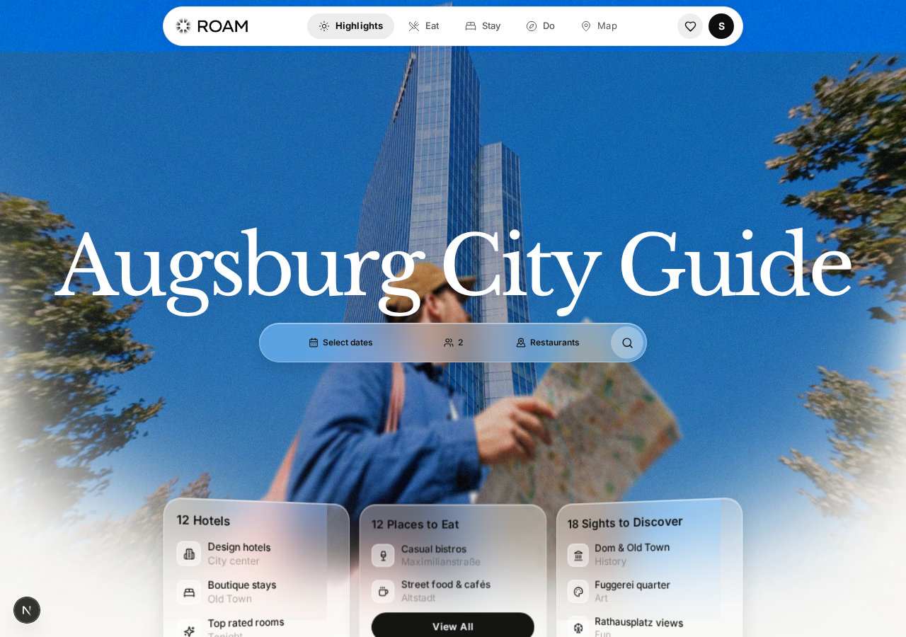
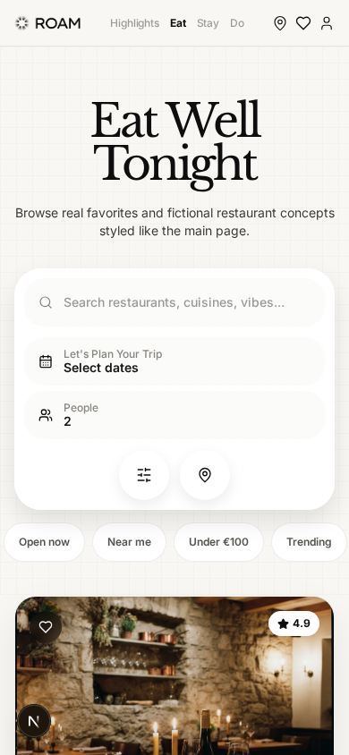
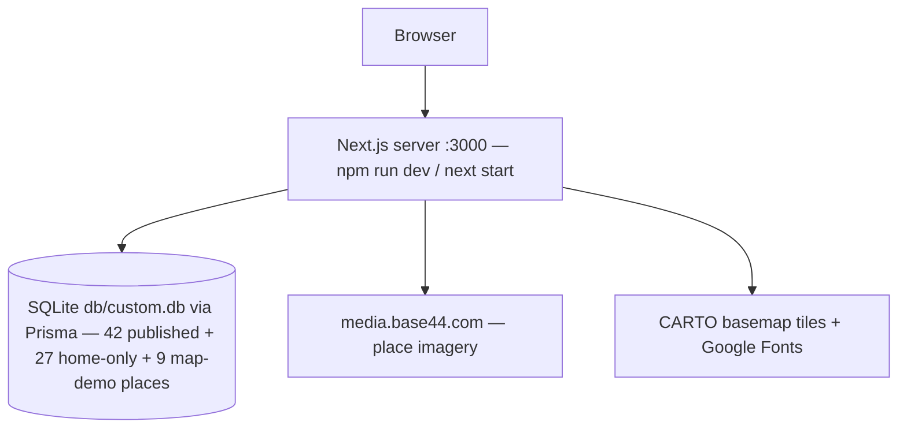

# ROAM — Augsburg City Guide


A production-grade, self-hosted clone of the reference trip-planning app at `activity-map.base44.app` — rebuilt as a single Next.js application with cookie-session auth, a full browse → detail → booking flow, an interactive map, and the 42 real places captured from the live app.

## Overview

The reference app is an Augsburg city guide: a photographic hero with a frosted glass trip-planner pill (hover-revealed labels, a react-day-picker-style date-range popover, and a search that routes into the category browses with `people`/`start_date`/`end_date` params), glass category cards, the scroll-driven **Recommended Route** itinerary, a blue **Highlighted Restaurants** band with a featured card and restaurant strip, the full **Choose Your Vibe** stay showcase, the **Highlighted Sights** grid, three category browses (Eat / Stay / Do) with search, measured filter chips, and a sticky white planner pill, redesigned place detail pages with a booking-request form, a Leaflet map over the whole city (9 demo places, as on the live app), favourites, and a redesigned profile with trips and bookings — all behind an email/password login. This repo reproduces that experience end-to-end — with ONE deliberate divergence: visits are LOGIN-FREE (a fresh visitor is auto-signed-in as a seeded guest account; the reference app's login wall is not reproduced — and v2.18 keeps DEEP LINKS working through the sign-in: a shared `/place/<slug>` URL returns the first-time visitor to that place, not the home page) — same visual design tokens (re-measured session 3: cream `#F8F7F4`, ink `#0E0E0E`, violet `#571AFF`, Libre Baskerville display serif + Inter for UI and nav), same filter semantics, same entity data, but running locally as a standalone Next.js 16 server with a Prisma/SQLite store and zero external services.

| Desktop home | Mobile browse |
|---|---|
|  |  |

Twenty-two dev-server captures live in [`docs/screenshots/`](docs/screenshots/) (re-captured session 72 on the v2.31 remediated tree — the earlier 66-capture set was deleted by the operator's cleanup commit, session 35 re-captured 16, session 36 refreshed them after the dep-hygiene/audit-override remediation, session 46 refreshed them after the deep-link gate remediation, session 48 after the booking-classification remediation, session 50 after the identity/avatar re-alignment, session 51 after the login-stay + anonymous-identity + title remediation, session 54 after the booking-picker remediation, session 56 after the picker-chrome re-alignment, session 58 after the profile-glass + browse-shell re-alignment, session 60 after the Carto-map route + 3D-fan cards remediation, session 62 after the staggered-fan stay grid + responsive hearts remediation, session 64 after the CARTO-key + fan-ramp remediation, session 66 after the /map basemap + view-model + search-semantics remediation, session 68 after the /map frame + events-chip + search-status-pill remediation, session 70 after the browse-pill + zero-state + card-order remediation): the desktop home (hero + planner + **the v2.25 3D-fan category cards**), the four home sections (**route with the v2.25 CARTO tile map — the v2.27 keyed tiles render the real basemap, no watermark — split-color progress pill, and graph-paper waypoint panel**, blue restaurants band, stays vibe — **the v2.25 badge-free home stay cards + the v2.26 STAGGERED FANNING grid (the dedicated 20-capture: the outer cards at ±6°, the middle column raised)**, sights), Eat, Stay, map (**the v2.28 keyed light_nolabels basemap at the live's fitted z15 — the same minimal style family as the route map, was Voyager — now in the v2.29 white 32px-radius frame with the top-right "0 events · N places" chip; the dedicated 21-capture: the SEARCH-ACTIVE shell with the violet "Searching for garden-related options in Augsburg." status pill; the dedicated 22-capture: the v2.30 search-resolved ZERO state — the live's white "No places found" card**), place detail, **the booking form's date-range calendar + 29-slot time-picker popovers (the v2.22 picker contract + the v2.23 chrome alignment — the month row with the calendar icon at its end, the bold uppercase weekday row + the v2.25 stay-form "Preferred Check-In Time*" label)**, favourites, profile (the "sepnetflix2023" identity with a same-day reservation under Upcoming — the v2.24 glass refresh: the transparent blurred card spanning 896px, the 55px mobile h1, the 18px tabs), the grown 646×118 desktop footer pill (the session-33 scroll-linked contract), the mobile home + Eat views with the shrink-wrapped 390px tab-bar (**the v2.26 44px tap targets**), the mobile map (**the v2.28 FIXED 356×310 canvas at the fitted z13**), the login card, and the GUEST profile (the v2.21 anonymous identity — h1 "Explorer" + the static "Your Roam account" line). Captured via `scripts/capture-screens-session72.mjs` against `npm run start`.

## Key Features

| Feature | Description |
|---------|-------------|
| 🧭 **Home, re-measured + remediated (sessions 3 + 6 + 10 + 22)** | Taller traveller-photo hero (591px phones / 900px-md / 938px-lg; session-22: the photo BACKDROP is absolute, bleeding 86px above the section top at md+ — the 1010px cover-cropped box at 1280 matching the live's more-zoomed framing — with the in-flow content layer carrying the heights and the photo sliding under the transparent sticky header at md) with the huge Libre Baskerville wordmark at the live's measured positions (h1 y≈203 mobile / y≈290 desktop, the 126px mobile planner gap), the white elevated PLANNER CARD below md (radius 30, gray field pills, "Let's Plan Your Trip"; the frosted glass pill from md), and the THREE GLASS CATEGORY CARDS riding the photo's bottom edge — **session-60 (v2.25): the 3D FAN — the desktop row carries `transform: scale(1.15)` with each card in a `perspective-800px` slot and the inner card tilting rotateY(±18°) (flattening on hover, 0.5s cubic-bezier(0.22,1,0.36,1)); the sliding row deck carries the View All pill as its 4th 36px item (violet on phones / #141413 from md) hidden behind the 124px window's `clip-path: inset(0px)` at rest and revealed by the hover `-44px` deck slide + the expanded `inset(0px -36px -36px)` clip; the cards run bg 0.34/0.58, blur 28 + saturate 160%, radius 20 at both breakpoints** — a horizontal SNAP CAROUSEL of 306px cards on phones (all four deck items visible) and the centered 263px fanned card row from md |
| 🗓 **Recommended Route** | The scroll-driven itinerary — 140vh heading trap (session-60: the pinned h2 overlay is min-h-screen and **FADES OUT across ~178px of scroll from the section's top** — the heading is gone by the time the map pins); below lg: a 220vh trap pins a FULL-VIEWPORT **CARTO TILE MAP** (session-60: the svg `viewBox 0 0 1500 1500` carrying 25 `light_nolabels` z14 tiles — the 8697-8701 × 5642-5646 grid, 502px cells, every href carrying the v2.27 CARTO key via `src/lib/carto.ts` since the provider deprecated anonymous raster access — plus the dashed base path `rgba(20,20,19,0.15) w5 dash 10 8`, the solid #141413 progress path, five cream waypoint circles r13, and the ink r7 head dot; the mobile map does NOT pan and has no progress chip) BEFORE the five TEXT stop cards flow (the panel pulls up −12vh; white time pill px-3/py-1 12px/400 + per-stop icon + dark serif 44px title + white rounded-28 max-w-md info card with the 20px/600 h3 place title + 13px #72706A inline meta — the City Gallery's meta carries the "· 90 min" duration note — + the 13px/600 black Learn More); from lg: a **416.65vh trap** with a 50/50 split — the panning CARTO map pins LEFT (the g translating `750−headX, 750−headY` to keep the head dot centered) with the **SPLIT-COLOR progress pill at bottom-24** (the violet fill sweeping right under the dark text clipped to the unfilled right + a white duplicate clipped to the filled left) while the stop cards ride the right half (bg #F8F7F4 + the 18px graph-paper overlay at 0.42 opacity, radially masked), CENTERED on the panel's middle (top-1/2 + translateY(-50%+offset), 576 wide, the City Gallery's 90-min note) translating CONTINUOUSLY with scroll: card i crosses the center at progress i/(N−1), every card moves at 0.665px per scroll px, tent-fading ±380px with 120ms linear transitions (the live's scroll-linked choreography) |
| 💙 **Highlighted Restaurants** | The vivid blue band (`#4D61FF`): desktop = a scroll-driven carousel over a 460vh trap — session-29 re-measure: a sticky CENTERED heading column (the h2 `clamp(46px,7vw,104px)` + the white View All pill below at gap 24) that FADES OUT through the first ~45% of the trap, a centered FIVE-NAME sliding window (uniform Inter `clamp(24px,2.6vw,40px)` 400 at gap 34 — the active solid white, the rest white/0.32), tilted floating photos, and one COMPACT frosted-glass detail card (min-w 330 at bottom 9vh: the address line + the centered €·★·rating meta + two flex-1 h-38 buttons — NO name) that fades IN as the heading fades out; the band RISES over the route trap's tail (`lg:-mt-[800px]`); mobile = a STICKY STACKING deck (session-26) of the FIRST SIX restaurants, each card pinning at y≈88 with 620px advances (the live implements the same pin via its own JS transforms) |
| 🛏 **Choose Your Vibe** | The full twelve-stay showcase (session-12 order: the live's shuffled home sequence — Courtyard Stay first, browse order untouched) as SQUARE photo cards (aspect 1/1, radius 24, white Inter 18px dsk / 24px mob titles overlaid, "€€€ · ★ rating" meta, ghost Learn More + white Book Now pills — **session-60: the home variant's white star-rating badge is GONE, the rating survives only in the meta line; the /stay browse variant keeps its badge**) — session-14: the grid fills COLUMN-MAJOR from md (the live's 3 columns × 4 stacked cards, so visual row 1 reads Courtyard | Maison | Velvet) over the bare 1178px grid (no container padding) at an 18px gap → 381px cards, under the big serif heading — session-12: FULL-WIDTH LEFT-ALIGNED at #1A1A1A with the live's per-letter scroll reveal (cream → ink, LetterReveal) and the 14px #8A8780 centered subtitle. **Session-62 (v2.26): the grid became a STAGGERED FANNING grid on md+** — three explicit `li[data-fan-col]` column wrappers whose MIDDLE column rises with scroll (translateY → −0.2 × the column height × p, p the grid's plain viewport traversal `(vh − top)/(vh + gridH)` — session-64: the live's ramp carries NO inset, zero at top≈vh; −315px at 1576 settled) while the outer cards fan `rotate(∓6°) + translateX(∓38px)` about their bottom-LEFT corner, each phased by its own viewport traversal (`(vh − top)/(vh + height)` — the row pitch staggers the cards so the tops settle first; rAF-throttled, transform-immune geometry reads via the positioned ul's offsetTops; phones stay FLAT — the whole effect is md+ only). The card hearts went RESPONSIVE (SaveButton: 44px h-11 below md / 36px w-9 from md — every surface: home, browses, detail hero) and the typography became variant-specific (home: lh 1.5 on the h3 + 18.6px/18px meta; browse: leading-tight + 16px md meta). The showcase image parallax is DESKTOP-ONLY (phones compute transform: none — the 118% fill is pure layout) |
| 🏛 **Highlighted Sights** | Six calm stops (Fuggerei → Schaezlerpalais) as square photo cards with white overlaid titles (24px mob / 18px dsk), in-card meta overlays, heart + rating pills, and the dark More Things to Do hand-off (session-8) |
| 🔍 **Trip planner (shared + browse)** | `TripPlanner` + `DateRangePicker` (Su–Sa popover, from/to optional, `DD/MM/YYYY — DD/MM/YYYY`): the home hero's search routes to `/eat|/stay|/do?people=N&start_date=…&end_date=…` (Hotels → `/stay`, Attractions → `/do`); the browse pages render the unified `BrowsePlanner` (session-8) — inline search + labelled date/people fields that AUTO-FORWARD the params back to the same browse — pure helpers unit-tested in `src/lib/planner.ts` |
| 🍽 **Eat / Stay / Do browses** | Server-rendered grids of the 42 captured places with live search and **data-measured filter chips** (session-12: compact 38px/12px pills; eat: Open now / Near me / Under €100 / Trending + cuisine tags; stay & do: the entities' own tags) that AND-compose, under the unified browse planner (session-8: one white card on phones / one sticky white pill from md — inline search + labelled date/people fields that auto-forward + two circular icon actions). Session-14: the heading block matches the live's measured geometry — the page runs `px-4 pt-16 md:px-8 md:pt-24` (h1 y≈168) with the heading in a full-width max-w-7xl block and the subtitle 14px #3A3A3A. Session-18: the live's heading became a FULL-BLEED textured block — the 18px graph-paper grid overlay at 40% opacity now wraps the heading + the planner + the chips (section h≈385–394 at 1280), with the chips row bleeding to the section edges. Cards re-measured session 3: eat/do names overlaid on 300px-mob/372px-dsk photos (28px Inter, tracking −0.04em) with tag pills, violet `#571AFF` Learn More, and ACTIVE+DIMMED price symbols; stay cards are dark `aspect-square` composites with ghost Learn More + white Book Now on hover; date-range params filter the grids. **Session 70 (v2.30): the browse planner rebuilt to the live's pill model — the search pill is `min-h-[54px]` (the old `h-[54px] md:h-auto` collapsed it to the 20px input floor at desktop) with the 1px black/5 hairline, the inset white highlight, px-5 and `rounded-[22px]` phones / full pill at md; [date, people] wrap in ONE `relative z-50 flex flex-col gap-2 sm:flex-row` block (the date pill min-w-238, the people min-w-108) so the search pill lands at the live's exact 720px; the grids open on the live's current card order (the seed re-ordered — the sets unchanged). Session 72 (v2.31): the search INPUT re-aligned to the live's computed model — 44px below md but CONTENT-DRIVEN ~20px at md+ (`h-11 md:h-auto`, safe under the pill's min-h-54), the typed text at font-weight 400 in #141413 (no font-medium), the ::placeholder overriding to 500 + black/40** |
| 🏛 **Place detail + booking request** | 50.7px-mobile→82px-desktop h1 (session-6 scale), "About this place" (34px, session-8) + tag pills, gallery, rating (session-8: the white rating pill rides the hero photo's top-right corner — no Map button; 260px-mob/420px-md/460px-lg photo; session-10: ONE wide white card `max-w-6xl` rounded-36, shadow-only, no border; session-14: the card's inner padding p-6 → md:p-10), highlights, and the booking-request form (Name*, Surname*, Dates, Time, Phone, Email*, Message → `Book Now` violet 48px) posting to `/api/bookings`. Session-18 restructure: the live ended the rounded-36 card AFTER the hero photo — the hero heading/photo block is now a FULL-BLEED textured section (the 18px graph-paper overlay, px-4 pt-4 → md:px-8 md:pt-6), and "About this place" + the form moved BELOW the card into a separate two-column grid (`gap-6`, `lg:grid-cols-[1.2fr_0.8fr]` — the live's 60/40 split); the form renders as its own `aside` card (rounded-28, black/8 hairline, no shadow, p-6/md:p-8) leading with the 18px "Book Now" h3 + the 14px #888580 request subtitle, SINGLE-COLUMN 44px fields with **16px corner radii** (session-18: the live moved off rounded-full); request fields persisted on the `Booking` model and bookings visible on the profile. **Session-53 (v2.22): the Dates/Time fields are the live's PICKER-TRIGGER BUTTONS + POPOVERS** — 44px rounded-2xl triggers ("Choose dates"/"Choose time", the calendar-days/clock icon + a rotating chevron) opening the shared popover chrome (cream, r-24, hairline, `0 20px 48 /0.14` — phones UP / md+ DOWN): the DATE-RANGE calendar (a month select of the current month + 11 forward, the S M T W T F S row, the 42-cell Sunday-first grid with past days disabled, violet range endpoints, `#F0E9FF` in-range days, "Thu 15 Oct — select end date" → "Thu 15 Oct — Sat 17 Oct") and the 29-slot TIME list (08:00→22:00, the selected slot violet + check). The POST sends the range's own `startDate`/`endDate`; the success note is the live's plain centered 12px/600 `#2A6B3A` line ("Your booking request for <place> has been sent.") and the form resets. Pure logic in `src/lib/booking-picker.ts`. **Session-55 (v2.23): the picker chrome re-aligned** — no aria-label/aria-expanded on the triggers (the label-derived "Dates*"/"Time*" names), the month row's `relative flex-1` wrapper (font-bold select + the absolute pointer-events-none chevron) + the calendar icon at the END, the bold uppercase 1.2px-tracked weekday row, the 0.12 hover shadows, the form's font-inter. **Session-60 (v2.25): the time field's label is category-aware — the STAY forms read "Preferred Check-In Time*" (eat/do keep "Time*")** |
| 🗺 **Interactive map** | Leaflet map with CARTO basemap (**session 66 / v2.28: the keyed LIGHT_NOLABELS tiles — the live's /map tile style measured for the first time (light_nolabels/15/...), the SAME minimal family as the route map; was Voyager — plus the live's FITBOUNDS view model: fitBounds(9 places, {padding: [40, 40], maxZoom: 15}) so the zoom is viewport-dependent (z15 @1280, z14 @640, z13 @390 — the live's exact table), the 9-pin bounds centered, the view RE-FITTING on every filter change (the Hotels pill climbs 390 z13 → z14), maxZoom 18 with the z0 floor, and the mobile canvas a FIXED 356×310 (not a vh model) — `src/lib/carto.ts` appends the operator's `?key=` so the real basemap renders since the provider deprecated anonymous access**) fed by the 9 demo places the live app hardcodes (status `"map"`, real lat/lng, `map-*` slugs): 12px black dot markers with white rings and hover-revealed name-label pills (session-30: clicking a pin navigates directly to the place page — no popup, no violet active state; the circular zoom pair renders as two separated 34×34 buttons), the session-12 chrome — the FULL-WIDTH cream search pill (max-w 1138, border black/5) with the violet icon cell + round filters button, 41px/12px category pills WITH icons (violet-tinted active), circular zoom controls, the 620px desktop canvas (**session 68 / v2.29: the live's WHITE FRAME — `rounded-[32px]` desktop / 28px phones + `border-white/70` + `bg-white` + the `0 18px 44px /0.10` shadow, the frame box 1216×622/358×312 so the inner canvas is 1214×620/356×310 EXACT, and the top-right IN-CANVAS "0 events · N places" status chip — a white rounded-full pill with the 6px ink dot, updating with every filter; the mobile search pill fixed to the live's 48px with the 44px input — the old `flex-1` collapsed it to 34px on phones; session 72 / v2.31: the input is `h-11 md:h-auto` — 44px below md, content-driven ~20px at md+, safe under the row's h-12 — with the typed text at weight 400**), bottom stats pills (Augsburg center / N places / € pricing — session-29: plain white, NO shadow), geolocation notice with Augsburg fallback, "Places on the map" list section (session-16: FOUR-row TEXT-ONLY white cards — radius 24, black/8 hairline, no photos — with the eyebrow + €-price on ONE justified row, the 15px/600 title, and the 12px #888580 neighborhood line; session-29: the eyebrow renders as a CREAM PILL (bg #F8F7F4, full radius, pad 4/10 — 26px tall) and the neighborhood line carries a 12px MapPin icon; the do-places carry their SUB-CATEGORY as the eyebrow — LANTERN WALK / ROOFTOP MUSIC / ART WORKSHOP — and the list follows the live's interleaved order: Brass & Marble first, the grid at a 12px gap; **session 66 / v2.28: the list-header COUNT CHIP — the bare count in a white rounded-full px-3 py-1.5 12px/600 pill on the right of the header row + the "No places" 0-result state**), **the v2.28 SUBMIT-DRIVEN search (the live's model: typing never filters — Enter submits; a pill click filters within the visible set with the empty-intersection FALLBACK to the pill-only set — the query resets, the input text stays stale; a query submitted with a pill active is pure AND and can render 0; the 28px clear button resets both)** — **session 68 / v2.29: the live's search STATUS PILL — submitting a query renders a violet pill inside the shell card below the search pill (the live's deterministic pending template "Searching for {query}-related options in Augsburg." + the 11px sparkles icon, bg #F0EAFF, border #D8CAFF, radius 12, 12px/600 #571AFF — the live's resolved text is LLM-generated, non-replicable) and the card RESTRUCTURES to a column [search, status, filter] while the query is active (the desktop card grows 66 → 164)**, and the search-resolved ZERO state renders the live's WHITE "No places found" card (rounded-28, py-14, 20px Libre Baskerville ink — session 70 / v2.30; the plain muted line remains the no-query zero), and popups linking into place pages |
| ❤️ **Favourites** | One-tap save/unsave on cards and detail pages (the 44×44 dark-glass heart, session-10), with a dedicated Favourites view (session-12: the 18px graph-paper grid texture at 40% opacity — session-14: scoped INSIDE the overflow-hidden heading section (the live's texture covers the heading block only), 55px serif heading riding the pt-16/md:pt-24 block (h1 y≈244), the 14px #3A3A3A subtitle, the live's Inter empty state) and an illustrated empty state |
| 👤 **Profile** | Session-16: a CHROME-LESS page (the `(bare)` route group — no navbar at any breakpoint, no footer, exactly like the live) carrying a FULL-PAGE fixed 18px graph-paper grid overlay at 40% opacity, the outer block `px-5 pb-24 pt-10 md:px-8 md:pt-16` with the main at max-w-4xl, and the translucent white/80 Go back + Sign out pills at the top. TWO glass cards (896px): the identity card (rounded-36, bg-white/78, border-white/70, CENTERED on phones / left from md) with the Profile eyebrow, the account identity as the h1 (session-50: the account NAME "sepnetflix2023" — 72px serif, the live's current authenticated identity) with the STATE-DEPENDENT 16px #555550 subtitle line (v2.21: the account EMAIL for real accounts; the static "Your Roam account" line for the guest — the live's anonymous identity), the cream outlined Augsburg / sun-icon 0-day-streak / heart-icon Explorer chips, and the dark heart Saved-places button into /favourites; the bookings card (rounded-32, mt-8) with the Trips eyebrow, the 36px "My bookings" h2 + total count, FULL-WIDTH 44px/12px Upcoming/Past tabs (session-48: CALENDAR-DAY classification — a reservation for tonight stays under Upcoming until its day ends, via the pure `isBookingPast` seam), 38px All/Eat/Stay/Do filters, and the white rounded-26 empty state |
| 📄 **Legal pages** | Privacy policy and Accessibility Statement (the footer's measured links), rendered as real public routes — and the white icon-cell footer pill renders on EVERY app page (session-6 live parity) |
| 🔐 **Cookie-session auth, guest-first** | scrypt password hashing + HMAC-SHA256-signed stateless cookies, login rate limiting (10/IP/15 min), and the LOGIN-FREE first visit: the auth-gated route groups redirect session-less visitors through the guest bootstrap (`GET /api/auth/guest` — provisions/uses the seeded guest account `guest@roam.local`, signs the session cookie, 303s back to a sanitised path via a RELATIVE Location — origin-agnostic behind any reverse proxy, v2.17), while the live-parity login card stays available at `/login` for the demo account (session-10: a plain white page — session-12: the document body pinned white too — with the shadcn-style card, the circular logo disc, system-font heading, Mail/Lock input icons, and the slate-900 `#0F172A` Sign-in button; the Google/forgot/signup flows answer with inline notices) |
| 📱 **Mobile-first chrome** | Measured 390px fixed-top cream-glass tab-bar (52px, ≤430px centered, text-only 12px Inter links — active 700/`#0E0E0E`, inactive 500/40%, three 18px right icons: MapPin/Heart/User; the home hero slides under the glass). Session-16: the mobile home planner card escapes the px-6 hero content — 358px wide at x=16 with a 4px grid gap (the live's measured geometry) that becomes the sticky transparent header wrapping the centered WHITE floating PILL (h-14, max-w 820, radius 999, 1px `#E8E6DC` border, soft shadow, 13px icon+text links with the active link 700 on the `rgba(14,14,14,0.08)` pill, heart + black avatar disc right cluster (session-50: the disc renders the EMAIL-DERIVED "S" initial — the white 14px/700 Inter letter, the live's current contract; every nav icon renders stroke-width 2 and the desktop heart disc a 17px glyph), hide-on-scroll choreography) from `md` up — regression-pinned by E2E against the five known Tailwind v4 mobile-nav failure classes |

## Architecture

| Layer | Technology | Version | Purpose |
|-------|-----------|---------|---------|
| Web framework | Next.js (App Router) | 16 | Pages, API route handlers, server components |
| UI runtime | React | 19 | Server components by default; 21 client components |
| Language | TypeScript | 5 (strict, `noImplicitAny` off) | Type-safe app + typed API DTOs |
| Styling | Tailwind CSS | 4 (CSS-first, no config file) | `@theme` tokens + `@utility` primitives |
| Fonts | Libre Baskerville + Inter | — | Serif display + UI/nav sans (Google Fonts; Poppins was removed by the live app's session-3 redesign — `.font-poppins` now maps to the serif) |
| Map | Leaflet + react-leaflet | 1.9 / 5 | Map view, `ssr:false` dynamic mount |
| ORM | Prisma | 6 | Schema, client, seed |
| Database | SQLite (PostgreSQL switchable) | — | Zero-config local store |
| Unit tests | Vitest | 6 | 117 checks on the pure seams (db-path, filters, planner, auth cookies, guest bootstrap incl. the origin-agnostic relative Location + the v2.18 deep-link `guestBootstrapUrl` contract, the v2.19 calendar-day booking classification, the v2.20 email-derived avatar initial, the v2.22 booking-picker seam — the 29 time slots, the range labels/values, the 42-cell calendar grid, the month options — and the v2.27 CARTO-key seam) |
| E2E tests | Playwright | 1.63 | Production `next start` on :3100 with its own seeded SQLite file — 120 checks incl. the v2.21 title sweep + login-stay pins + the v2.22 booking-picker contracts + the v2.26 staggered-fan/heart/parallax pins + the v2.27 keyed-tile + no-inset-ramp pins + the v2.28 /map basemap/fitBounds/search-semantics pins + the v2.29 /map frame/events-chip/status-pill/mobile-search-pill/gap pins + the v2.30 browse-pill/zero-card/card-order pins + the v2.31 input-weight/height-model pins |
| Runtime | npm / Node.js | ≥20 | Install, dev, seed, server |



## File Hierarchy

```
📂 src/
 ┣ 📂 app/
 ┃ ┣ 📂 (app)/            ← auth-gated route group (layout redirects session-less visitors to the guest bootstrap)
 ┃ ┃ ┣ 📄 page.tsx        ← Home: hero + planner + category cards + Recommended Route
                             + blue restaurants + stay showcase + sights + footer
 ┃ ┃ ┣ 📄 eat|stay|do/    ← Category browses (server components, searchParams-aware)
 ┃ ┃ ┣ 📄 place/[slug]/   ← Place detail + booking-request form
 ┃ ┃ ┣ 📄 map/ favourites/ profile/
 ┃ ┣ 📂 api/              ← health, auth/*, places, places/[slug], favourites, bookings
 ┃ ┣ 📄 login/            ← Real login route (public)
 📃 privacy-policy/ accessibility-statement/ ← Public legal pages (the live's routes; the legacy /privacy + /accessibility redirect)
 ┃ ┣ 📄 globals.css       ← Tailwind v4 @theme tokens + @utility primitives
 ┃ ┗ 📄 layout.tsx        ← Root layout, fonts, metadata
 ┣ 📂 components/         ← Navbar + SiteFooter + LegalPage, Hero, CategoryCards,
                          RecommendedRoute (sticky scroll), HighlightedRestaurants,
                          StayShowcase, HighlightedSights, CategoryExplorer, PlaceCard,
                          StayCard, planner/ (TripPlanner + DateRangePicker), BookingForm,
                          MapExplorer + LeafletCanvas, FavouritesView, ProfileView, LoginForm
 ┣ 📂 lib/                ← auth, db, db-path, filters, planner, places
                          (listHomePlaces + listMapPlaces), rate-limit, utils
 ┗ 📂 types/              ← PlaceDTO / BookingDTO / PlaceCategory
📂 prisma/                ← schema.prisma, seed.ts, data/{eat,stay,do,home,map}.json
                              (captured entities + home-only showcase rows + 9 map-demo places)
📂 tests/                 ← db-path + filters + guest (Vitest), e2e/ (Playwright: guest, auth, browse, home parity, mobile-nav)
📂 scripts/               ← smoke-test.sh (31-check API suite incl. the guest bootstrap + the deep-link gates)
📂 docs/                  ← DEPLOYMENT.md, remediation-plan.md, Tailwind-V4-Validation-Report.md,
                              screenshots/ (14 captures), SSH push runbook
```

## Quick Start

Requires Node.js ≥20 and npm.

1. Clone and install:

    ```bash
    git clone https://github.com/nordeim/activity-map.git
    cd activity-map
    npm install
    ```

2. Configure and seed the database. The SQLite file lives at `db/custom.db`
   (repo root). `DATABASE_URL="file:../db/custom.db"` is resolved against
   `prisma/schema.prisma`:

    ```bash
    cp .env.example .env
    npm run db:push     # apply the schema (no migrations folder)
    npm run db:seed     # 78 places (42 published + 27 home-only + 9 map-demo) + the demo user + the guest user
    ```

3. Start the dev server:

    ```bash
    npm run dev
    ```

**Verify setup:** open `http://localhost:3000` → you land straight on the Highlights page — no login: the first visit is auto-signed-in as the seeded guest account (`guest@roam.local`, visible as "Explorer" + the static "Your Roam account" line on `/profile` — the live's anonymous identity, v2.21) — and the page renders the traveller-photo hero, the glass planner (pick dates in the popover, then Search → `/eat?people=…&start_date=…`), the glass category cards, and the full home showcase (sticky route, restaurants, stays, sights). Optional demo login: navigate to `/login` and sign in with `sepnetflix2023@outlook.com` / `$Abcd1234`.

## Environment Variables

| Variable | Required | Purpose |
|----------|----------|---------|
| `DATABASE_URL` | Yes | `file:../db/custom.db` (relative URLs resolve against `prisma/schema.prisma`) or a PostgreSQL string — see `.env.example` |
| `AUTH_SECRET` | **In production** | HMAC key for session cookies; generate with `openssl rand -hex 32` |
| `NEXT_PUBLIC_SITE_URL` | No | Reserved canonical-origin slot |
| `NEXT_PUBLIC_CARTO_KEY` | No | CARTO Basemaps API key — unset falls back to the committed key (`docs/carto_key.txt`), which `src/lib/carto.ts` appends as `?key=` on every tile URL (the home route map + the /map light_nolabels layer) since the provider deprecated anonymous raster access |

## Testing

| Layer | Command | Checks | Notes |
|-------|---------|--------|-------|
| Unit | `npm test` | 117 | Vitest — db-path (including Postgres-URL pin to SQLite), filter semantics, planner helpers, cookie Secure flag, password hashing, guest bootstrap (identity, never-guessable guest password, create-or-reuse, open-redirect guard, the v2.18 deep-link `guestBootstrapUrl`, session tokens, route handler, origin-agnostic relative Location), the v2.19 calendar-day booking classification (same-day stays Upcoming), the v2.20 email-derived avatar initial, the v2.22 booking-picker seam (time slots, range labels/values, the 42-cell grid, month options), and the v2.27 CARTO-key seam (the default key + the `?key=`/`&key=` URL builder) |
| E2E | `npm run build && npm run test:e2e` | 120 | Playwright drives `next start` on :3100 with its own seeded SQLite file (`db/e2e.db`) — incl. the login-free first visit + the v2.18 deep-link pins (fresh /eat, /map, /place/<slug> visits return to the deep link) + the v2.22 booking-picker contracts (trigger buttons, popover chrome, range semantics, the 29-slot time list, the success note + reset) + the v2.26 stay-grid fan/heart/parallax/typography pins + the v2.27 keyed-tile pins (the route's 25-tile grid + the Leaflet basemap) + the no-inset mid-ramp fan pin + the v2.28 /map pins (the light_nolabels style, the fitBounds zoom table 15/14/13, the bounds-centered pins, the maxZoom 18 cap, the Enter-submitted search, the pill-click empty-fallback, the re-fit on filter changes, the count chip + No-places state, the 28px clear button) + the v2.29 /map pins (the 32px white frame with the exact 620/310 inner canvas, the 0-events chip + its filter updates, the violet search status pill + the column-restructured card, the 48px mobile search pill with the 44px input, the pills→canvas gaps 32px desktop / 44px phones) + the v2.30 pins (the browse planner's 54px min-height search pill + the bordered inset-shadow chrome + the combined date/people block geometry, the /map search-resolved white "No places found" card, the live's current browse card order) + the v2.31 pins (the input's computed model: content-driven ~20px at md+ / 44px below md, typed text weight 400, placeholder 500 + black/40) |
| Smoke | `npm run build && ./scripts/smoke-test.sh` | 31 | Boots a fresh production server and exercises the whole API surface (incl. the guest bootstrap + the relative-Location + deep-link-gate assertions) |

The full pre-push gate is `lint → typecheck → test → build → smoke → e2e` (see `AGENTS.md`).

## API Reference

| Endpoint | Method | Auth | Description |
|----------|--------|------|-------------|
| `/api/health` | GET | — | Liveness probe |
| `/api/auth/guest` | GET | — | Login-free bootstrap: provisions/uses the guest account → session cookie → relative 303 to the sanitised `?next=` (default `/`) — origin-agnostic (v2.17) |
| `/api/auth/login` | POST | — | Credential check → session cookie (rate-limited: 10/IP/15 min) |
| `/api/auth/logout` | POST | ✔ | Clears the session |
| `/api/auth/me` | GET | ✔ | Current session payload |
| `/api/places` | GET | ✔ | Places with per-user `saved` flags (`?category=eat\|stay\|do`) |
| `/api/places/[slug]` | GET | ✔ | One place |
| `/api/favourites` | GET / POST / DELETE | ✔ | List / save / unsave |
| `/api/bookings` | GET / POST | ✔ | List / create (guests clamped server-side) |

All responses use the envelope `{ ok: true, data } | { ok: false, error }`.

## Design System

Re-measured from the live app session 3 (`src/app/globals.css` `@theme`):

| Token | Hex | Usage |
|-------|-----|-------|
| `--color-cream` | `#F8F7F4` | Page canvas (footer matches) |
| `--color-cream-deep` / `--color-surface2` | `#F2F1EE` | Raised cream surfaces, tag pills |
| `--color-ink` | `#0E0E0E` | Primary text, black buttons, map markers |
| `--color-secondary` | `#3A3A3A` | Body copy |
| `--color-muted` | `#888580` | Muted meta text |
| `--color-line` | `#E8E6DC` | Navbar bottom border |
| `--color-border` | `#DDDBD5` | Card hairlines |
| `--color-roam` | `#571AFF` | Learn More / Book Now accent, active map marker, selection |
| `--color-roam-deep` | `#4A0FE0` | Accent hover/pressed |
| `--color-electric` | `#4D61FF` | The home "Highlighted Restaurants" blue band |

Typography: **Libre Baskerville** (serif display — every h1/h2, with per-section `clamp()` scales measured at 1280/768/390) + **Inter** (UI sans AND nav links — the live app dropped Poppins in its session-3 redesign; the legacy `.font-poppins` utility now maps to Libre Baskerville), all via Google Fonts. VIEW ALL pills are near-black `#141413` on the glass category cards. Motion respects `prefers-reduced-motion`. Map markers are 16px black dots with a white ring (22px violet when active); popups follow the app's radius scale.

## Deployment

Single-process production build + SQLite — no Docker or external services required. Full guide (absolute `DATABASE_URL`, reverse proxy, updating, troubleshooting): [`docs/DEPLOYMENT.md`](docs/DEPLOYMENT.md).

```bash
npm run build
npm run start        # NODE_ENV=production next start (DATABASE_URL pinned inline)
```

## Project Status

| Phase | Status | Key Deliverables |
|-------|--------|------------------|
| Reference analysis | ✅ Complete | Live app explored; entity data captured (12 eat / 12 stay / 18 do); design tokens measured |
| Application build | ✅ Complete | Full route group, API surface, Leaflet map, auth, seed |
| Mobile navigation fix | ✅ Complete | Tailwind v4 failure classes addressed + E2E-pinned (5 classes, 8 checks) |
| Verification | ✅ Complete | lint ✓ typecheck ✓ 42 unit ✓ 54 E2E ✓ 27 smoke ✓ (session-12 gates) |
| Documentation | ✅ Complete | AGENTS.md, CLAUDE.md, README.md, Project_Architecture_Document.md, 14 screenshots |
| Session 2 remediation | ✅ Complete | Live-app parity pass — fonts/logo/hero, home showcase (route, blue restaurants, stays, sights, footer, legal pages), env pinning; gates re-verified (32 unit · 27 smoke · 35 E2E) |
| Session 3 remediation | ✅ Complete | Live-app re-measure (14 findings, `docs/remediation-plan-session-3.md`): tokens `#F8F7F4/#0E0E0E/#571AFF`, Poppins→Inter nav, flat-white desktop navbar + cream-glass mobile tab-bar, TripPlanner + DateRangePicker routing into browses, redesigned eat/do/stay cards, sticky-route redesign, booking-request form + schema fields, 9 demo map places, profile redesign; gates re-verified (42 unit · 27 smoke · 35 E2E) |
| Session 4 recovery | ✅ Complete | Interrupted-hand-off repair (`docs/remediation-plan-session-4.md`): restored the deleted `(app)` route-group layout (auth gate + Navbar), home page, and `/api/auth/login` route (orphaned duplicate at `/api/auth` removed); live-app parity re-verified (mobile 390px chrome matches reference); 14 screenshots refreshed; all gates green (42 unit · 27 smoke · 35 E2E) |
| Session 6 redesign parity | ✅ Complete | Live-app re-measure (`docs/remediation-plan-session-6.md`, findings F1–F14): desktop floating-pill navbar (13px links), mobile 12px nav links + white planner card, violet mobile VIEW ALL, pinned route card-swap with photo stops + black Learn More, blue restaurants carousel (desktop) + sticky card deck (mobile), square stay/sight cards with overlaid white Inter titles, icon-cell footer pill on every page, 50.7px typography scale, profile h1 = username, live-parity login chrome; hero wordmark clipping fixed; gates green (42 unit · 27 smoke · 45 E2E) |
| Session 8 evolution parity | ✅ Complete | Live-app re-measure (`docs/remediation-plan-session-8.md`, findings F1–F13): text-only route stop cards (photos removed) + early-pinned 576px swap over a 420vh trap, six-card mobile restaurant deck, per-letter scroll reveal on the Choose Your Vibe heading, 24px mobile stay/sight titles, dark More Things to Do pill, unified browse planner (card/pill with inline search + labelled fields + icon actions, auto-forward params), detail rating pill on the photo + 34px About + 260px mobile photo, 300px mobile browse photos, profile back/email/saved-button/icons, violet-tinted map pills + cream search + circular zoom + bottom stats; gates green (42 unit · 27 smoke · 52 E2E) |
| Session 10 residual-gap parity | ✅ Complete | Deep re-measure (`docs/remediation-plan-session-10.md`, findings F1–F9): category cards rebuilt to the live internals (263px glass cards, 28×28 glass icon cells, 12px/500 two-line rows, live icon set incl. Wine/Coffee/Palette/FerrisWheel, full-width 54px View All) + a mobile horizontal SNAP CAROUSEL (306px cards, scrollWidth 982); hero re-geometried to the live's measured positions (591/900/938px photo sliding under the transparent header, h1 y≈203/290, 126px mobile planner gap, cards flush with the photo bottom); login redesigned to the live's shadcn chrome (plain white page, circular logo disc, system-font heading, Mail/Lock input icons, slate-900 button, bottom forgot/signup row); favourites de-gridded (55px/0.92/−0.06em h1, Inter 20px/600 empty state); detail page widened to one max-w-6xl rounded-36 shadow-only card with the 420px-md/460px-lg photo tiers; profile Saved-places heart button; 44×44 heart overlays; route stops as h2; gates green (42 unit · 27 smoke · **54 E2E**) |
| Session 12 evolution parity | ✅ Complete | Live re-measure (`docs/remediation-plan-session-12.md`, findings F1–F9): the home stay showcase re-ordered to the live's shuffled sequence (Courtyard Stay first — the /stay browse order untouched); the profile redesigned into TWO glass cards (the account NAME "Explorer" as the 72px h1, "Your Roam account", full-width 44px/12px tabs, 38px filters, the white rounded-26 empty state); the map chrome widened (full-width 1138px bordered search, 41px/12px pills, 620px desktop canvas); the vibe heading went full-width left-aligned #1A1A1A with the 14px #8A8780 subtitle and the 1178px grid; the favourites grid texture restored (18px crossings, 40% opacity) with the 14px #3A3A3A subtitle; the login body pinned white (unlayered-rule workaround); browse chips compacted 38px/12px; category cards compacted 248px; gates green (42 unit · 27 smoke · **54 E2E**) |
| Session 14 deployed-mirror parity | ✅ Complete | The deployed mirror came back UP — first session to run browser E2E against `activity-map.jesspete.shop` (mobile nav + all pages verified, save round-trip E2E-proven) AND diff it against the live source (`docs/remediation-plan-session-14.md`, findings F1–F11): the profile identity re-rendered (USERNAME h1 + EMAIL line — the seed user renamed); the vibe stay grid switched to the live's COLUMN-major flow (381px cards, 18px gap, bare 1178 grid); the map list cards went TEXT-ONLY (radius 24, no photos); the browse/map heading block re-geometried (px-5/pt-16 → md:px-8/md:pt-24, max-w-7xl, 14px #3A3A3A subtitle); the booking form rebuilt (Book Now 18px heading, 14px #888580 request line, single-column 44px fields, hairline-only card, ≈56/44 detail split); the favourites overlay scoped to the heading section; the hero px-6; the sights grid 1120px; observed live-site bug: the hosted app's SavedPlace POST 403s; gates green (42 unit · 27 smoke · **54 E2E**) |
| Session 16 profile/map parity | ✅ Complete | Dual-site browser audit (`docs/remediation-plan-session-16.md`, findings F1–F11): the profile rebuilt as the live's CHROME-LESS page (the `(bare)` route group — no navbar/footer — with the full-page fixed 18px grid overlay, the live's outer geometry px-5/pt-10 → md:px-8/md:pt-16 + max-w-4xl main, centered-mobile identity, sun/heart chip icons, the Go back/Sign out white/80 pills); the map list cards rebuilt to the live's FOUR-row layout (eyebrow + price on one justified row, title, neighborhood line; do-places eyebrow = sub-category uppercase; the live's interleaved order — Brass & Marble first); the mobile planner card widened to 358px at x=16 (gap 4px); the category cards re-measured (desktop 46px rows + 34×35 icon cells + the View All hanging below the glass; mobile radius 24); gates green (42 unit · 27 smoke · **56 E2E**) |
| Session 18 texture/detail parity | ✅ Complete | Dual-site browser audit (`docs/remediation-plan-session-18.md`, findings F1–F8): the live's 18px graph-paper grid texture now rides EVERY heading section (the browse views + map + the detail hero — full-bleed relative sections wrapping the planner/chips too); the place-detail restructured to the live's split layout (the rounded-36 card ends after the hero photo; About + the form below in a separate `gap-6`/`1.2fr_0.8fr` grid; the form its own rounded-28 aside with 16px-radius fields); the mobile route pins a full-viewport winding-path visual (~208vh, no chip/timeline; rounded-28 stop cards with 30px titles); the mobile restaurants flow as a static list (~620px advances); the desktop blue band rises over the route trap's tail (`lg:-mt-[800px]`); the mobile page paddings matched at 16px; gates green (42 unit · 27 smoke · **56 E2E**) |
| Session 20 route-choreography parity | ✅ Complete | Dual-site browser audit (`docs/remediation-plan-session-20.md`, findings F1–F4): the live's route stop cards re-measured — the place name is now an h3 at **20px/600** (line-height 30px) with the 13px/400 **#72706A** meta line + the 13px/600 Learn More text + the max-w-md (448px) desktop link card with the lighter 0 8px 28px/0.08 shadow + the shadow-less px-3/py-1 time pill (12px/400, 14px clock); the desktop split rebuilt to **50/50** (the visual panel at 640px/1280, the stops column px-8 with the card SLOT at y≈237) with the live's **CONTINUOUS scroll-linked choreography** (cards translate up through the slot at i/(N−1) crossings, 0.665px per scroll px, ±380px tent crossfades, 120ms linear transitions — exiting cards rise OUT, never sink); the mobile panel re-padded `28px 18px 48px` with 28px gaps (cards 354@x18); gates green (42 unit · 27 smoke · **56 E2E**) |
| Session 22 hero-framing + nav-glass parity | ✅ Complete | Dual-site browser audit (`docs/remediation-plan-session-22.md`, findings F1–F5): the desktop hero photo FRAMING rebuilt — the backdrop is now absolute at every breakpoint, bleeding 86px above the section top and stopping 14px short of the bottom at md+ (the photo box spans page −86→924 at 1280 = 1010px, −86→886 at 768 = 972px — cover-cropped to the live's ≈7.7% more-zoomed crop; the in-flow content layer carries the 591/900/938 heights, the h1 keeps y≈203/290); the mobile-nav glass re-measured — `rgba(248,247,244,0.62)` + `backdrop-filter: blur(24px) saturate(1.5)` (was /60 + blur(20)); the letter-spacing deltas matched (nav links −0.01em mobile / +0.01em desktop, the route h3 −0.02em, the time-pill text +0.05em); gates green (42 unit · 27 smoke · **58 E2E**) |
| Session 23 footer + tab-bar + page-bottom parity | ✅ Complete | Dual-site browser audit — the mirror re-verified running the session-22 code (every page zero console errors, mobile nav end-to-end, favourites + booking round-trips) and the live re-measured with the footer swept for the first time since session 2 (`docs/remediation-plan-session-23.md`, findings F1–F4): the mobile tab-bar totals **52px border-box** (nav h-[51px] + the header's 1px border-b — was 53); the footer REBUILT as the live's compact shrink-wrapped GLASS pill (506×96 at md — border 1px `#E8E6DC`, `backdrop-filter: blur(40px) saturate(1.5)`, radius 28, pad 8px 10px, links 74×78 with 20px icons over 11px/600 labels; a 3-col grid + 350px width on phones) with the footer element owning pt-32/pb-24 mobile → pt-64/pb-56 desktop, the inner at max-w-5xl (1024), and the legal row a justify-between row from md (© 12px `#8A8780` left, Privacy/Accessibility right); the page-bottom chains matched (home card→pill 32 + pill→footer 0 desktop/22 mobile; eat/map/detail last-content→footer 96 at both breakpoints — the footer's `mt-8` removed); gates green (42 unit · 27 smoke · 61 E2E) |
| Session 24 filter-shell parity | ✅ Complete | Dual-site browser audit — the mirror re-verified running the session-23 code (every page zero console errors, mobile nav end-to-end, favourites + booking round-trips, every session-23 contract EXACT) and the live re-measured with the filter surfaces swept for the first time (`docs/remediation-plan-session-24.md`, findings F1–F10 — the live has evolved a "filter-shell" design system): the browse chips re-chromed (12px/**600**, the rgba(14,14,14,0.08) hairline, inactive #555550, the ACTIVE chip the SOLID VIOLET #571FF fill, `min-h-[44px]` phone touch targets — was 500/borderless/ink-active/fixed 38); the browse cards gained the live's FLOATING SHELL (article `rounded-[24px] md:rounded-[28px]` + hairline + `bg-white` + `shadow 0 18px 44px /0.08`; the heart disc corrected to 36px); the map search REBUILT as the live's sticky "command center" (sticky top-10 phones / top-96 md wrapping an r-30/r-34 glass shell — white/92 phones / white/78 md, the 1px white/70 hairline, `0 8px 22px /0.10` — carrying the original search pill + the 56/48px cream filter button, the pills below at 600 weight); the browse planner STICKY at BOTH breakpoints (top-10 phones / top-96 md, pad 10/6, solid white + white/70 hairline at md, h≈68); the mobile heading sections unified on the live's pt-112 contract (spacer 52 + `pt-[60px]` + `pb-[22px]` — h1 y≈112 browses/map / 188 favourites / the detail Back pill y≈112 at 36px); the favourites texture FULL-BLEED + the empty state shadowless; gates green (42 unit · 27 smoke · 66 E2E) |
| Session 25 login/legal/category parity | ✅ Complete | Dual-site browser audit — the mirror REDEPLOYED with the session-24 code and verified ALL GREEN by DOM signature (the chips/card shell/map command center/pt-112/heart disc/tab-bar 52 + zero console errors + the mobile nav end-to-end + the favourites & booking round-trips); the live re-measured with the longest-pinned surfaces swept (`docs/remediation-plan-session-25.md`, findings F1–F5): **the login** — the shadcn inputs are `text-sm` (14px, was 16px) and the whole "Need an account? Sign up" line is ONE button (the emphasized part a font-medium span); **the category cards** — the live renders its session-10 internals at md (36px rows, 28×28 cells) and SCALES the row `transform: matrix(1.15)`, so the clone now matches the VISIBLE contract (24px headers `md:leading-6`, 32×32 cells `md:h-8 md:w-8` with 15px svgs, `gap-3.5` 14px — cards at x 231/508/786 @1280, ≈215px tall, the View All pill hanging 49px past the card bottom); **the favourites empty card** is max-w-xl (576 centered @1280, was max-w-md/448); **the legal pages** moved to the live's routes `/privacy-policy` + `/accessibility-statement` (the legacy paths redirect) with the live's chrome (the ← Back home link 14px #8A8780, the 48px Libre Baskerville h1, 14px/28px #5F5C56 paras, no "Last updated" eyebrow, the live's verbatim texts); gates green (42 unit · 27 smoke · 67 E2E — a new legal-pages contract) |
| Session 26 footer/mobile-home parity | ✅ Complete | Dual-site browser audit — the mirror REDEPLOYED with the session-25 code and verified ALL GREEN by DOM signature (the login 14px inputs + the one-button signup row, the legal routes + redirects + chrome, the category cards 24/32×32/gap-14, the favourites empty 576, zero console errors, the mobile nav end-to-end, the favourites & booking round-trips); the live re-measured with the FOOTER swept below the session-23 pill + the mobile home sections swept systematically for the first time since session 20 (`docs/remediation-plan-session-26.md`, findings F1–F7): **the footer legal row** — a 1px black/[0.05] top hairline + pt-3/sm:pt-5 + mt-4/sm:mt-8, the footer's own `px-5` + **sm (640)** vertical-pad switch (not md), and BOTH the pill and the legal row capping at max-w-[390px] centered below md; **the mobile route heading** — the live hides the heading section below lg and pins the h2 INSIDE the trap (`absolute top-[68px]`, w min(92vw,360px), `clamp(38px,11vw,48px)` ≈42.9px at 390, lh 1.02, tracking −0.055em) with the trap at 220vh — the heading now rides the FULL trap scroll instead of vanishing mid-trap; **the mobile restaurant deck** — a STICKY STACKING deck again (each card `sticky top-[88px]`, 130px flow gaps, the later card sliding OVER the pinned earlier one; the deck pads 56/18/0); **the mobile showcase insets** — the stay grid px-[18px] (cards 354 @x=18) + the sights grid px-4 (358 @x=16), was full-bleed 390; **the category track** — pad 18/18 + gap-3 (12px) so the cards ride at y≈578, the mobile pill mt-2; gates green (42 unit · 27 smoke · **68 E2E** — the stacking-deck test rewritten + the route-heading/footer/insets/track contracts extended) |
| Session 27 route-stop/login parity | ✅ Complete | Dual-site browser audit — the mirror REDEPLOYED with the session-26 code and verified ALL GREEN by DOM signature (the footer legal-row hairline + sm: switch, the trap-pinned 42.9px route heading, the sticky stacking deck, the showcase insets, the category track, zero console errors, the mobile nav end-to-end, the favourites & booking round-trips); the live re-measured with the ROUTE STOP CARDS swept below the session-20 text-only contract + the login fields re-checked at every breakpoint (`docs/remediation-plan-session-27.md`, findings F1–F6): **the stop time pills** — the live re-added the soft shadow `0 8px 22px /0.06` + a 1px /0.1 hairline + a PER-STOP category icon (Coffee/Utensils/Palette/Martini/Leaf at stroke-width 1.8) + dimmer #3A3A3A text; **the stop link cards** — a 1px /0.08 hairline + the hover lift (translate-y + the deeper 0 18px 44px shadow); **the stop titles** — lh 1.1 + mb-2; **the meta rows** — a 14px map-pin svg leading separate 13px spans; **the Learn More hover** — violet #571AFF + its glow; **the login fields** — RESPONSIVE: `text-base md:text-sm` (16px below md) + the Sign-in button `h-11 sm:h-12` (44px below sm); gates green (42 unit · 27 smoke · **68 E2E** — the route-stop contract extended + the responsive login pinned at 390/640/1280) |
| Session 28 date-picker/stay-pill/booking-label parity | ✅ Complete | Dual-site browser audit — the mirror REDEPLOYED with the session-27 code and verified ALL GREEN by DOM signature (the coffee-icon time pill, the bordered link cards, zero console errors, the mobile nav end-to-end, the favourites & booking round-trips); the live re-measured with the TRIP-PLANNER DATE-RANGE POPOVER swept for the first time since session 3 + the home stay pills + the booking-form labels + the profile chips (`docs/remediation-plan-session-28.md`, findings F1–F4): **the popover** — 510px wide at desktop (100vw−32 at mobile) with pad 12 + the from/to header as a 2-col grid of SELF-CONTAINED 238×50 white pill fields (label 12px/500 #8A8780 + value 12px/600 #141413 + a 14px calendar icon INSIDE) + NO Done button + the month label 14px/500 + 28×28 nav buttons + 12.8px/400 #737373 weekdays + the selected day at weight 400 + the #F7F4FF/violet in-range days + the gray #737373 PREV-MONTH trailing-day buttons + a 40px row pitch; **the home stay pills** — 34px (was the session-6 41px override) + the Book Now gained a 1px white/[0.92] border; **the booking labels** — 12px/600 #3A3A3A with inline asterisks + the #DDDBD5 field borders; **the profile chips** — px-4; en-route fix: the hero content wrapper's z-10 CAPPED the popover's z-[30000] below the category section's z-10 (pointer-event interception) — the wrapper drops the z (DOM order keeps the content above the backdrop); gates green (42 unit · 27 smoke · **69 E2E** — the new date-picker contract) |
| Session 29 restaurant-band + map-card parity | ✅ Complete | Dual-site browser audit — the mirror REDEPLOYED with the session-28 code and verified ALL GREEN by DOM signature (the 510px date-picker popover with the self-contained from/to fields, zero console errors, the mobile nav end-to-end, the favourites & booking round-trips); the live re-measured with the DESKTOP RESTAURANT BAND swept as a whole for the first time since session 6 + the map list-card chrome + the stats pills + the detail rating pill (`docs/remediation-plan-session-29.md`, findings F1–F8): **the band heading layer** — a sticky vertically+horizontally CENTERED column (the h2 `clamp(46px,7vw,104px)` lh 1.02 tracking −0.055em text-center + the white View All pill BELOW at gap 24 — h 44, pad 0/24, 13px/600, tracking 0.02em) that FADES OUT through the first ~45% of the trap; **the names watermark** — a centered FIVE-NAME sliding window (2 before + the active + 2 after, circular wrap: Granary, Faro, VOLTA, Roux, Aura at rest) at uniform Inter `clamp(24px,2.6vw,40px)` 400, gap 34 — the active solid white, the rest white/0.32, the row centering AS A GROUP; **the featured card** — the compact centered model (min-w 330 at bottom 9vh, pad 16, r 28, bg white/0.08 + the 1px white/0.16 border + blur 18 + the 0 18 48 /0.35 shadow, text-center: the address 12px/0.04em white-0.56 + the centered meta gap 14 at 13px (€ + the 4px dot + ★★★★★ gold #F7D774 + the rating) + two flex-1 h-38 12px buttons — Book a Table white with the 1px white/0.28 border, Learn More white/0.08 — NO name inside) that fades IN as the heading fades out; **the map list card** — the eyebrow renders as a CREAM PILL (bg #F8F7F4, full radius, pad 4/10, 26px tall) + the neighborhood line carries a 12px MapPin icon + the grid gap 12px; **the map stats pills** — NO shadow; **the detail rating pill** — 61×32 (pad 8/12, the 14px star); gates green (42 unit · 27 smoke · **69 E2E** — the band contract reworked + the map/detail contracts extended) |
| Session 30 404-surfaces + map-pin/zoom parity | ✅ Complete | Dual-site browser audit (`docs/remediation-plan-session-30.md`, findings F1–F5): the two 404 surfaces swept for the first time + the map's pin/zoom chrome re-swept below the session-3/8 models — the place-404 rebuilt as the live's IN-APP design (`(app)/place/[slug]/not-found.tsx` — the 46px serif "Place not found" + the 44px ink "Back to Do" pill inside the app chrome); the generic 404 rebuilt as the platform's slate page (the 72px font-light "404" + the divider + "Page Not Found" + the quoted path + the white "Go Home" button, chrome-less); the map zoom controls re-chromed as two separated circular 34×34 buttons (Leaflet's joined 30px default pair was untouched — despite the docs' own "circular zoom" claim since session 8); the pin model rebuilt to the live's (12px ink dots with 2px white rings + hover scale 1.32 + hover-revealed white name-label pills — the 16px dot + 22px violet active state retired); the pin click navigates directly to the place page (the popup + the selected-place card + the "Tap a dot" hint removed as clone inventions); gates green (42 unit · 27 smoke · **71 E2E** — the new not-found spec + the map marker/zoom/navigation contract) |
| Session 31 hero vh-model + 404 hydration fix + vibe centering + showcase parallax | ✅ Complete | Dual-site browser audit (`docs/remediation-plan-session-31.md`, findings F1–F4): the generic 404's React #418 hydration error fixed (the statically-prerendered page's `usePathname()` baked "_not-found" into the server HTML — now reads `window.location` through `useSyncExternalStore`, pinned by a zero-console-errors assertion); the hero rebuilt as the live's VIEWPORT-HEIGHT-RELATIVE model (the section `md:-mt-[80px]` over fitted calc heights, the photo box `top: calc(-80px+0.25vh)` / `height: calc(100%+72px)` with big elliptical ROUNDED bottom corners at md+ and 42%/48px on phones, the content `md:pt-[calc(5rem+28vh)]`, the h1 `-translate-y-1.5` + the 16px pill gap, the h1 font CAPPED at 38px on phones, the raw image with no shade/blend — the h1 landing at y=267/290/319 at 720/800/900 viewports, EXACT at every sampled height); the vibe heading CENTER-ALIGNED (the live changed it from left — px-18 + max-w-94vw, the exact live line breaks); the home showcase images carry the live's 1.16 zoom + scroll parallax (the stays' imgs transformed, the sights in oversized -inset-y-16% wrappers — the /stay browse cards stay plain); gates green (42 unit · 27 smoke · **73 E2E**) |
| Session 32 mobile-nav link-group + desktop footer-pill parity | ✅ Complete | Dual-site browser audit (`docs/remediation-plan-session-32.md`, findings F1–F2): the mirror verified running the session-31 code ALL GREEN (every session-31 signature — the vh-model hero, the centered vibe, the parallax, the hydration-clean 404 — zero console errors on 11 pages, the mobile nav end-to-end, the favourites & booking round-trips); the live re-measured with TWO drifts remediated to EXACT parity: **the mobile tab-bar's middle link group is now SHRINK-WRAPPED** (`min-w-0` + `mr-2`, no `flex-1` — the four text links measure x=121/192/222/259 at 390 and 246/317/347/384 at 640, 4px left of the old flex-1-centered group) with every nav link carrying the live's `press-shrink` touch feedback (the 0.18s `cubic-bezier(0.22,1,0.36,1)` transform transition + `:active scale(0.97)` — the unlayered globals.css rule, with the 200ms color transition moved to the LABEL span so the two transition shorthands never collide); **the desktop footer pill GREW** — 646×118 at md+ (was 506×96) with radius 34, pad 12px 16px, gap 12, the links 92×92 tiles carrying 24px icons over 12px/600 labels (one row of six; the MOBILE pill unchanged — the 3-col grid verified EXACT); gates green (42 unit · 27 smoke · **76 E2E** — the new shrink-wrap position tests at 390/640 + the press-shrink contract + the updated footer test) |
| Session 33 footer scroll-linked growth + link hover parity | ✅ Complete | Dual-site browser audit (`docs/remediation-plan-session-33.md`, findings F1–F4): the mirror verified running the session-32 code ALL GREEN (the 646×118 pill + the 92×92 tiles + the shrink-wrapped nav + the press-shrink, zero console errors on 11 pages, the mobile nav end-to-end, the favourites & booking round-trips — NO bugs); the live re-measured with FOUR findings remediated to EXACT parity: **the desktop pill's growth is SCROLL-LINKED and CONTINUOUS** — the live's pill renders the compact 506×96 model while the footer is offscreen and interpolates LINEARLY with the footer's visible fraction p (gap 8+4p, pad (8+4p)/(10+6p), radius 28+6p, links 74+18p × 78+14p r-(18+6p), icons 20+4p, labels 11+1p — fit to ±0.02 across 10 sampled scroll positions), reaching the grown 646×118 when fully visible and compacting back when it leaves, smoothed by 120ms linear transitions — replicated via the `--footer-p` CSS var (rAF-throttled scroll listener) + md+ calc classes + the `footer-pill-transition`/`footer-link-transition` utilities (the mobile pill `transition-none`, never grows); **the links' VIOLET hover** at both breakpoints (`transform: translateY(-12px) scale(1.1)` as ONE matrix + the #571AFF fill + white text + the `0 16px 34px /0.28` glow, the svg's own unguarded hover `scale: 1.1`); **the pill's soft `0 2px 12px /0.08` shadow**; the icons' **stroke-width 2.1** + the labels' **−0.01em tracking** + the grown link radius **24px**; gates green (42 unit · 27 smoke · **76 E2E** — the rewritten footer contract: compact-at-load + the transition lists + the shadow + the hover + the half-visibility interpolation midpoint (gap 10) + the mobile static model) |
| Session 34 npm-runtime port (operator commit) | ✅ Complete | Operator's `grok updates` commit (3690531, per `docs/recent_changes_to_validate.txt` + `docs/remediation-plan-session-34.md`): the runtime ported from Bun/standalone to npm + `next start` (`serverExternalPackages`, Playwright webServer via `npx next start`, smoke script retooled); `cookieSecureFlag()` keeps HTTP previews logged in (Secure only for `https://` origins) + `tests/auth.test.ts`; `runtimeDatabaseUrl()` pins SQLite when the env is missing or Postgres; `/api/health` runs `SELECT 1`; gates green (48 unit · 27 smoke · 76 E2E) |
| Session 35 audit + remediation of the operator commits | ✅ Complete | Full audit of the operator's commits (`docs/remediation-plan-session-35.md`, findings A1–A15): the mirror verified running the session-33 code ALL GREEN (zero console errors on 10 pages, the mobile nav end-to-end at 390, the favourites + booking round-trips, the footer growth live) and the live source re-verified UNCHANGED (nav 433/559/639/727, mobile 121/192/222/259, the footer 506×96→646×118); remediated — the inline `DATABASE_URL` pinning RESTORED on `dev`/`start`/`db:push`/`db:seed` (the documented hijack reproduced: a stray parent `.env` + exported var sent the seed one directory above the repo), the parity toolchain restored (tailwindcss 4.3.3, @tailwindcss/postcss 4.3.3, next 16.3.x, react 19.3), the unused Drizzle/Postgres scaffolding removed, the smoke script's stale-`next-server` cleanup fixed (kill-by-port; an orphan with a spent rate limiter caused phantom 429/401s), the E2E mobile-nav position specs wait for `document.fonts.ready` (the Inter fallback-font flake: Highlights 115 vs 121), script exec bits restored, 16 dev-server screenshots re-captured, docs aligned; gates green (48 unit · 27/27 smoke × 2 · **76/76 E2E × 3**) |
| Session 46 audit + deep-link-preserving gates (v2.18) | ✅ Complete | Audited the v2.16/v2.17 guest-bootstrap range (`20e6f9e..1964242`) — the E2E corpus was never RUN for those commits (only `--list`), and executing it exposed 2 RED guest specs; reproduced on the deployed mirror: a fresh visitor deep-linking to `/profile`, `/eat`, or `/place/<slug>` was bounced to `/` (the layouts' gate passed no `?next=`; the live source preserves logged-out deep links). Remediated (`docs/remediation-plan-session-46.md`, findings F1–F5): the PATH-AWARE gate — `requireUser("/own-path")` (`src/lib/page-gate.ts`) in every authenticated page + the pure `guestBootstrapUrl` seam (`src/lib/guest.ts`), chrome-only layouts, sign-out as a full navigation (the RSC soft-nav cannot follow the bootstrap's redirect chain — it rendered an empty shell), the smoke deep-link checks, 16 screenshots re-captured; `.env` untracked (a live AUTH_SECRET was git-tracked); gates green (75 unit · 31/31 smoke ×2 · **84/84 E2E — the first fully-executed run of the guest suite**) |
| Session 48 audit + calendar-day bookings + live identity re-alignment (v2.19) | ✅ Complete | Audited the v2.18 range (`66c50de..a358ffb`) on the REDEPLOYED mirror (the deep-link + sign-out fixes verified live); the sandbox crossing UTC midnight exposed a time-bombed E2E booking spec, and the live repro showed the root cause: a booking for TONIGHT landed under "Past (1)" — the instant comparison `new Date(startDate) < Date.now()` flips same-day reservations at 00:00 UTC. Also re-measured the live: the account identity drifted back (profile h1 "Explorer" + the static "Your Roam account" line; the navbar avatar is the account-agnostic lucide User icon). Remediated (`docs/remediation-plan-session-48.md`, findings F1–F5): the pure `isBookingPast` seam (`src/lib/bookings.ts`) — CALENDAR-DAY classification pinned by 8 unit checks + a deterministic same-day E2E pin; the seed/ProfileView/Navbar re-aligned to the live's current identity/avatar; the smoke + E2E booking fixtures now use runtime-computed dates (never hardcoded); 16 screenshots re-captured (the profile shows the same-day reservation under Upcoming); gates green (83 unit · 31/31 smoke ×2 · 84/84 E2E) |
| Session 50 audit + identity/avatar re-alignment + nav icon strokes (v2.20) | ✅ Complete | Audited the v2.18 range re-review + the redeployed v2.19 mirror (the calendar-day classification verified live — a same-day booking lands under "Upcoming (1)"; the mobile navigation menu geometry + taps verified end-to-end at 390 — NO Tailwind v4 regression; every other parity surface exact: desktop nav 433/559/639/727/805, footer 646×118, chips, detail, favourites, zero console errors). The live's identity surface oscillated a THIRD time (Explorer→sepnetflix2023→Explorer→sepnetflix2023): profile h1 "sepnetflix2023" + the account EMAIL subtitle, and the desktop avatar reverted to the email-derived "S" initial. Remediated (`docs/remediation-plan-session-50.md`, findings F1–F5): the seed name, the ProfileView subtitle, and the Navbar avatar re-aligned (the `initials()` seam pinned by 4 new unit checks — 87 total); every nav icon re-stroked to width 2 with the desktop heart at 17px; 16 screenshots re-captured; gates green (87 unit · 31/31 smoke ×2 · 84/84 E2E) |
| Session 51 audit + login-stay + anonymous-identity + title parity (v2.21) | ✅ Complete | Audited the v2.18 range (re-review) + the redeployed v2.20 mirror vs the live source: the live went OPEN (anonymous browsing), so its anonymous surfaces were measured for the first time — F1: /login renders the form for EVERYONE (the mirror's authenticated bounce removed); F2: the guest renders the live's ANONYMOUS identity (h1 "Explorer" + the static "Your Roam account" subtitle + the white 17px stroke-2 lucide-user avatar — the new identity seam `src/lib/identity.ts`); F3: the document titles aligned to the live's "Activity Map" / "X | Activity Map" format (incl. the map's "Discover" and the detail's static "Place Page"). 17 screenshots re-captured; unit 87→92; E2E 84→92. |
| Session 54 audit + booking-form picker parity (v2.22) | ✅ Complete | Audited the v2.19–v2.21 range on the redeployed v2.21 mirror vs the live source (mobile nav + identity + titles + footer + chips all EXACT — no Tailwind v4 regression, no identity oscillation; the fifth authenticated measurement held) and found ONE gap: the booking form's Dates/Time fields — the live renders PICKER-TRIGGER buttons with popovers (a date-RANGE calendar with a month select, the 42-cell grid, past-disabled days, violet endpoints; a 29-slot time list with a check-marked selected slot), while the mirror rendered free-text inputs. Remediated TDD-first: the client-safe `src/lib/booking-picker.ts` seam (21 unit checks), the `BookingDatePicker`/`BookingTimePicker` components (the measured trigger + popover chrome), the POST's own range endpoints, the live's plain `#2A6B3A` success note + the form reset. 19 screenshots re-captured (the two new picker captures); unit 92→113; E2E 92→93. |
| Session 56 audit + picker-chrome re-alignment (v2.23) | ✅ Complete | Audited the redeployed v2.22 mirror vs the live source (mobile nav + identity + titles + hero + footer all EXACT — no Tailwind v4 regression, the sixth authenticated identity measurement held; the v2.22 picker LOGIC verified exact: the range semantics, the reopen highlights, the success note, the reset) and found five CHROME gaps: the month-row layout (the live's `relative flex-1` wrapper + the calendar icon at the END + the absolute pointer-events-none chevron inset right-5), the font-bold select with violet hover/focus, the bold uppercase tracking-[0.12em] weekday row, the 0.12 hover shadows, and the ARIA contract (no aria-label/aria-expanded — the label-derived names; the v2.22 aria-label had also MASKED the E2E reset pin). Remediated TDD-first with the pins flipped to the label-derived names + the VISUAL reset assertions. 19 screenshots re-captured; unit 113 + E2E 93 (the picker pins extended, count stable). |
| Session 58 audit + profile-glass + browse-shell re-alignment (v2.24) | ✅ Complete | Audited the redeployed v2.23 mirror vs the live source (mobile tab bar + footer grid + desktop nav + footer pill + hero + home cards + picker chrome all EXACT — no Tailwind v4 regression; the SEVENTH identity measurement held "sepnetflix2023") and found the live's profile had evolved into a GLASS design plus a browse-shell drift: the profile's padding model (the page div owns the padding — the cards span the full 896px), the transparent+blurred cards (the live's `bg-white/78` class does not compute — its CDN skips the /78 step), the compound inset-highlight shadows, the glass Go-back/Sign-out pills with hover-inverts, the violet Saved-places hover, the 55px mobile identity h1, the 18px-radius tabs with no-space labels, the cream-pill count, the centered max-w-xl subtitles on all five heading pages, the map-glyph planner buttons with the inset chrome, and the chips row's x=16 inset. Remediated TDD-first (8 RED tests → GREEN → numerically + pixel + VLM verified). 19 screenshots re-captured; unit 113 + E2E 93 (the pins extended, count stable). |
| Session 60 audit + Carto-map route + 3D-fan cards (v2.25) | ✅ Complete | The workspace was rebuilt from `2bc4a45` after a sandbox crash wiped the uncommitted session-60 work — every finding re-measured fresh. Audited the live vs the v2.24 mirror (the mobile navigation menu — the task's focus — geometry + taps EXACT at 390, no Tailwind v4 regression; the hero, desktop nav, stays grid, and the mobile restaurant deck also unchanged) and found four drift clusters: the live's route visual became a REAL CARTO TILE MAP (25 `light_nolabels` z14 tiles in a `1500×1500` svg, the dashed/solid progress paths, the cream waypoints, the ink head dot with the md-only head-centering pan, the split-color progress pill, the 18px graph-paper waypoint panel, the fading heading overlay, the 416.65vh trap, the mobile no-pan map), the home category cards became a 3D ±18° FAN (the 1.15 wrapper scale, perspective-800 slots, the hover flatten, the sliding row deck with the in-card clipped View All pill, bg 0.34/0.58 + saturate 160%), the home stay cards lost the star badge, and the stay booking form's time label became "Preferred Check-In Time*". Remediated TDD-first (R0: 5 RED tests → R1–R3 GREEN: `RecommendedRoute.tsx` rewritten with a pure-JS bezier arc-length sampler (703.097 vs the live's 703.098), `CategoryCards.tsx` fanned, `StayCard.tsx` de-badged, `BookingTimePicker` label threaded) → R4 numerically IDENTICAL to the live (the pan/head/progress/pill to 3 decimals; the cards' x/y/w/h within 1px) + VLM "essentially identical". 19 screenshots re-captured; unit 113 + E2E 94. |
| Session 64 audit + CARTO-key basemaps + fan-ramp re-fit (v2.27) | ✅ Complete | Audited the live vs the operator's redeployed v2.26 mirror (fresh build + re-seeded db per `docs/start_server_log.txt`): the MOBILE NAVIGATION MENU (the task's focus) re-verified EXACT at 390 on BOTH sites (the tab-bar links x 16/121/192/222/259/304/330/356, the 52px glass, the 44px tap targets, the Map/Favourites/Profile taps green — no Tailwind v4 regression; the identity's ninth measurement holds "sepnetflix2023"); the v2.26 surfaces (the fan grid structure/colH/pitch, the settled −315.237/±6.000°, the responsive hearts 44/36, the desktop nav) all EXACT. TWO findings (`docs/remediation-plan-session-63.md`): the operator supplied the CARTO Basemaps API key (`docs/carto_key.txt` — both sites' tiles still served the provider's "API KEY REQUIRED" watermark placeholder) and a 5-point parked curve fit re-pinned the middle fan column's ramp as NO-INSET (zero at gridTop≈vh, slope 0.2×colH/(vh+gridH) exact — the session-62 ±38px inset fit diverged up to ~3.4px mid-ramp). Remediated TDD-first (R0: 5 RED pins → R1–R3 GREEN: `src/lib/carto.ts` + the keyed tile URLs in RecommendedRoute + LeafletCanvas + the inset removed; R4: the keyed 5×5 grid returns real imagery, the /map Voyager tiles 24/24 loaded, the fan delta 0.00 at a parked position) → 20 screenshots re-captured (the maps now render the real basemaps) + docs aligned; unit 113→117 + E2E 100→102 (+2 new tests; the route-tile key pins extend the existing route specs). |
| Session 70 audit + the browse-pill + zero-state + card-order remediation (v2.30) | ✅ Complete | Audited the live vs the operator's redeployed v2.29 mirror (fresh build + re-seeded db per `docs/start_server_log.txt`): the MOBILE NAVIGATION MENU (the task's focus) verified EXACT at 390 on BOTH sites (the 52px glass tab-bar, the links x=16/121/192/222/259/304/330/356, the 44px tap targets, taps green — no Tailwind v4 regression; the identity's 12th measurement held "sepnetflix2023"), and found five gaps (`docs/remediation-plan-session-69.md`): the live's pending pill text varies per query too (docs-only), the live's search-resolved zero state is a WHITE "No places found" card (the clone rendered the plain muted line everywhere), the browse planner's search pill had a REAL desktop bug (`h-[54px] md:h-auto` collapsed it to 20px — the F5 trap family; the live is min-h-54 with a 44px input) plus chrome drift (the black/5 hairline, px-5, the inset highlight, full-radius at md) and a row restructure ([date, people] in one `sm:flex-row` block — the pill 807 → the live's 720px), the live's place URLs became ObjectIds (documented divergence — the clone keeps readable slugs), and the browse card ORDER drifted within rating ties (the seed re-ordered to the live's sequences; the sets unchanged). TDD: 5 RED pins → GREEN; the full gate re-verified (117 unit · 31 smoke · 119 E2E); 22 screenshots; docs aligned |
| Session 72 audit + the search-input model remediation (v2.31) | ✅ Complete | Audited the live vs the operator's redeployed v2.30 mirror (fresh build + re-seeded db per `docs/start_server_log.txt`): the MOBILE NAVIGATION MENU (the task's focus) verified EXACT at 390 on BOTH sites — the 14th consecutive verification, no Tailwind v4 regression; the identity's 13th measurement held "sepnetflix2023"; every prior surface re-verified (the footer growth 646×118 IDENTICAL at true max scroll — an earlier 638 reading was a `scrollTo(body.scrollHeight)` undershoot artifact; the browse orders + ObjectId URLs stable; the chips, home, map, detail, login, profile, favourites all exact). TWO findings (`docs/remediation-plan-session-71.md`): (F1, docs-only) the live's pending pill text evolved a THIRD variant ("Searching for brass related items in Augsburg." — "items" after "options"/"listings"); (F2) the search-input model — the live's TYPED text is font-weight 400 in #141413 (no font-medium; the ::placeholder overrides to 500 + black/40) and its desktop input is CONTENT-DRIVEN ~20px (44px is mobile-only) while the clone rendered 500/44px everywhere. TDD: 2 RED pins → GREEN (both inputs `h-11 md:h-auto` under their height-carrying rows + weight-400 typed text + the placeholder override); the full gate re-verified (117 unit · 31 smoke · 120 E2E); 22 screenshots re-captured; docs aligned |
| Session 66 audit + the /map basemap/view-model/search-semantics remediation (v2.28) | ✅ Complete | Audited the live vs the operator's redeployed v2.27 mirror (fresh build + re-seeded db + `NEXT_PUBLIC_CARTO_KEY` in `.env` per `docs/start_server_log.txt`): the MOBILE NAVIGATION MENU (the task's focus) verified EXACT at 390 on BOTH sites (the tab-bar fixed at the viewport TOP (0, 0, 390, 52) with the glass `rgba(248,247,244,0.62)` + `blur(24px) saturate(1.5)`, the links x 16/121/192/222/259/304/330/356 at y=4 — every anchor 44px tall, the Map/Favourites/Profile taps green — no Tailwind v4 regression; the identity's TENTH measurement holds "sepnetflix2023"); every v2.27 surface EXACT (the mirror's route tiles 50/50 keyed + the /map 24/24 keyed and loaded with the real imagery pixel-verified, the fan settled −315.237/−315.34 and the mid-ramp no-inset delta 0.00 at two parked points, the category fan ±18°, the hearts, the hero, the booking label); the live still keyless upstream. TWO findings, both on the /map surface (`docs/remediation-plan-session-65.md`): (F1) the basemap + view model — the live serves LIGHT_NOLABELS z15 tiles (the same minimal family as its route map; the clone had Voyager) and its initial view is fitBounds(9 places, {padding [40,40], maxZoom 15}) — the zoom viewport-dependent (z13 @390 canvas 356×310, z14 @640, z15 @768+), the 9-pin bounds centered, the view RE-FITTING on every filter change, maxZoom 18, the mobile canvas a FIXED 356×310 (the clone had 62vh) — pinned by viewport discriminators (canvas 362 → z13 while 366 → z14; the 1278-canvas capped at z15); (F2) the search + list semantics — the live's query submits on ENTER (typing never filters), a pill click filters within the visible set with the empty-intersection FALLBACK to the pill-only set, a query with a pill active is pure AND (can render 0 "No places"), the list-header COUNT CHIP, and the 28px clear button. Remediated TDD-first (R0: 8 RED pins → R1–R2 GREEN: LeafletCanvas light_nolabels + maxZoom 18 + the fitBounds view model with the mount/re-fit split, replacing the never-firing guard-gated pad(0.18) fit + the fixed center/zoom; MapExplorer's inputText/submittedQuery split + the pill fallback + the count chip + the No-places state + the 310px canvas + the 28px clear) → R4 verified (20/20 checks: the zoom table, the bounds-centering, the re-fit, the search semantics, the keyed real imagery) → 20 screenshots re-captured + docs aligned; E2E 102→109 (+7 new tests). |
| Session 62 audit + staggered-fan stay grid + responsive hearts (v2.26) | ✅ Complete | Audited the live vs the operator's redeployed v2.25 mirror (fresh build + re-seeded db per `docs/start_server_log.txt`): the MOBILE NAVIGATION MENU (the task's focus) re-verified EXACT at 390 (the tab-bar links x 121/192/222/259, icons 304/330/356, 52px glass, taps green — no Tailwind v4 regression; the identity's eighth measurement holds "sepnetflix2023"); the v2.25 surfaces (Carto route + pan, ±18° category fan, "Preferred Check-In Time*", badge-free home stays, the restaurants band heights) all EXACT — the Carto tiles now return the provider's "API KEY REQUIRED" watermark placeholder IDENTICALLY on both sites (an external degradation, documented); the hero SHA-256-identical. FIVE drift clusters found (`docs/remediation-plan-session-61.md`): the home stays grid became a STAGGERED FANNING grid on md+ (three column wrappers — the middle column rising to −0.2× its height with scroll while the outer cards fan rotate(∓6°)+translateX(∓38px) about their bottom-left corner, each phased by its own viewport traversal; phones flat), the card hearts went RESPONSIVE (44px below md on EVERY surface — home, browses, detail hero), the showcase parallax became DESKTOP-ONLY (phones compute transform:none), the home cards' typography went lh 1.5 (variant-specific: browse keeps 1.25), and the planner card re-tinted 0.94 + a 1px white inset highlight. Remediated TDD-first (R0: 7 RED pins → R1–R3 GREEN → R4 numerically IDENTICAL — the settled fan −315.34 vs the live's −315.24, all ±6.000°, the col-1 rect [−78, 418] exact; focused-crop VLM "visually identical"; the earlier full-page VLM "no fan" claims disproven by the numbers) → 20 screenshots re-captured (the new 20-fan capture) + 9 docs aligned; unit 113 + E2E 94→100. |
| Session 36 audit + dep hygiene + npm-audit fix | ✅ Complete | Baseline gate green on the untouched tree at `ae20598` (lint · typecheck · 48 unit · build · 27/27 smoke · **76/76 E2E first-run**) with every session-35 remediation verified INTACT; the dual-site browser audit re-verified parity — the live source UNCHANGED at every swept signature (desktop nav 433/559/639/727/805, mobile tab-bar 121/192/222/259 @390 + 246/317/347/384 @640 + the 52px glass, footer pill 506×96→646×118 scroll-linked, hero h1 y=319 @1280×900) and the deployed mirror matching EXACTLY (zero console errors on 7 pages, mobile nav end-to-end with taps + active state, favourites + booking round-trips — **the mobile navigation menu works exactly as expected; no Tailwind v4 regression**); remediated (`docs/remediation-plan-session-36.md`, findings B1–B6): 3 unused deps removed (`zustand` — contradicts the documented no-Zustand architecture — `tailwindcss-animate`, `class-variance-authority`; zero src imports verified first), `npm audit` cleared 3 high → **0 vulnerabilities** via the `overrides` deepmerge-ts ^8.0.2 pin (GHSA-ggr8-5vv4-36mx in the prisma CLI chain — dual-package + same `deepmerge` export verified compatible; the `audit fix --force` prisma-6.12.0 downgrade rejected), the `.env` PostgreSQL-section bun leftover fixed, `install_packages.sh` re-aligned, 16 screenshots re-captured on the remediated tree; gates green (48 unit · 27/27 smoke × 2 · **76/76 E2E × 2**) |

## Troubleshooting

| Symptom | Cause | Fix |
|---------|-------|-----|
| `Error code 14: Unable to open the database file` | Server started outside the repo, or a stray parent `.env`/exported shell var injected an absolute `DATABASE_URL` | Start via `npm run start` / `npm run dev` (both pin the URL inline); set an absolute `file:` URL in production |
| Standalone server uses the wrong database after a rebuild | Turbopack's production minifier mis-compiles multi-return path helpers | Already mitigated — `src/lib/db-path.ts` uses single-exit forms; keep them that way |
| Login rejected with 429 | Rate limiter (10 attempts/IP/15 min) | Wait for `Retry-After` or restart the process (in-memory buckets) |
| Logins loop back to `/login` after a restart | `AUTH_SECRET` changed between restarts | Keep the secret stable |

## Contributing

- TDD where a pure seam is involved: extend `tests/*.test.ts` first (RED), implement (GREEN), refactor.
- Tailwind v4: CSS-first — add tokens to `@theme` in `src/app/globals.css`, never a `tailwind.config.*` file.
- React 19: no `forwardRef`; server components by default.
- Conventional Commits, `main` only, push via `docs/ssh_git_wrapper_v3.py` (runbook in `docs/how-to-git-push-using-ssh-wrapper_SKILL.md`).
